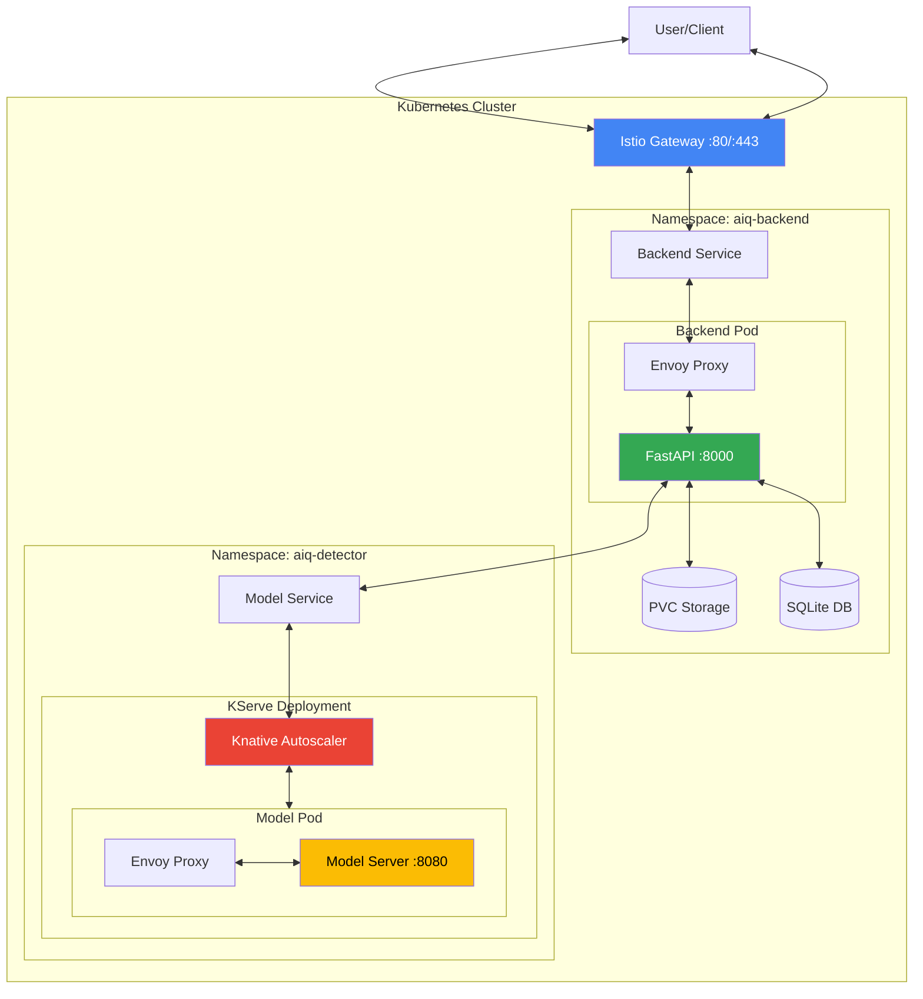
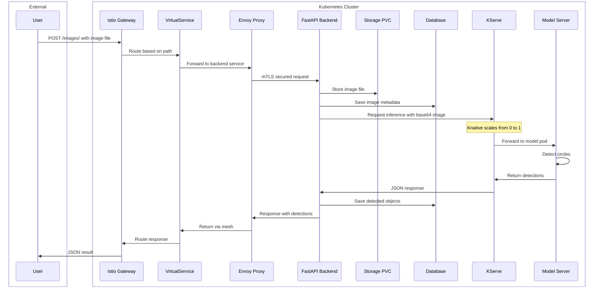

# KServe ML Deployment Project

This repository provides a **batteries-included template** for serving machine-learning models on Kubernetes with the following stack:

* **Istio** for service mesh & ingress
* **Knative Serving** for serverless autoscaling
* **KServe** for model management & prediction endpoints

The goal is to give you an opinionated, yet extensible starting point that you can run locally on Kind _or_ promote to any managed Kubernetes service.

## Architecture Overview

The following diagram illustrates the complete request flow when a user uploads an image for circular object detection:



### Request Flow Steps

1. **User → Istio Gateway**: Client sends POST request to `/images/` endpoint
2. **Gateway → Backend Service**: VirtualService routes request to backend service
3. **Service → Pod**: Kubernetes service load balancer to backend pod
4. **Envoy → FastAPI**: Sidecar proxy forwards request with mTLS
5. **FastAPI Processing**:
   - Stores image in PVC-backed storage
   - Saves metadata to SQLite database
   - Prepares inference request
6. **FastAPI → Model Service**: Sends base64 image for inference
7. **Knative Autoscaling**: Scales model pod from 0 to 1 if needed
8. **Model Inference**: Detects circles and returns bounding boxes
9. **Response Flow**: Results flow back through the same path
10. **User Response**: Client receives JSON with detected objects

### Detailed Request Flow



### Workflow Description

1. **User Upload**: Client sends a POST request to `/api/v1/images/` with an image file
2. **Istio Ingress**: Request enters through Istio Gateway and is routed by VirtualService rules
3. **Service Mesh**: Envoy sidecar proxy handles mTLS, observability, and load balancing
4. **FastAPI Backend**: 
   - Receives and validates the image
   - Stores image in persistent storage (PVC-backed filesystem)
   - Registers metadata in database (image ID, path, timestamp)
5. **Model Inference Request**: Backend prepares inference request with base64-encoded image
6. **KServe/Knative Autoscaling**: 
   - Knative autoscaler receives request
   - Scales model pod from 0 to 1 (cold start) or routes to existing pod
   - Creates revision-specific pods on demand
7. **Model Processing**: 
   - Model server receives image
   - PyTorch/TensorFlow model detects circular objects
   - Returns bounding boxes, centroids, and confidence scores
8. **Response Processing**:
   - Backend receives detection results
   - Saves detected objects to database
   - Returns comprehensive response to user

### Key Components

- **Istio Gateway**: Entry point for all external traffic, handles TLS termination
- **VirtualService**: Defines routing rules for different endpoints
- **Envoy Proxy**: Sidecar container providing service mesh capabilities
- **Knative Serving**: Provides serverless scaling, including scale-to-zero
- **KServe**: Manages model deployment, versioning, and inference endpoints
- **Persistent Storage**: Ensures data survives pod restarts (critical for SQLite)

---
## Project Structure

```
.
├── environments/           # Environment-specific Kubernetes manifests
│   ├── dev/                # Development environment configs
│   ├── stage/              # Staging environment configs
│   ├── prod/               # Production configs (Helm values, manifests)
│   └── local/              # Local Kind cluster setup
│       ├── aiq_detector/   # Model server deployment manifests
│       ├── backend/        # Backend service K8s manifests
│       │   ├── *.yaml      # Deployments, services, storage, Istio routing
│       │   ├── deploy.sh   # Automated deployment script
│       │   └── test-istio.sh # Test script with Istio integration
│       ├── test/           # Demo model and test payloads
│       ├── install_kserve_knative.sh  # KServe/Knative installation
│       ├── setup_ingress_routing.sh   # Ingress configuration
│       ├── setup_kind.sh   # Kind cluster setup
│       └── README.md       # Local environment documentation
├── data/                   # Data directory
├── logs/                   # Application logs
├── model/                  # Pretrained model artifacts
├── services/               # Microservices
│   ├── backend/            # FastAPI backend service
│   │   ├── aiq_circular_detection/  # Main application package
│   │   ├── config/         # Configuration management
│   │   ├── tests/          # Unit and integration tests
│   │   ├── data/           # Backend data storage
│   │   ├── logs/           # Backend service logs
│   │   ├── Dockerfile      # Optimized multi-stage build
│   │   ├── docker-compose.yml  # Docker Compose configuration
│   │   ├── pyproject.toml  # Python project configuration
│   │   ├── uv.lock         # Dependency lock file
│   │   ├── start-dev.sh    # Development server startup
│   │   ├── start-dev-real.sh  # Real mode development server
│   │   └── test_full_integration.sh  # Integration tests
│   ├── evaluation/         # Model evaluation module
│   │   ├── dataset/        # Evaluation dataset
│   │   ├── output/         # Evaluation results
│   │   ├── evaluate_model.py  # Evaluation script
│   │   ├── requirements.txt   # Evaluation dependencies
│   │   ├── run_evaluation.sh  # Execution script
│   │   └── README.md       # Evaluation documentation
│   └── spec.md             # Service specifications
├── run_all.sh              # Unified runner script (local/kind modes)
├── run_all_k8s.sh          # Kubernetes deployment script
└── README.md               # This file
```

## Getting Started

### Prerequisites

- Docker Desktop with Kubernetes enabled
- `kind` - Kubernetes in Docker
- `kubectl` - Kubernetes CLI
- `kustomize` - Tool for customizing Kubernetes YAML configurations
- `jq` - JSON processor
- `uv` - Fast Python package manager ([installation guide](https://github.com/astral-sh/uv))

### Quick Start

### Local Development Testing (No Kubernetes/Docker)

For rapid development and testing without Kubernetes or Docker, you can run all services locally on your machine.

#### Running Everything Locally

```bash
# Run all services locally (model server + backend + tests)
./run_all.sh

# Or explicitly specify local mode
./run_all.sh --mode local
```

This script will:
1. Start the AI model server on port 9090
2. Start the backend API service on port 8000
3. Run integration tests automatically
4. Run model evaluation (if dataset is available)
5. Display performance metrics summary
6. Keep services running for manual testing

#### Running in Kubernetes (Kind)

```bash
# Set up complete K8s infrastructure and run services
./run_all_k8s.sh

# Clean up K8s infrastructure when done
./run_all_k8s.sh --clean

# Or use the parametrized script with Kind mode
./run_all.sh --mode kind
```
What it does:
1. Creates a Kind cluster with proper configuration
2. Installs KServe, Knative, Istio, and Cert-Manager
3. Sets up ingress routing for Kind
4. Builds and deploys the model server
5. Builds and deploys the backend service
6. Runs integration tests
7. Performs model evaluation (optional)

## Scripts Overview

### `run_all.sh`
A unified script that can run services in two modes:
- **Local mode** (default): Runs services as local processes
- **Kind mode**: Uses existing Kubernetes infrastructure

Usage:
```bash
./run_all.sh [--mode local|kind]
```

Features:
- Starts model server and backend service
- Runs integration tests
- Performs model evaluation (if dataset is available)
- Provides real-time logs and status
- Automatic cleanup on exit

The script handles:
- Prerequisite checking
- Port availability verification
- Service health monitoring
- Automatic cleanup on exit
- Detailed logging to `logs/` directory
- Optional model evaluation with performance metrics

To enable automatic model evaluation:
1. Place your evaluation dataset in `services/evaluation/dataset/`
2. Include `_annotations.coco.json` and image files
3. The script will automatically run evaluation and display results

#### Manual Local Testing

If you prefer to run services individually:

1. **Start the Model Server**:
   ```bash
   cd environments/local/aiq_detector
   ./run_local.sh
   # Model server will run on http://localhost:9090
   # Swagger UI: http://localhost:9090/docs
   ```

2. **Start the Backend Service** (in a new terminal):
   ```bash
   cd services/backend
   ./start-dev-real.sh
   # Backend API will run on http://localhost:8000
   # API Docs: http://localhost:8000/docs
   ```

3. **Run Integration Tests** (in a new terminal):
   ```bash
   cd services/backend
   ./test_full_integration.sh
   ```

#### Troubleshooting Local Development

- **Port conflicts**: Ensure ports 8000 and 9090 are free
- **Model download**: First run downloads the AI model (~300MB)
- **Logs**: Check `logs/model_server.log` and `logs/backend_server.log`
- **Cleanup**: Use `Ctrl+C` to stop all services gracefully

### API Endpoints

Once deployed, the backend service provides:

- `POST /images/` - Upload image for circle detection
- `GET /images/{image_id}/objects` - List detected objects for an image
- `GET /images/{image_id}/objects/{object_id}` - Get object details
- `GET /health` - Health check endpoint
- `GET /docs` - Interactive API documentation (Swagger UI)

### Configuration

The backend service can operate in two modes:

1. **Dummy Mode** (default): Returns mock detection results for testing
2. **Real Mode**: Connects to actual KServe model endpoint

Configure via environment variables:
```yaml
MODE: "dummy"  # or "real"
MODEL_SERVER_URL: "http://model-service.namespace.svc.cluster.local"
```

## Production Deployment

For production environments:

1. **Replace SQLite** with PostgreSQL or MySQL for multi-replica support
2. **Use cloud storage** (S3, GCS, Azure Storage) instead of local filesystem
3. **Configure proper ingress** with TLS certificates and domain names
4. **Set resource limits** and autoscaling policies
5. **Enable monitoring** with Prometheus and distributed tracing

See `environments/local/backend/DEPLOYMENT.md` for detailed deployment instructions.

## Model Evaluation

The project includes a comprehensive evaluation module to assess model performance on circular object detection tasks.

### Evaluation Metrics

The evaluation module uses industry-standard computer vision metrics:

- **Jaccard Index (IoU)**: Measures overlap between predicted and ground truth regions
  - Simple and weighted averages computed
  - Range: 0 to 1 (higher is better)
  
- **F1 Score**: Balances precision and recall
  - Precision: Ratio of correct detections to total detections
  - Recall: Ratio of detected objects to total ground truth objects
  - Uses IoU threshold of 0.5 for matching

- **Hungarian Assignment**: Optimally matches predictions to ground truth objects

### Running Evaluation

1. **Prepare dataset** in COCO format:
   ```bash
   cd services/evaluation
   mkdir -p dataset
   # Copy COCO annotations and images
   cp /path/to/_annotations.coco.json dataset/
   cp /path/to/images/*.jpg dataset/
   ```

2. **Run evaluation**:
   ```bash
   cd services/evaluation
   ./run_evaluation.sh
   ```

The evaluation generates:
- Detailed metrics report (precision, recall, F1 score, Jaccard Index)
- Annotated images showing predictions (red) vs ground truth (green)
- Per-image performance breakdowns

See `services/evaluation/README.md` for detailed documentation.

## Development

### Running Tests
```bash
cd services/backend
pytest
```

### Building Docker Image
```bash
cd services/backend
docker build -t aiq-circular-detection:latest .
```

### Local Development
```bash
cd services/backend
./start-dev.sh
```

## Development

For detailed development instructions, see the individual README files in:
- `environments/local/aiq_detector/README.md` - Model server details
- `environments/local/backend/DEPLOYMENT.md` - Backend deployment guide
- `services/backend/README.md` - Backend development guide
- `services/evaluation/README.md` - Evaluation tools guide

## Contributing

1. Fork the repository
2. Create a feature branch
3. Make your changes
4. Run tests and ensure the deployment works
5. Submit a pull request
