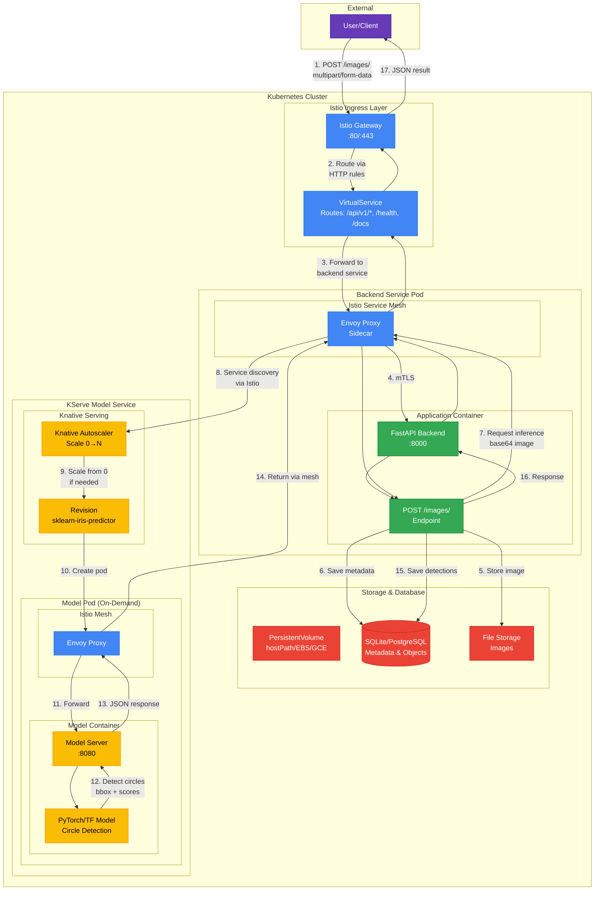

# KServe ML Deployment Project

This repository provides a **batteries-included template** for serving machine-learning models on Kubernetes with the following stack:

* **Istio** for service mesh & ingress
* **Knative Serving** for serverless autoscaling
* **KServe** for model management & prediction endpoints

The goal is to give you an opinionated, yet extensible starting point that you can run locally on Kind _or_ promote to any managed Kubernetes service.

## Architecture Overview

The following diagram illustrates the complete request flow when a user uploads an image for circular object detection:



### Workflow Description

1. **User Upload**: Client sends a POST request to `/api/v1/images/` with an image file
2. **Istio Ingress**: Request enters through Istio Gateway and is routed by VirtualService rules
3. **Service Mesh**: Envoy sidecar proxy handles mTLS, observability, and load balancing
4. **FastAPI Backend**: 
   - Receives and validates the image
   - Stores image in persistent storage (PVC-backed filesystem)
   - Registers metadata in database (image ID, path, timestamp)
5. **Model Inference Request**: Backend prepares inference request with base64-encoded image
6. **KServe/Knative Autoscaling**: 
   - Knative autoscaler receives request
   - Scales model pod from 0 to 1 (cold start) or routes to existing pod
   - Creates revision-specific pods on demand
7. **Model Processing**: 
   - Model server receives image
   - PyTorch/TensorFlow model detects circular objects
   - Returns bounding boxes, centroids, and confidence scores
8. **Response Processing**:
   - Backend receives detection results
   - Saves detected objects to database
   - Returns comprehensive response to user

### Key Components

- **Istio Gateway**: Entry point for all external traffic, handles TLS termination
- **VirtualService**: Defines routing rules for different endpoints
- **Envoy Proxy**: Sidecar container providing service mesh capabilities
- **Knative Serving**: Provides serverless scaling, including scale-to-zero
- **KServe**: Manages model deployment, versioning, and inference endpoints
- **Persistent Storage**: Ensures data survives pod restarts (critical for SQLite)

---
## Project Structure

```
.
├── environments/           # Environment-specific Kubernetes manifests
│   ├── dev/                # Development environment configs
│   ├── stage/              # Staging environment configs
│   ├── prod/               # Production configs (Helm values, manifests)
│   └── local/              # Local Kind cluster setup
│       ├── backend/        # Backend service K8s manifests
│       │   ├── *.yaml      # Deployments, services, storage, Istio routing
│       │   ├── deploy.sh   # Automated deployment script
│       │   └── test-istio.sh # Test script with Istio integration
│       └── test/           # Demo model and test payloads
├── model/                  # Pretrained model artifacts
├── services/               # Microservices
│   └── backend/            # FastAPI backend service
│       ├── aiq_circular_detection/  # Main application package
│       ├── config/         # Configuration management
│       ├── tests/          # Unit and integration tests
│       └── Dockerfile      # Optimized multi-stage build
└── scripts/                # Helper scripts

## Getting Started

### Prerequisites

- Docker Desktop with Kubernetes enabled
- `kind` - Kubernetes in Docker
- `kubectl` - Kubernetes CLI
- `helm` - Package manager for Kubernetes
- `jq` - JSON processor

### Quick Start

1. **Create Kind cluster with Istio, Knative, and KServe**:
   ```bash
   # Create cluster
   bash environments/local/setup_kind.sh
   
   # Install the full stack
   bash environments/local/install_kserve_knative.sh
   ```

2. **Deploy the Backend Service**:
   ```bash
   cd environments/local/backend
   ./deploy.sh
   ```

3. **Test the deployment**:
   ```bash
   # Test through Istio ingress
   ./test-istio.sh
   
   # Access API documentation
   # Visit http://localhost:8080/docs while test-istio.sh is running
   ```

4. **Deploy a sample ML model** (optional):
   ```bash
   kubectl create namespace kserve-test
   kubectl apply -n kserve-test -f environments/local/test/sklearn-iris.yaml
   ```

### API Endpoints

Once deployed, the backend service provides:

- `POST /images/` - Upload image for circle detection
- `GET /images/{image_id}/objects` - List detected objects for an image
- `GET /images/{image_id}/objects/{object_id}` - Get object details
- `GET /health` - Health check endpoint
- `GET /docs` - Interactive API documentation (Swagger UI)

### Configuration

The backend service can operate in two modes:

1. **Dummy Mode** (default): Returns mock detection results for testing
2. **Real Mode**: Connects to actual KServe model endpoint

Configure via environment variables:
```yaml
MODE: "dummy"  # or "real"
MODEL_SERVER_URL: "http://model-service.namespace.svc.cluster.local"
```

## Production Deployment

For production environments:

1. **Replace SQLite** with PostgreSQL or MySQL for multi-replica support
2. **Use cloud storage** (S3, GCS, Azure Storage) instead of local filesystem
3. **Configure proper ingress** with TLS certificates and domain names
4. **Set resource limits** and autoscaling policies
5. **Enable monitoring** with Prometheus and distributed tracing

See `environments/local/backend/DEPLOYMENT.md` for detailed deployment instructions.

## Development

### Running Tests
```bash
cd services/backend
pytest
```

### Building Docker Image
```bash
cd services/backend
docker build -t aiq-circular-detection:latest .
```

### Local Development
```bash
cd services/backend
./start-dev.sh
```

## Contributing

1. Fork the repository
2. Create a feature branch
3. Make your changes
4. Run tests and ensure the deployment works
5. Submit a pull request

For detailed documentation on the local environment setup, see `environments/local/README.md`.