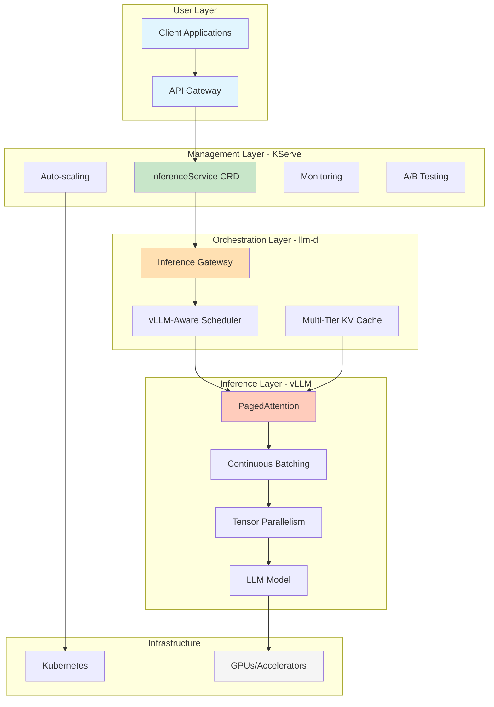
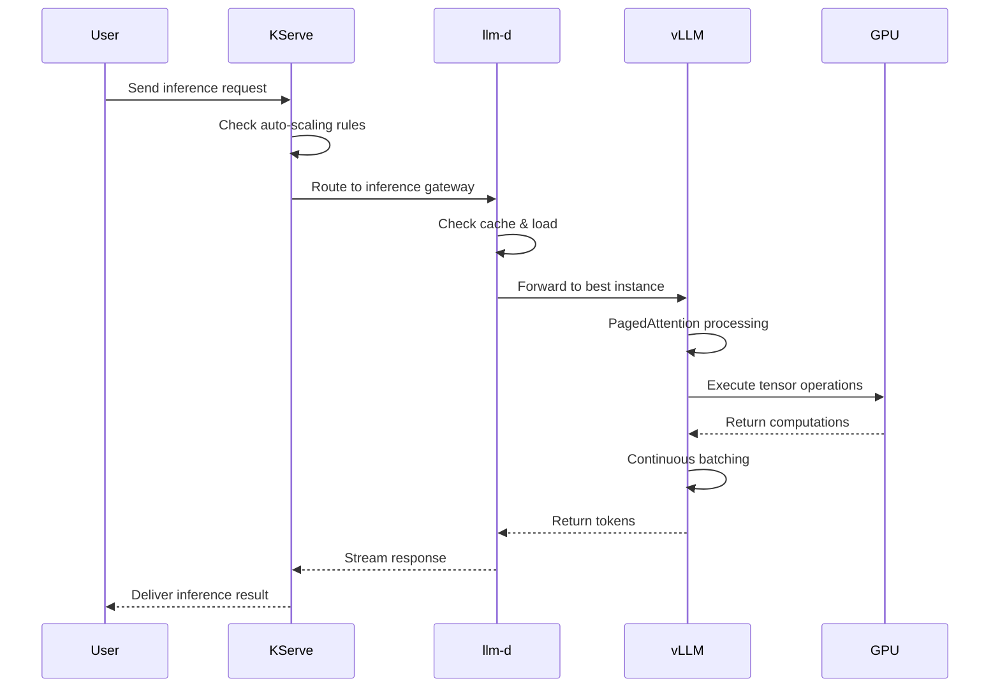
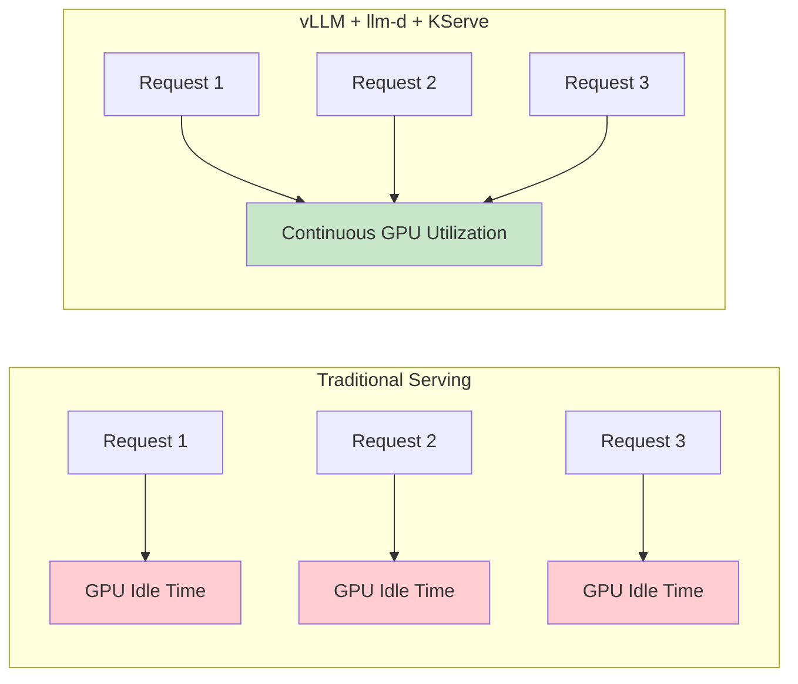
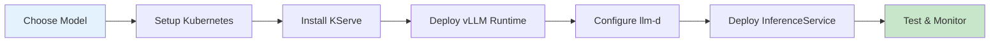

# LLM Inference Stack Overview: vLLM, llm-d, and KServe

## Introduction

This document provides a comprehensive overview of the modern Large Language Model (LLM) inference stack, focusing on three key technologies that work together to enable production-scale AI deployments. 

**Quick Summary**: vLLM provides the high-performance inference engine, llm-d orchestrates distributed serving on Kubernetes, and KServe offers the standardized deployment and management layer.

## Technology Stack Overview

## Key Components Explained

### 1. vLLM - The High-Performance Inference Engine

**vLLM** (Versatile Large Language Model) is the foundation of our stack, providing:

- **24x faster inference** than traditional transformers
- **Memory-efficient serving** through PagedAttention
- **Dynamic request handling** via continuous batching
- **Multi-GPU support** with tensor parallelism

[Learn more in the vLLM Deep Dive →](./02-vllm-deep-dive.md)

### 2. llm-d - Kubernetes-Native Distributed Inference

**llm-d** (LLM Daemon) orchestrates vLLM at scale:

- **Intelligent request routing** based on cache hits
- **Disaggregated serving** for prefill and decode stages
- **Multi-tier caching** for cost optimization
- **Native Kubernetes integration**

[Explore llm-d Architecture →](./03-llm-d-architecture.md)

### 3. KServe - Standardized Model Serving Platform

**KServe** provides the production-ready deployment layer:

- **Unified API** for all model frameworks
- **Auto-scaling** including scale-to-zero
- **Production features** like monitoring and A/B testing
- **Multi-framework support** beyond just LLMs

[Understand KServe Integration →](./04-kserve-integration.md)

## How They Work Together

## Performance Comparison

## Use Cases and Benefits

### When to Use This Stack

✅ **Perfect for:**
- Production LLM deployments at scale
- Multi-tenant environments
- Cost-sensitive deployments
- High-throughput requirements
- Enterprise AI applications

### Key Benefits

| Benefit | Description | Impact |
|---------|-------------|---------|
| **Performance** | 24x throughput improvement | Handle more users with same hardware |
| **Cost Efficiency** | 90% better GPU utilization | Lower infrastructure costs |
| **Scalability** | Auto-scaling with KServe | Handle variable loads automatically |
| **Reliability** | Production-grade orchestration | 99.9%+ uptime achievable |
| **Flexibility** | Multi-model support | Deploy various model types |

## Quick Start Path

## Next Steps

1. **[Deep Dive into vLLM](./02-vllm-deep-dive.md)** - Understand PagedAttention and performance optimizations
2. **[Explore llm-d Architecture](./03-llm-d-architecture.md)** - Learn about distributed inference patterns
3. **[Master KServe Integration](./04-kserve-integration.md)** - Deploy production-ready services
4. **[Study Architecture Patterns](./05-architecture-patterns.md)** - Choose the right deployment model
5. **[Follow Deployment Guide](./06-deployment-guide.md)** - Step-by-step production setup
6. **[Reference Glossary](./07-glossary.md)** - Technical terms and acronyms explained

## Industry Adoption

Major companies using this stack:
- **ByteDance** - AIBrix control plane
- **Amazon** - Rufus shopping assistant
- **LinkedIn** - AI features
- **LMSYS** - FastChat platform
- **Red Hat** - OpenShift AI

## Further Resources

- [vLLM Documentation](https://docs.vllm.ai/)
- [KServe Official Site](https://kserve.github.io/)
- [llm-d GitHub](https://github.com/llm-d/llm-d)
- [Production Best Practices](./06-deployment-guide.md#best-practices)