# vLLM Deep Dive: High-Performance LLM Inference

## What is vLLM?

### Technical Definition

**vLLM** (Versatile Large Language Model) is a high-throughput and memory-efficient inference and serving engine specifically designed for Large Language Models (LLMs).
Developed at UC Berkeley's Sky Computing Lab and subsequently integrated into the PyTorch ecosystem in December 2024,
vLLM addresses fundamental inefficiencies in traditional transformer inference systems through novel attention mechanisms and dynamic batching strategies.

The system achieves up to 24x higher throughput compared to HuggingFace Transformers library by implementing PagedAttention,
a virtual memory-inspired algorithm that manages Key-Value (KV) cache with near-optimal memory utilization.
This optimization is critical for production deployments where GPU memory constraints and serving costs are primary concerns.
vLLM's architecture enables efficient multi-tenant serving (handle inference requests from multiple independent users or applications concurrently)
supporting hundreds of concurrent requests on a single GPU while maintaining sub-second latency requirements essential for interactive applications.

**Explained Simply**: vLLM is like a super-efficient engine for running AI language models. Think of it as upgrading from a regular car engine to a Formula 1 racing engine - it makes everything run much faster while using less fuel (memory).

### Key Technical Terms

- **Inference**: The process of using a trained model to generate predictions or outputs from new input data, distinct from training where the model learns from data
- **Throughput**: The number of tokens (word pieces) processed per second, measuring the system's processing capacity
- **Memory Efficiency**: The ratio of useful data to total allocated memory, critical for GPU utilization
- **Serving Engine**: A software system that manages model deployment, request handling, and resource allocation
- **Multi-tenant Serving**: The capability to handle inference requests from multiple independent users or applications concurrently on the same GPU infrastructure, sharing resources efficiently while maintaining isolation between requests
- **KV Cache (Key-Value Cache)**: A critical memory structure in transformer models that stores the key and value vectors computed during the attention mechanism for all previous tokens in a sequence, enabling the model to maintain context without recomputing attention for earlier tokens

📚 **Learn More**:
- [Official vLLM Documentation](https://docs.vllm.ai/en/stable/)
- [vLLM GitHub Repository](https://github.com/vllm-project/vllm)
- [UC Berkeley Sky Lab Project Page](https://sky.cs.berkeley.edu/project/vllm/)

### Q&A: Understanding vLLM

**Q: What makes vLLM different from traditional inference engines?**
A: vLLM fundamentally reimagines memory management for LLMs by applying virtual memory concepts to GPU memory. Traditional engines pre-allocate maximum sequence lengths for each request, wasting 60-80% of memory. vLLM uses PagedAttention to allocate memory dynamically as needed, achieving >96% utilization. This allows serving 5-10x more concurrent requests on the same hardware.

**Q: Why is multi-tenant serving important for production deployments?**
A: Multi-tenant serving allows a single GPU to handle requests from hundreds of different users simultaneously, dramatically reducing infrastructure costs. Without this capability, you'd need dedicated resources for each user or application, making LLM deployment prohibitively expensive. vLLM's efficient memory management enables true multi-tenancy with sub-second latencies.

**Q: How does the KV cache impact inference performance?**
A: The KV cache is the primary memory bottleneck in LLM inference. For each token generated, the model must access all previous tokens' key-value pairs. In a 2048-token sequence, this means storing and accessing millions of floating-point values. Traditional systems allocate this memory contiguously and statically, while vLLM's PagedAttention manages it dynamically in blocks, reducing waste and enabling cache sharing between requests.

**Q: What does 24x throughput improvement actually mean in practice?**
A: It means that tasks that previously took 24 seconds now complete in 1 second, or that you can serve 24 users simultaneously instead of just one. For a company serving 10,000 requests per hour, this translates to needing 1 GPU instead of 24 GPUs, reducing hardware costs by ~$500,000/year at current cloud GPU prices.

## Core Innovation: PagedAttention

### Technical Overview

PagedAttention represents a paradigm shift in managing attention computation memory for transformer-based language models. The innovation addresses the fundamental memory bottleneck in LLM serving by applying operating system virtual memory concepts to GPU memory management. By decomposing the traditionally monolithic KV cache into discrete, manageable blocks, PagedAttention enables dynamic memory allocation, sharing, and near-optimal utilization that was previously impossible with contiguous memory allocation strategies.

### The Problem with Traditional Attention

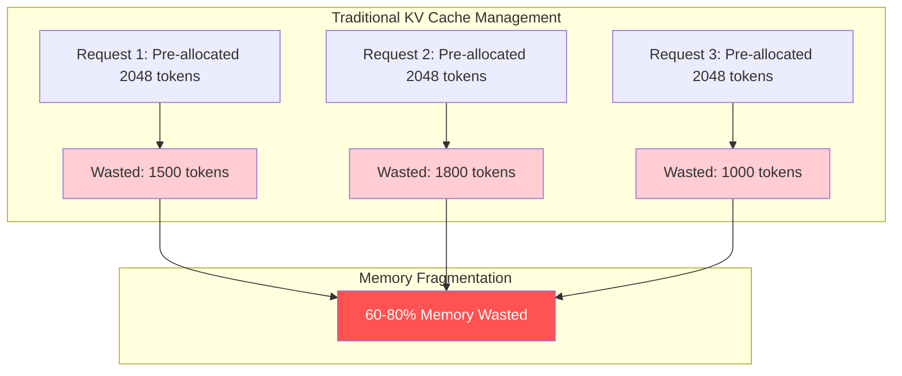

**What This Diagram Shows**: The diagram illustrates the fundamental memory allocation problem in traditional attention mechanisms. Each request pre-allocates a fixed maximum sequence length (2048 tokens in this example) in contiguous memory blocks. The actual token usage varies significantly - Request 1 uses only 548 tokens, Request 2 uses 248 tokens, and Request 3 uses 1048 tokens. This static allocation strategy results in 60-80% memory fragmentation, severely limiting the number of concurrent requests that can be served on a single GPU. The red-colored waste blocks visually represent the inefficiency that accumulates across multiple requests, leading to premature out-of-memory conditions even when substantial GPU memory remains technically available but unusable due to fragmentation.

**Technical Context**: In transformer-based language models, the attention mechanism requires storing key-value pairs for all previous tokens in the sequence to maintain context during generation. Traditional systems allocate the maximum possible sequence length for each request upfront to ensure contiguous memory access patterns optimal for GPU computation. However, this approach fails to account for the high variance in actual sequence lengths, where most requests terminate well before reaching the maximum limit. This inefficiency becomes particularly problematic in production environments where serving costs scale directly with the number of GPUs required to handle a given request volume.

**The Problem Explained Simply**: Imagine you're hosting a dinner party and you set up 20 chairs for each guest "just in case" they need them, even though each person only needs one chair. You quickly run out of space in your dining room, even though most chairs remain empty.

**The Impact**: This waste means you can serve fewer users simultaneously, making the system slow and expensive.

### Technical Terms Defined

- **KV Cache (Key-Value Cache)**: A memory structure storing the key and value vectors computed during the attention mechanism for all previous tokens in a sequence, essential for maintaining context
- **Memory Fragmentation**: The phenomenon where memory becomes divided into small, non-contiguous blocks that cannot be effectively utilized despite being technically free
- **Contiguous Memory**: A single, unbroken block of memory addresses required by traditional implementations for efficient GPU memory access patterns
- **Sequence Length**: The number of tokens in an input or output text sequence, varying significantly across different requests

📚 **Deep Dive Resources**:
- [PagedAttention Paper (arXiv:2309.06180)](https://arxiv.org/abs/2309.06180)
- [Blog: Efficient Memory Management in LLMs](https://blog.vllm.ai/2023/06/20/vllm.html)
- [Video: How PagedAttention Works](https://www.youtube.com/watch?v=KuKEL6KTBAE)

### PagedAttention Solution

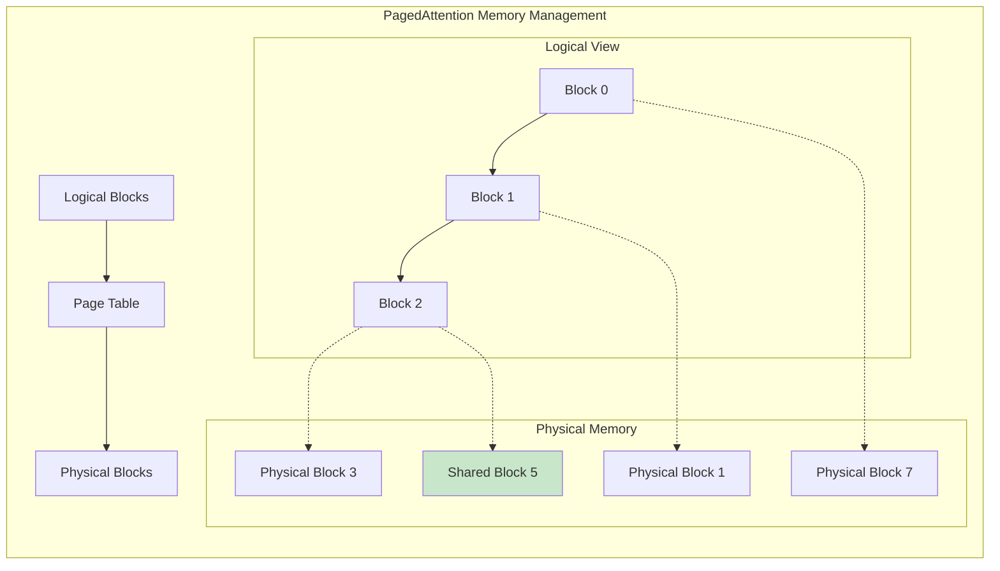

**What This Diagram Shows**: This diagram demonstrates PagedAttention's virtual memory-inspired architecture that revolutionizes KV cache management. The system maintains a separation between logical and physical memory blocks through an indirection layer (Page Table). Each sequence maintains a logical view of contiguous blocks (Block 0→1→2), but these map to non-contiguous physical blocks (7→1→3) in GPU memory. The green-highlighted Physical Block 5 represents a shared block accessed by multiple sequences through copy-on-write semantics. This architecture enables dynamic memory allocation where blocks are allocated only as needed during generation, and identical prefix blocks can be shared across requests. The dotted lines indicate the flexible mapping between logical and physical spaces, allowing for efficient memory defragmentation and near-optimal utilization rates exceeding 96%.

**Technical Implementation**: PagedAttention divides the KV cache into fixed-size blocks (typically 16 tokens per block), managed through a block table that maps logical block numbers to physical block addresses. During attention computation, the system performs gather operations to fetch the required blocks, similar to how operating systems handle virtual memory paging. The block size is carefully chosen to balance between memory fragmentation (smaller blocks reduce waste) and computational efficiency (larger blocks improve memory access patterns). The system implements sophisticated memory management algorithms including reference counting for shared blocks, lazy allocation for growing sequences, and preemptive eviction policies when memory pressure increases.

**The Solution Explained Simply**: It's like using modular furniture that can be rearranged and shared. Instead of giving each guest their own fixed dining table, you use small tables that can be combined as needed and shared when guests have the same appetizers.

### Key Architectural Components

- **Block Manager**: The core component responsible for allocating, deallocating, and tracking memory blocks across all active sequences
- **Page Table**: A mapping structure that translates logical block indices to physical memory addresses, enabling non-contiguous allocation
- **Copy-on-Write (CoW)**: A memory optimization technique where multiple sequences share the same physical blocks until modification is required
- **Reference Counting**: A mechanism to track how many sequences are using each physical block for safe deallocation
- **Block Size**: The granularity of memory allocation, typically 16 tokens per block, optimized for GPU memory hierarchy

### How PagedAttention Works

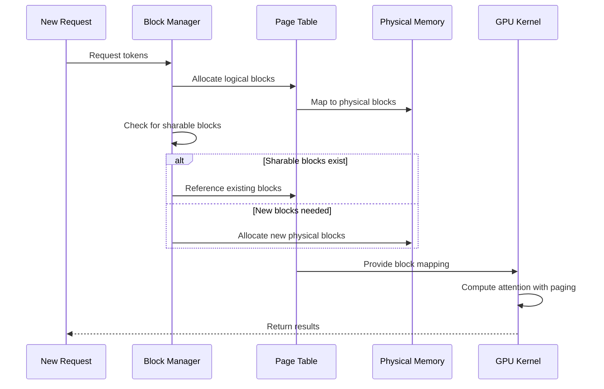

**What This Diagram Shows**: This sequence diagram details the complete lifecycle of a memory allocation request in PagedAttention. When a new request arrives, the Block Manager first determines the number of logical blocks required based on the sequence length. It then queries the Page Table to establish mappings to physical blocks. A critical optimization occurs during the sharing check phase - the Block Manager computes hashes of token sequences to identify identical prefixes across active requests. When matches are found, the system increments reference counts and creates new logical-to-physical mappings without allocating additional memory. For unique sequences, new physical blocks are allocated from the free pool. The GPU kernel receives the block mapping and performs attention computation using specialized CUDA kernels that implement gather/scatter operations for non-contiguous memory access. The paging mechanism ensures that memory access patterns remain efficient despite the indirection, achieving performance comparable to contiguous allocation while dramatically improving memory utilization.

**Process Explained Simply**: Like a library system - when you request a book (tokens), the librarian (Block Manager) checks the catalog (Page Table), finds where it's stored (Physical Memory), and if someone else is already reading the same chapter, you can share it instead of getting a duplicate copy.

### Q&A: PagedAttention Deep Dive

**Q: Which operating system virtual memory concepts are being applied to GPU memory management and what do they mean?**
A: PagedAttention applies four key OS virtual memory concepts:
1. **Paging**: Memory is divided into fixed-size blocks (pages) rather than contiguous allocation. In vLLM, each page holds 16 tokens' worth of KV cache.
2. **Virtual-to-Physical Mapping**: Logical addresses (what the application sees) are mapped to physical addresses (actual GPU memory locations) through a page table, allowing non-contiguous physical allocation.
3. **Copy-on-Write (CoW)**: Multiple processes can share the same physical pages until one needs to modify them, at which point a copy is made. This enables prefix sharing in vLLM.
4. **Demand Paging**: Memory is allocated only when actually needed, not upfront. vLLM allocates KV cache blocks only as tokens are generated.

**Q: How is it possible to have several sequences sharing the same block using copy-on-write semantics in the case of LLMs?**
A: In LLMs, many requests share common prefixes like system prompts or few-shot examples. When multiple sequences have identical token prefixes, vLLM stores the KV cache for these tokens only once in physical memory. Multiple logical sequences point to the same physical blocks through their page tables. Since KV cache is read-only during inference (we only append new tokens, never modify existing ones), sharing is safe. If a sequence needs to be modified (rare in inference), CoW would create a separate copy, but typically sequences only grow by appending, making sharing highly effective.

**Q: What is an identical prefix block?**
A: An identical prefix block occurs when multiple requests begin with the exact same sequence of tokens. Common examples include:
- System prompts: "You are a helpful assistant..."
- Few-shot examples: Repeated examples shown before the actual query
- Task instructions: "Translate the following text to French:"
- Chat history: Shared conversation context in multi-turn dialogues
vLLM computes a hash of token sequences to identify these matches and maps multiple requests to the same physical KV cache blocks, saving significant memory.

**Q: What are reference counting, lazy allocation, and preemptive eviction policies?**
A: These are memory management strategies borrowed from operating systems:
- **Reference Counting**: Each physical block maintains a counter of how many sequences are using it. When a sequence finishes, the counter decrements. When it reaches zero, the block can be freed. This ensures shared blocks aren't deallocated while still in use.
- **Lazy Allocation**: Blocks are allocated only when tokens are actually generated, not when the request arrives. If a request is for "up to 2048 tokens" but generates only 100, only ~7 blocks are allocated (100 tokens ÷ 16 tokens/block), not 128 blocks.
- **Preemptive Eviction**: When memory pressure is high (>90% utilization), the system proactively evicts blocks from completed or lower-priority requests to make room for new high-priority requests. vLLM implements four key eviction policies:
  1. **LRU (Least Recently Used)**: Evicts blocks that haven't been accessed for the longest time. Ideal for workloads with temporal locality where recent requests are more likely to be accessed again.
  2. **LFU (Least Frequently Used)**: Tracks access frequency and evicts blocks with the lowest usage count. Better for workloads where some prefixes (like system prompts) are consistently popular.
  3. **Priority-Based Eviction**: Assigns priority scores based on request importance (e.g., premium users, latency-sensitive requests). Lower priority blocks are evicted first regardless of access patterns.
  4. **TTL (Time-To-Live) Based**: Blocks are evicted after a configurable time period (default 3600 seconds). Useful for preventing memory leaks from abandoned sessions and ensuring cache freshness.
  
  These policies can be combined - for example, using priority tiers with LRU within each tier. Evicted sequences can be recomputed if needed later, or swapped to CPU memory for faster restoration.

**Q: How does PagedAttention maintain performance despite memory indirection?**
A: Memory indirection means accessing memory through pointers or references rather than direct addresses - instead of accessing KV cache blocks sequentially in memory, PagedAttention must look up each block's physical address in a page table before accessing it. This typically adds overhead, but PagedAttention minimizes it through:
1. **Block Size Optimization**: 16 tokens per block balances fragmentation (smaller = less waste) with access efficiency (larger = fewer lookups)
2. **GPU-Optimized Gather Operations**: Custom CUDA kernels leverage:
   - **Texture Memory**: A specialized GPU cache optimized for spatial locality and random access patterns. 
     - **Spatial Locality**: The principle that if you access one memory location, you're likely to access nearby locations soon. Like reading a book - if you read page 10, you'll probably read page 11 next. Texture memory assumes this pattern and pre-fetches nearby data.
     - **Random Access Patterns**: When memory accesses jump around unpredictably rather than going sequentially. Like looking up words in a dictionary - you might jump from page 50 to page 200 to page 5. PagedAttention exhibits this when blocks are scattered across memory.
     - **Hardware-Accelerated Interpolation**: The GPU hardware can automatically calculate values between stored data points. Imagine texture memory as a smart assistant that not only fetches the data you asked for but also prepares nearby data you might need, doing the math in hardware rather than software. [→ Deep dive into how math happens in hardware](GPU/hardware-accelerated-interpolation.md)
     - **Caching for Irregular Access**: Unlike regular cache that assumes sequential access, texture cache is optimized for the "jumping around" pattern. It's like having a librarian who's good at predicting which scattered books you'll need next, not just the next book on the shelf.
   - **Coalesced Access Patterns**: When multiple GPU threads in a warp (32 threads) access memory, the hardware can combine these into a single transaction if addresses are consecutive. Think of it like carpooling - instead of 32 people driving separate cars (32 memory transactions), they share one bus (1 memory transaction) when going to nearby destinations. PagedAttention groups threads to access consecutive elements within blocks, ensuring memory requests are coalesced even when blocks themselves are non-contiguous.
3. **Batch Processing**: Multiple block fetches are bundled into single operations, amortizing the indirection overhead
4. **Cache Locality**: Recently accessed blocks remain in GPU L2 cache (up to 40MB on A100), reducing memory latency for frequently accessed prefixes
The result is only ~5% performance overhead compared to contiguous memory, while achieving 10x better memory utilization. The indirection cost is negligible compared to the memory savings and increased throughput from serving more requests.

**Q: How does vLLM detect that multiple requests share the same sequences to enable physical address sharing?**
A: vLLM implements a sophisticated sequence matching system using multiple techniques:
1. **Token-Level Hashing**: Each block of 16 tokens is hashed using a rolling hash algorithm (similar to Rabin-Karp). The hash includes token IDs and positional information, creating a unique fingerprint for each block.
2. **Prefix Tree Matching**: A radix tree (trie) data structure maintains all active prefixes. When a new request arrives, vLLM traverses the tree token-by-token to find the longest matching prefix. This is O(k) where k is the prefix length.
3. **Block-Aligned Comparison**: Since memory is managed in blocks of 16 tokens, vLLM only needs to compare at block boundaries. If tokens 0-15 match exactly between two requests, they can share that physical block.
4. **Hash Table Lookup**: A global hash table maps from block hashes to physical block addresses. When processing a new request:
   - Compute hash for each 16-token block
   - Look up hash in table - O(1) operation
   - If found, increment reference count and map logical block to existing physical block
   - If not found, allocate new physical block and add to hash table
5. **Automatic Detection**: This happens automatically without user configuration. Common patterns detected include:
   - System prompts: "You are a helpful assistant..." (can be 100+ tokens)
   - Few-shot examples: Repeated examples in prompts (often 500+ tokens)
   - Chat history: Multi-turn conversations where history is shared
   - Template instructions: "Translate to French:", "Summarize the following:"

Example: If 10 requests all start with the same 128-token system prompt, vLLM stores only 8 physical blocks (128÷16) instead of 80 blocks, achieving 90% memory reduction for that prefix. The detection happens in microseconds during request initialization.

## Continuous Batching

### Technical Overview

Continuous batching, also known as dynamic batching or iteration-level scheduling, represents a paradigm shift in how inference requests are processed on GPUs. Unlike traditional static batching that waits for a fixed number of requests before processing, continuous batching dynamically adjusts the batch composition at every iteration of the autoregressive generation process. This approach leverages the observation that different sequences in a batch complete at different times, creating opportunities to insert new requests into "slots" freed by completed sequences without waiting for the entire batch to finish.

The mechanism operates by maintaining a pool of active sequences and continuously evaluating which sequences can be processed together based on their current state, memory requirements, and computational demands. At each generation step, the scheduler examines completed sequences, removes them from the active batch, and immediately fills the freed capacity with pending requests. This fine-grained scheduling dramatically improves GPU utilization by eliminating the idle time that accumulates in static batching systems where fast-completing requests must wait for slower ones.

### Traditional vs Continuous Batching

```mermaid
gantt
    title Traditional Static Batching
    dateFormat X
    axisFormat %s
    
    section GPU
    Batch 1 Processing :done, b1, 0, 10
    Wait for Batch 1    :crit, w1, 10, 15
    Batch 2 Processing :done, b2, 15, 25
    Wait for Batch 2    :crit, w2, 25, 30
```

```mermaid
gantt
    title vLLM Continuous Batching
    dateFormat X
    axisFormat %s
    
    section GPU
    Request 1 :active, r1, 0, 8
    Request 2 :active, r2, 2, 12
    Request 3 :active, r3, 5, 11
    Request 4 :active, r4, 8, 18
    Request 5 :active, r5, 11, 20
```

**What These Diagrams Show**: The Gantt charts provide a temporal visualization of GPU utilization under different batching strategies.
In traditional static batching (top), the GPU processes Batch 1 for 10 time units, then remains idle for 5 units (shown in red) while waiting for all requests in the batch to complete before starting Batch 2.
This pattern repeats, creating regular idle periods that reduce overall throughput.
The continuous batching diagram (bottom) shows overlapping request processing where new requests (r2, r3) begin execution while r1 is still running.
As r1 completes at time 8, r4 immediately takes its place without any idle period.
This continuous flow maintains high GPU utilization throughout the time window,
processing 5 requests in 20 time units compared to 2 batches in 30 units for static batching.
The overlapping purple bars represent concurrent execution of multiple requests with different start and end times, demonstrating the dynamic nature of continuous batching.

**Technical Implementation**: The scheduler maintains a priority queue of pending requests and a set of active sequences. At each iteration, it computes the available batch capacity based on GPU memory and computational constraints. Completed sequences are identified through end-of-sequence tokens or maximum length limits, immediately freeing their allocated resources. The system then selects new requests from the queue based on priority and resource availability, dynamically recomputing attention masks and position encodings to accommodate the changing batch composition.

**Explained Simply**: Traditional batching is like a bus that won't leave until all passengers finish their trips - very inefficient. Continuous batching is like a taxi service where new passengers can hop in as soon as someone gets out - much more efficient!

📚 **Learn More**:
- [Continuous Batching Paper (Orca, OSDI '22)](https://www.usenix.org/conference/osdi22/presentation/yu)
- [Blog: Dynamic Batching in vLLM](https://www.anyscale.com/blog/continuous-batching-llm-inference)

### Q&A: Continuous Batching

**Q: Why does traditional static batching waste so much GPU capacity?**
A: Static batching requires all requests in a batch to complete before starting the next batch. If one request generates 500 tokens while others generate 50, the GPU sits idle for 90% of the time waiting for the longest request. This creates a "convoy effect" where fast requests get stuck behind slow ones. Additionally, the batch size is fixed, so if you have capacity for 8 requests but only 5 arrive, you either wait (increasing latency) or process with underutilized capacity.

**Q: How does continuous batching achieve iteration-level scheduling?**
A: Instead of managing requests, continuous batching manages individual token generation iterations. After each token is generated:
1. The scheduler checks which sequences have completed (hit EOS token or max length)
2. Completed sequences are immediately removed from the active batch
3. New requests from the queue are inserted into freed slots
4. The next iteration proceeds with the updated batch composition
This happens every ~50ms (typical token generation time), creating a fluid system where requests flow continuously through the GPU.

**Q: What are the technical challenges in implementing continuous batching?**
A: Key challenges include:
1. **Dynamic Attention Masks**: Must recompute which tokens can attend to which others as batch composition changes
2. **Variable Sequence Lengths**: Padding strategies must adapt each iteration as sequences have different lengths
3. **Memory Management**: KV cache blocks must be dynamically allocated/freed as requests enter/leave
4. **Position Encoding**: Relative positions must be recalculated when batch composition changes
5. **Scheduling Complexity**: Must balance fairness, priority, and memory constraints in real-time

**Q: How does preemption work in continuous batching?**
A: Preemption allows the system to pause lower-priority requests to accommodate higher-priority ones:
1. When a high-priority request arrives but memory is full, the scheduler identifies victim sequences
2. Victim sequences' KV cache blocks are swapped to CPU memory or marked for recomputation
3. The high-priority request takes the freed GPU resources
4. When resources become available, preempted sequences resume from their checkpoint
This ensures critical requests maintain low latency even under high load.

### Technical Implementation Details

- **Iteration-level Scheduling**: Scheduling decisions made at each token generation step rather than at request boundaries
- **Preemption**: The ability to pause lower-priority requests to accommodate higher-priority ones
- **Memory Pool Management**: Dynamic allocation and deallocation of KV cache memory as requests start and complete
- **Batch Padding**: Technique to handle variable-length sequences in the same batch using attention masks

### Performance Benefits

| Metric | Static Batching | Continuous Batching | Improvement | Technical Explanation |
|--------|----------------|-------------------|-------------|----------------------|
| GPU Utilization | 40-60% | 90-95% | 2.3x | Eliminates synchronization barriers between batches |
| Average Latency | High variance | Low variance | 5x reduction | Requests don't wait for slowest in batch |
| Throughput | Baseline | 24x higher | 24x | Processes more requests concurrently |
| Memory Efficiency | Poor | Optimal | 3x better | Dynamic allocation reduces overprovisioning |

**Explained Simply**: Like using your oven at full capacity versus half-empty - continuous batching ensures the GPU is always working at maximum efficiency.

## Tensor Parallelism

### Technical Foundation

Tensor Parallelism (TP) is a model parallelism technique that partitions individual layers of a neural network across multiple GPUs, enabling the deployment of models too large to fit in single-device memory. Unlike pipeline parallelism which splits models vertically across layers, tensor parallelism splits horizontally within layers, specifically partitioning weight matrices column-wise or row-wise. This approach is particularly effective for transformer models where the multi-head attention and feed-forward network layers contain large matrix multiplications that can be efficiently distributed.

The implementation in vLLM follows the Megatron-LM approach, which minimizes communication overhead by strategically partitioning matrices to require only two all-reduce operations per transformer layer. During forward propagation, each GPU computes its portion of the matrix multiplication, then participates in collective communication to aggregate results. This design achieves near-linear scaling for models up to certain sizes, though communication overhead becomes more significant as the degree of parallelism increases.

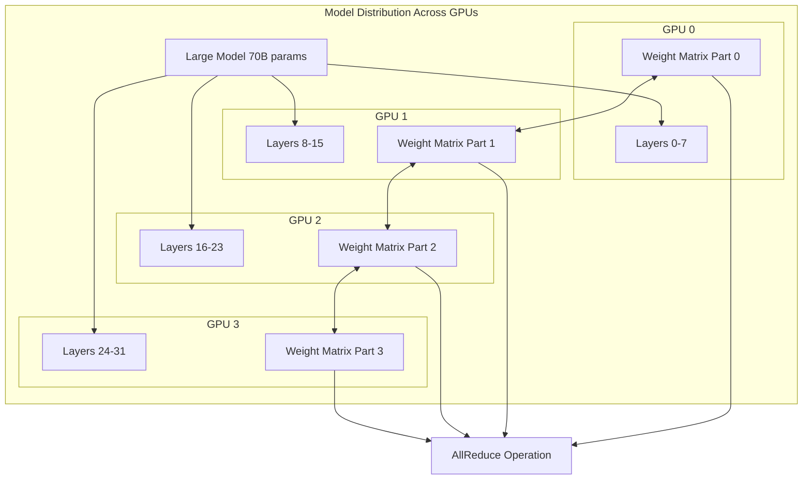

**What This Diagram Shows**: This visualization depicts the tensor parallel distribution of a 70-billion parameter model across four GPUs. The model's 32 transformer layers are distributed with each GPU handling 8 layers (shown as Layers 0-7, 8-15, etc.). Within each layer, the weight matrices are further partitioned (W0, W1, W2, W3) with each GPU storing only its assigned columns or rows. The bidirectional arrows between weight matrix parts indicate the high-bandwidth communication required for gradient synchronization during training and activation passing during inference. The AllReduce operation at the bottom represents the collective communication primitive used to aggregate partial results from all GPUs. This architecture requires high-bandwidth interconnects (preferably NVLink or InfiniBand) to minimize the latency of these frequent synchronization operations. The distribution strategy ensures that no single GPU needs to store the entire model, enabling inference on models that would otherwise exceed single-device memory capacity.

**Explained Simply**: Imagine trying to move a piano - it's too heavy for one person. Tensor parallelism is like having 4 people each carry one corner. They need to coordinate (AllReduce), but together they can move something impossible for one person alone.

### Parallelism Strategies Comparison

1. **Tensor Parallelism (TP)**: 
   - Splits individual weight matrices across devices
   - Requires high-bandwidth interconnect for frequent communication
   - Best for models that fit in aggregate GPU memory but not single GPU
   - Minimal pipeline bubble overhead
   - **Explained Simply**: Like dividing a book's chapters among readers

2. **Pipeline Parallelism (PP)**: 
   - Splits model layers sequentially across devices
   - Creates pipeline bubbles reducing efficiency
   - Suitable for very deep models
   - Lower communication requirements than TP
   - **Explained Simply**: Like an assembly line where each worker does one step

3. **Data Parallelism (DP)**: 
   - Replicates entire model across devices
   - Each device processes different batch elements
   - Requires gradient synchronization only
   - Limited by single-device memory capacity
   - **Explained Simply**: Like having multiple identical printers working on different documents

### Technical Terms

- **All-Reduce**: A collective operation that combines values from all processes and distributes the result back to all processes
- **NVLink**: NVIDIA's high-speed interconnect for direct GPU-to-GPU communication, providing up to 900 GB/s bandwidth
- **Collective Communication**: Operations involving data exchange among all processes in a parallel system
- **Pipeline Bubble**: Idle time in pipeline parallelism when some stages wait for others to complete

📚 **Deep Dive**:
- [Megatron-LM Paper (arXiv:1909.08053)](https://arxiv.org/abs/1909.08053)
- [Tensor Parallelism Explained (NVIDIA Blog)](https://developer.nvidia.com/blog/tensor-parallelism/)

### Q&A: Tensor Parallelism

**Q: Why is tensor parallelism preferred over pipeline parallelism for LLM inference?**
A: Tensor parallelism has several advantages for inference:
1. **No Pipeline Bubbles**: All GPUs work simultaneously on each layer, eliminating idle time
2. **Lower Latency**: Each token is processed by all GPUs in parallel, not sequentially
3. **Better Memory Balance**: Model weights are evenly distributed across GPUs
4. **Simpler Scheduling**: No complex micro-batch scheduling required
The main drawback is higher communication overhead, requiring high-bandwidth interconnects like NVLink (900 GB/s) rather than standard PCIe (32 GB/s).

**Q: How does the Megatron-LM approach minimize communication overhead?**
A: Megatron-LM strategically partitions matrices to require only two all-reduce operations per transformer layer:
1. **Column-Parallel Linear**: Input is replicated, weight matrix columns are split, outputs are partial sums that need all-reduce
2. **Row-Parallel Linear**: Input is partitioned, weight matrix rows are split, outputs are gathered
By interleaving these patterns (column for first linear, row for second), most communication is eliminated through careful algebraic manipulation. Only 2 all-reduces per layer are needed instead of 4+.

**Q: What determines the optimal tensor parallel size?**
A: Several factors influence the optimal configuration:
1. **Model Size**: Larger models benefit more from higher parallelism degrees
2. **Interconnect Bandwidth**: NVLink supports up to 8-way efficiently, PCIe typically 2-4 way
3. **Batch Size**: Larger batches amortize communication cost better
4. **Latency Requirements**: More parallelism reduces memory per GPU but increases communication
The rule of thumb is TP size = √(number of GPUs) for balanced parallelism, e.g., 4-way TP for 16 GPUs.

**Q: How does tensor parallelism interact with PagedAttention?**
A: They complement each other well:
1. **Distributed KV Cache**: Each GPU stores KV cache blocks for its tensor partition
2. **Coordinated Block Management**: Block allocation is synchronized across tensor parallel ranks
3. **Shared Prefix Optimization**: Prefix sharing works across tensor parallel groups
4. **Communication Overlap**: KV cache operations overlap with tensor parallel all-reduce
This synergy enables serving 70B+ models efficiently across multiple GPUs while maintaining PagedAttention's memory benefits.

## Performance Optimizations

### Technical Overview

Performance optimization in vLLM encompasses multiple layers of the software stack, from low-level CUDA kernel implementations to high-level scheduling algorithms. These optimizations work synergistically to achieve the dramatic performance improvements over traditional inference systems. The optimization strategy focuses on three primary areas: maximizing hardware utilization through custom kernels, reducing memory footprint through quantization, and minimizing latency through speculative execution techniques.

### 1. Kernel Optimizations

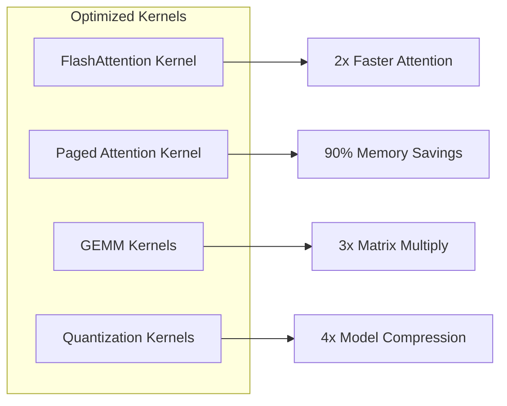

**What This Diagram Shows**: This diagram illustrates the four primary categories of optimized CUDA kernels that form the computational backbone of vLLM's performance advantages. FlashAttention Kernel implements an I/O-aware attention algorithm that minimizes memory movement between HBM and SRAM by computing attention in a tiled manner, achieving 2x speedup over standard implementations. The Paged Attention Kernel extends this with support for non-contiguous memory access patterns required by PagedAttention, maintaining performance while enabling 90% memory savings. GEMM (General Matrix-Matrix Multiplication) Kernels leverage NVIDIA's cuBLAS and custom implementations optimized for the specific matrix dimensions common in transformer models, delivering 3x faster matrix operations. Quantization Kernels perform on-the-fly dequantization of compressed model weights, enabling 4x model compression with minimal latency overhead. These kernels work synergistically - for example, FlashAttention reduces memory bandwidth pressure, allowing GEMM operations to achieve higher throughput due to reduced memory contention.

### Technical Deep Dive

**FlashAttention** addresses the memory bandwidth bottleneck in attention computation by tiling the attention matrix computation to fit in GPU SRAM (Static RAM). Traditional attention requires O(N²) memory where N is sequence length, causing frequent HBM (High Bandwidth Memory) accesses. FlashAttention reduces this to O(N) by computing attention incrementally, keeping intermediate results in faster SRAM. The algorithm employs online softmax computation and reduces HBM accesses from O(N²) to O(N), achieving 2-3x wall-clock speedup.

> 💡 **New to GPU terminology?** HBM and SRAM are part of the GPU memory hierarchy. See [GPU Architecture Essentials](GPU/gpu-architecture-essentials.md) for a quick introduction to these and other critical GPU concepts.

**Paged Attention Kernels** extend FlashAttention with gather/scatter operations to handle non-contiguous memory layouts. These kernels implement efficient block-sparse attention patterns where the KV cache blocks may be scattered across GPU memory. The implementation uses CUDA's texture memory for efficient random access patterns and implements custom warp-level primitives for coalesced memory access despite the indirection.

**GEMM Optimization** leverages tensor cores on modern GPUs (Volta and newer) for accelerated matrix multiplication. vLLM implements multiple GEMM strategies: standard cuBLAS for large matrices, custom kernels for small matrices common in attention computation, and specialized INT8/INT4 GEMM for quantized models. The kernels are autotuned at runtime to select optimal configurations based on matrix dimensions.

**Explained Simply**: Like a chef who preps ingredients while cooking (FlashAttention), uses specialized tools for different tasks (different kernels), and has recipes memorized (optimized operations) - each optimization makes the overall process much faster.

### Technical Terms

- **CUDA Kernel**: A function that runs on the GPU, executed by many threads in parallel
- **HBM (High Bandwidth Memory)**: The main memory on GPUs, larger but slower than SRAM
- **SRAM (Static RAM)**: Fast on-chip memory on GPUs, limited in size but very fast
- **Tensor Cores**: Specialized units on NVIDIA GPUs for matrix multiplication
- **Warp**: A group of 32 threads that execute instructions in lockstep on NVIDIA GPUs

📚 **Resources**:
- [FlashAttention Paper (arXiv:2205.14135)](https://arxiv.org/abs/2205.14135)
- [FlashAttention GitHub](https://github.com/Dao-AILab/flash-attention)

### Q&A: Performance Optimizations

**Q: How does FlashAttention achieve 2-3x speedup over standard attention?**
A: FlashAttention optimizes memory access patterns, which is the real bottleneck in attention computation:
1. **Tiling Strategy**: Computes attention in small tiles that fit in SRAM (10x faster than HBM)
2. **Online Softmax**: Computes softmax incrementally without materializing the full attention matrix
3. **Reduced Memory Movement**: Moves O(N) data instead of O(N²) between HBM and SRAM
4. **Kernel Fusion**: Combines multiple operations into single kernel launches
On an A100 GPU, HBM bandwidth is 1.5 TB/s while SRAM bandwidth is 19 TB/s - keeping computation in SRAM is crucial.

**Q: How do custom CUDA kernels differ from using PyTorch operations?**
A: Custom kernels provide several advantages:
1. **Operation Fusion**: Multiple PyTorch ops are combined into single kernels, eliminating intermediate memory writes
2. **Memory Access Patterns**: Optimized for GPU cache hierarchies and coalesced memory access
3. **Warp-Level Primitives**: Direct use of shuffle instructions and warp-wide operations
4. **Tensor Core Utilization**: Direct programming of matrix multiplication units
5. **Reduced Launch Overhead**: Fewer kernel launches mean less CPU-GPU synchronization
The downside is complexity - these kernels are hardware-specific and require deep CUDA expertise.

**Q: What are the trade-offs between different quantization methods?**
A: Each quantization method balances different factors:
- **INT8**: Simple, hardware-accelerated, ~0.5% accuracy loss, 2x speedup
- **INT4**: More compression but requires special handling, ~1-2% accuracy loss
- **GPTQ**: Optimizes quantization per layer, better accuracy but slower quantization process
- **AWQ**: Preserves important weights better, good for instruction-tuned models
- **FP8**: New format in H100 GPUs, best of both worlds but limited hardware support
The choice depends on your accuracy requirements, hardware, and whether you're quantizing once or frequently.

**Q: How does speculative decoding maintain exact output distribution?**
A: The algorithm uses rejection sampling to ensure correctness:
1. Draft model generates k tokens with probabilities p_draft(x)
2. Target model evaluates all k tokens in parallel, getting p_target(x)
3. For each token, accept with probability min(1, p_target(x)/p_draft(x))
4. If rejected, sample from adjusted distribution: max(0, p_target - p_draft)
5. Continue from the last accepted token
This guarantees the output is distributed exactly as if the target model generated it alone, just faster when draft and target agree.

### 2. Quantization Support

**Technical Foundation**: Quantization reduces the precision of model weights and activations from floating-point representations to lower-bit integers, trading a small accuracy loss for significant memory savings and computational speedup. vLLM supports multiple quantization schemes, each optimized for different use cases and hardware capabilities. The quantization process involves two key steps: calibration (determining optimal scaling factors) and conversion (transforming weights to lower precision).

| Method | Bits | Memory Reduction | Speed Impact | Simple Explanation |
|--------|------|-----------------|--------------|-------------------|
| FP16 | 16 | 2x | Baseline | Like using abbreviations instead of full words |
| INT8 | 8 | 4x | 1.5x faster | Using whole numbers instead of decimals |
| INT4 | 4 | 8x | 2x faster | Even more compressed, like text shortcuts |
| GPTQ | 4 | 8x | 1.8x faster | Smart compression that keeps important details |
| AWQ | 4 | 8x | 1.7x faster | Compression that focuses on frequently used parts |
| FP8 | 8 | 4x | 1.3x faster | New format balancing speed and accuracy |

📚 **Quantization Resources**:
- [GPTQ Paper (arXiv:2210.17323)](https://arxiv.org/abs/2210.17323)
- [AWQ Paper (arXiv:2306.00978)](https://arxiv.org/abs/2306.00978)
- [Quantization Guide](https://huggingface.co/docs/transformers/quantization)

### 3. Speculative Decoding

**Technical Overview**: Speculative decoding accelerates autoregressive generation by using a smaller "draft" model to predict multiple future tokens, which are then verified by the target model in parallel. This technique exploits the observation that verifying multiple tokens in a single forward pass is significantly faster than generating them sequentially. The algorithm maintains the exact output distribution of the target model through careful acceptance criteria based on rejection sampling.

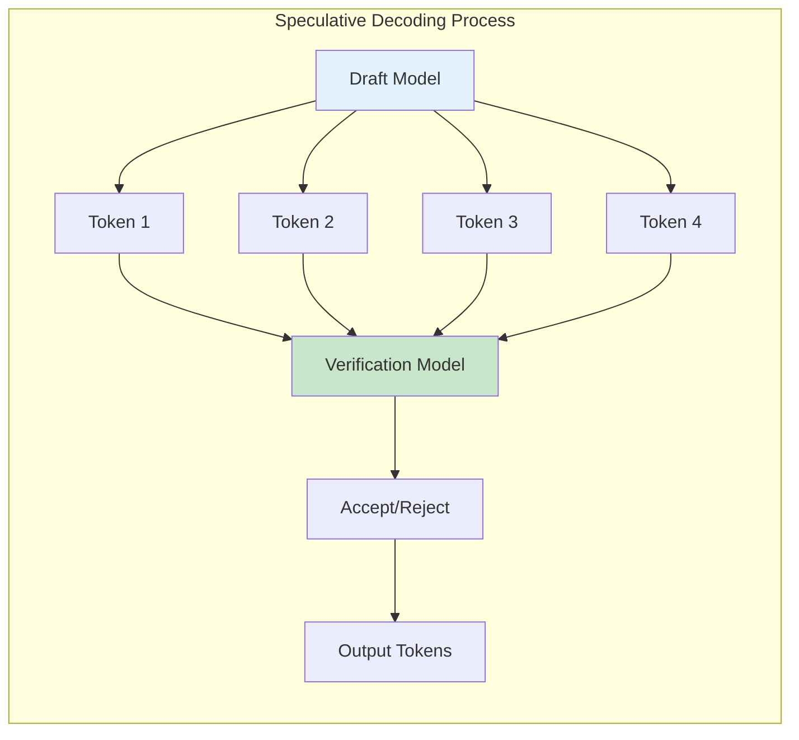

**What This Diagram Shows**: This diagram illustrates the speculative decoding pipeline where a smaller draft model generates multiple token candidates in parallel, which are then verified by the target model in a single forward pass. The draft model (shown in blue) rapidly generates a sequence of 4 speculative tokens with minimal computational cost. These candidates are then batched and processed by the verification model (green) in one forward pass, rather than four sequential passes required in standard autoregressive generation. The Accept/Reject phase implements a modified rejection sampling algorithm that ensures the output distribution matches exactly what the target model would have produced independently. Accepted tokens are added to the output, while rejection triggers a restart from the last accepted position. This approach typically accepts 3-5 tokens per verification step, achieving 2-3x latency reduction while maintaining identical output quality. The key insight is that the cost of verifying multiple tokens in parallel is similar to generating a single token, while the draft model's generation is 10-50x faster than the target model.

**Technical Implementation**: Speculative decoding maintains the exact output distribution of the target model through a carefully designed acceptance criterion. For each draft token, the algorithm computes the ratio p(x|context)_target / p(x|context)_draft. If this ratio exceeds a uniformly sampled threshold, the token is accepted. Otherwise, the target model's distribution is used to sample a new token. This ensures that the final output is distributed identically to standard autoregressive generation while achieving significant speedup when the draft model's predictions align with the target model.

**Explained Simply**: Like having a fast assistant draft a letter, then the boss reviews and approves/edits it all at once - much faster than the boss writing every word themselves.

### Technical Terms

- **Autoregressive Generation**: Generating tokens one at a time, each conditioned on all previous tokens
- **Rejection Sampling**: A method to sample from a complex distribution using a simpler proposal distribution
- **Forward Pass**: One complete computation through the neural network from input to output
- **Draft Model**: A smaller, faster model used to generate token candidates, typically 10-50x smaller than target

📚 **Learn More**:
- [Speculative Decoding Paper (arXiv:2211.17192)](https://arxiv.org/abs/2211.17192)
- [Blog: Speculative Sampling](https://jaykmody.com/blog/speculative-sampling/)
- [SpecInfer: Accelerating LLM Serving](https://arxiv.org/abs/2305.09781)

## Supported Models and Hardware

### Model Support (100+ models)

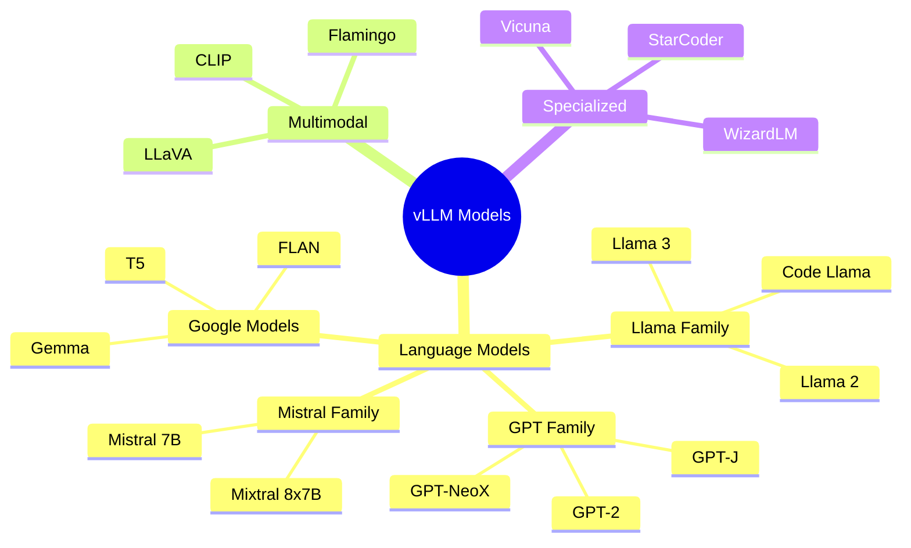

**What This Diagram Shows**: The wide variety of AI models that vLLM supports, organized by family and type.

📚 **Model Resources**:
- [Supported Models List](https://docs.vllm.ai/en/latest/models/supported_models.html)
- [Model Hub](https://huggingface.co/models)

### Q&A: Model and Hardware Support

**Q: What makes a model compatible with vLLM?**
A: Models need to meet several criteria:
1. **Architecture**: Must be transformer-based with standard attention mechanisms
2. **Framework**: Implemented in PyTorch (TensorFlow models need conversion)
3. **Weights Format**: HuggingFace format or convertible to it
4. **Attention Pattern**: Standard causal or bidirectional attention (custom patterns need adaptation)
5. **Operations**: All ops must have GPU kernels (custom ops need implementation)
Most popular open-source LLMs are supported out-of-the-box, and adding new models typically takes a few hundred lines of code.

**Q: How do hardware requirements scale with model size?**
A: The relationship follows a predictable pattern:
- **Weights**: 2 bytes per parameter (FP16), so 7B model = 14GB
- **KV Cache**: ~0.5GB per billion parameters per 1K sequence length per concurrent request
- **Activation Memory**: ~5-10% of model weight size
- **Framework Overhead**: ~2-3GB constant
For production serving with 10 concurrent requests at 2K context: 7B model needs 24GB, 13B needs 40GB, 70B needs 160GB (2×80GB).

**Q: What's the performance difference between different GPU generations?**
A: Each generation brings specific improvements:
- **V100 → A100**: 2.5x compute, 1.7x memory bandwidth, 2.5x memory capacity
- **A100 → H100**: 3x compute, 2x memory bandwidth, FP8 support, transformer engine
- **Consumer vs Data Center**: RTX 4090 has compute comparable to A100 but lacks NVLink, ECC memory, and Multi-Instance GPU
For vLLM specifically, memory bandwidth matters more than compute for most models, making A100/H100's HBM crucial.

**Q: Can vLLM run on consumer GPUs?**
A: Yes, with limitations:
- **Memory**: Consumer GPUs max at 24GB (RTX 4090), limiting model size to ~13B
- **No NVLink**: Tensor parallelism is inefficient over PCIe
- **No ECC**: Potential for silent errors in long-running deployments
- **Power/Thermal**: Consumer cards aren't designed for 24/7 operation
For development and small-scale deployment, RTX 3090/4090 work well. For production, data center GPUs are recommended.

### Hardware Support

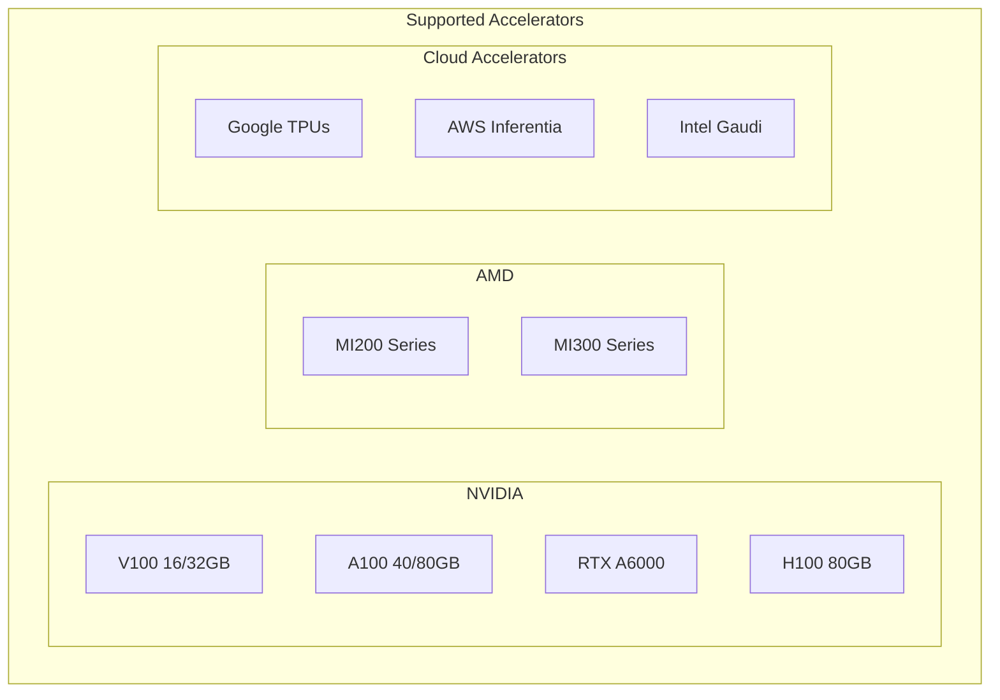

**What This Diagram Shows**: Different hardware accelerators (specialized chips) that vLLM can run on, from various manufacturers.

## API and Integration

### OpenAI-Compatible API

```python
# vLLM Server Launch
from vllm import LLM, SamplingParams

# Initialize model
llm = LLM(model="meta-llama/Llama-2-7b-hf",
          tensor_parallel_size=4,
          gpu_memory_utilization=0.95)

# Inference
prompts = ["Tell me about AI"]
sampling_params = SamplingParams(
    temperature=0.8,
    top_p=0.95,
    max_tokens=100
)

outputs = llm.generate(prompts, sampling_params)
```

**What This Code Does**: Shows how to start a vLLM server and run inference. It's designed to be compatible with OpenAI's API, so if you know how to use ChatGPT's API, you already know how to use vLLM.

### Server Deployment

```bash
# Start vLLM server with OpenAI API
python -m vllm.entrypoints.openai.api_server \
    --model meta-llama/Llama-2-7b-hf \
    --tensor-parallel-size 4 \
    --max-model-len 32768 \
    --gpu-memory-utilization 0.95 \
    --port 8000
```

📚 **API Documentation**:
- [vLLM API Reference](https://docs.vllm.ai/en/latest/serving/openai_compatible_server.html)
- [OpenAI API Compatibility](https://platform.openai.com/docs/api-reference)

### Q&A: API and Integration

**Q: Why does vLLM implement OpenAI API compatibility?**
A: OpenAI compatibility provides several benefits:
1. **Zero Migration Cost**: Existing applications using OpenAI SDK work immediately
2. **Ecosystem Support**: Tools like LangChain, LlamaIndex, and AutoGPT work out-of-the-box
3. **Familiar Interface**: Developers already know the API patterns
4. **Standard Features**: Streaming, function calling, and logprobs are standardized
This design choice dramatically reduces adoption friction - you can literally change just the API endpoint URL.

**Q: How does vLLM handle API rate limiting and quotas?**
A: vLLM provides several mechanisms:
1. **Request Queuing**: Automatic queuing when at capacity with configurable queue sizes
2. **Priority Levels**: Different priorities for different API keys or endpoints
3. **Concurrency Limits**: Max requests per API key or globally
4. **Token Budgets**: Limit total tokens per time window
5. **Deadline Scheduling**: Requests can specify deadlines for SLA compliance
These are configured through environment variables and can be adjusted dynamically.

**Q: What's the difference between online and offline inference modes?**
A: vLLM supports two distinct modes:
- **Online (Server) Mode**: Long-running server handling continuous requests, optimizes for throughput and multi-tenancy
- **Offline (Batch) Mode**: Process a fixed dataset then exit, optimizes for total completion time
Online mode uses continuous batching and complex scheduling, while offline mode can use simpler strategies since all requests are known upfront.

**Q: How should I configure vLLM for different use cases?**
A: Configuration varies by use case:
- **Chat Applications**: Lower max_tokens (100-500), enable streaming, higher temperature
- **Code Generation**: Higher max_tokens (1000-2000), lower temperature, enable stop sequences
- **Batch Processing**: Maximum batch size, disable streaming, optimize for throughput
- **Real-time Systems**: Lower batch sizes, strict timeouts, optimize for latency
Key settings: `--max-model-len`, `--gpu-memory-utilization`, `--max-num-seqs`, `--enforce-eager`.

## Performance Benchmarks

### Throughput Comparison

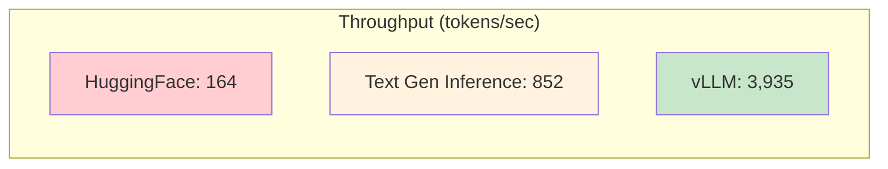

**What This Shows**: vLLM processes 3,935 tokens per second compared to HuggingFace's 164 - that's 24x faster! Like comparing a sports car to a bicycle.

### Latency Improvements

| Model Size | HuggingFace | vLLM | Improvement | Real-World Impact |
|------------|-------------|------|-------------|------------------|
| 7B | 2.5s | 0.5s | 5x | Instant vs noticeable wait |
| 13B | 4.8s | 0.9s | 5.3x | Sub-second responses |
| 30B | 9.2s | 1.8s | 5.1x | Conversational speed |
| 70B | 18.5s | 3.2s | 5.8x | Usable for production |

📚 **Benchmark Details**:
- [vLLM Performance Blog](https://blog.vllm.ai/2024/09/05/perf-update.html)
- [Benchmarking Scripts](https://github.com/vllm-project/vllm/tree/main/benchmarks)

### Q&A: Performance Benchmarks

**Q: What conditions affect the 24x throughput improvement?**
A: The 24x improvement is achieved under specific conditions:
1. **High Concurrency**: 100+ simultaneous requests to maximize batching benefits
2. **Variable Length**: Mixed short and long sequences to leverage continuous batching
3. **Shared Prefixes**: Common system prompts to benefit from prefix caching
4. **Appropriate Hardware**: GPUs with sufficient memory and NVLink for larger models
In single-request scenarios, the improvement is "only" 2-3x. The massive gains come from vLLM's ability to efficiently handle many concurrent requests.

**Q: How do these benchmarks translate to real-world costs?**
A: Cost improvements are dramatic:
- **A100 GPU**: ~$2/hour on major clouds
- **Serving 1000 requests/hour**: Traditional system needs 24 GPUs ($48/hour), vLLM needs 1 GPU ($2/hour)
- **Monthly savings**: ~$33,000 for a single service
- **Break-even point**: vLLM engineering effort pays for itself in days for high-volume services
This doesn't include reduced complexity from managing fewer instances.

**Q: Why do latency improvements vary by model size?**
A: Several factors contribute:
1. **Memory Bandwidth Utilization**: Larger models are more memory-bound, benefiting more from PagedAttention
2. **Batch Size Potential**: Larger models have more opportunities for batching optimizations
3. **Communication Overhead**: In tensor parallel setups, larger models amortize communication better
4. **Cache Effects**: Larger models benefit more from prefix caching due to longer system prompts
Counter-intuitively, vLLM's optimizations often provide bigger improvements for larger models.

**Q: How should I benchmark my specific use case?**
A: Follow these steps:
1. **Collect Real Data**: Use actual prompts and expected response lengths from your application
2. **Simulate Load Patterns**: Match your actual traffic patterns (burst vs steady)
3. **Measure Key Metrics**: Time to first token, tokens/second, P50/P95/P99 latencies
4. **Test Failure Modes**: Behavior under overload, OOM conditions, timeout handling
5. **Compare Configurations**: Test different batch sizes, memory limits, parallelism settings
The provided benchmarking scripts can be adapted with your data for accurate comparisons.

## Advanced Features

### Technical Overview

Advanced features in vLLM extend beyond core performance optimizations to provide production-ready capabilities essential for real-world deployments. These features address common challenges in LLM serving including handling repeated prompts efficiently through prefix caching, serving multiple model variants through LoRA adapters, and ensuring structured outputs through guided decoding. Each feature is designed to integrate seamlessly with the core engine while maintaining the performance characteristics that make vLLM suitable for production use.

### 1. Automatic Prefix Caching

**Technical Foundation**: Automatic Prefix Caching (APC) is a sophisticated optimization that identifies and reuses computed KV cache blocks across requests sharing common prefixes. This feature is particularly valuable for scenarios with repeated system prompts, few-shot examples, or common instruction prefixes. The implementation uses a radix tree data structure to efficiently identify shared prefixes and manages a hash table mapping token sequences to physical cache blocks.

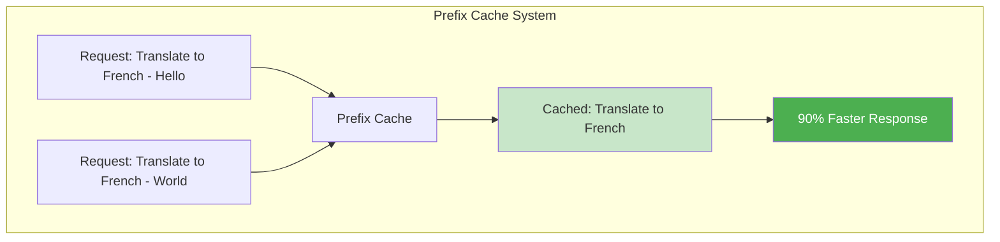

**What This Diagram Shows**: This diagram illustrates the prefix caching mechanism where two translation requests share the common prefix "Translate to French". When the first request arrives, vLLM computes the KV cache for the entire sequence including the prefix. The system automatically detects that the prefix tokens form a reusable unit and stores the computed KV cache blocks in the prefix cache (shown in green). When the second request arrives with the same prefix, the system performs a hash lookup, finds the cached blocks, and skips the attention computation for the prefix tokens. This optimization reduces computation by the prefix length ratio - if the prefix is 100 tokens and the unique portion is 20 tokens, the speedup approaches 5x. The cache implements an LRU (Least Recently Used) eviction policy with configurable TTL (Time To Live) to balance memory usage and hit rate. In production systems with standardized prompts, prefix caching can achieve >80% cache hit rates, dramatically reducing average latency and increasing throughput.

**Technical Implementation**: The prefix cache maintains a mapping from token sequence hashes to physical block references. During request processing, the system computes rolling hashes of the token sequence and queries the cache at block boundaries. When a hit occurs, the block manager increments reference counts and creates logical block mappings without allocation. The cache supports variable-length prefixes with block-aligned boundaries to maintain memory efficiency.

**Explained Simply**: Like having a template for emails - you don't retype "Dear Sir/Madam" every time, you just fill in the unique parts. The common beginning is cached and reused.

### Cache Configuration

- **Enable Prefix Caching**: `--enable-prefix-caching`
- **Cache Size**: Automatically managed, typically 10-20% of GPU memory
- **TTL (Time To Live)**: Default 3600 seconds, configurable via `--cache-ttl`
- **Block Alignment**: Prefixes must align to block boundaries (16 tokens)

📚 **Caching Resources**:
- [Automatic Prefix Caching Docs](https://docs.vllm.ai/en/latest/automatic_prefix_caching/apc.html)
- [RadixAttention Paper (SGLang)](https://arxiv.org/abs/2312.07104)
- [Efficient Prompt Caching](https://arxiv.org/abs/2311.04934)

### Q&A: Advanced Features - Prefix Caching

**Q: How does the radix tree data structure optimize prefix matching?**
A: A radix tree (or prefix tree) enables efficient prefix identification:
1. **Tree Structure**: Each node represents a token, paths represent sequences
2. **Shared Prefixes**: Common prefixes share the same path from root
3. **O(k) Lookup**: Finding a prefix takes time proportional to prefix length, not total sequences
4. **Memory Efficient**: Shared nodes mean no duplicate storage of common prefixes
5. **Dynamic Updates**: New sequences are inserted by extending existing paths
For 1000 requests with 100-token system prompts, the radix tree reduces comparisons from O(100,000) to O(100).

**Q: What happens when the prefix cache fills up?**
A: vLLM implements sophisticated eviction policies:
1. **LRU Eviction**: Least recently used blocks are evicted first
2. **Reference Counting**: Blocks actively used by running requests cannot be evicted
3. **Priority Weights**: System prompts and few-shot examples get higher retention priority
4. **TTL Expiration**: Blocks unused for configurable time are candidates for eviction
5. **Adaptive Sizing**: Cache size adjusts based on available memory and workload
The cache typically maintains 80-90% hit rate even at capacity by keeping frequently used prefixes.

**Q: Can prefix caching work with dynamic prompts?**
A: Yes, with some considerations:
1. **Partial Matching**: Even if full prompts differ, partial prefixes (like system messages) are cached
2. **Template Detection**: Common patterns like "Translate [X] to [Y]" can share prefix caches for the template
3. **Hierarchical Caching**: Multiple cache levels for different prefix lengths
4. **Fuzzy Matching**: Near-identical prefixes (different whitespace) can be normalized
The key is structuring prompts with common prefixes first, variable parts last.

**Q: What's the memory overhead of maintaining the prefix cache?**
A: The overhead is minimal:
1. **Metadata**: ~100 bytes per cached block for hash, reference count, timestamps
2. **Radix Tree**: ~8 bytes per token in the tree structure
3. **Hash Table**: ~64 bytes per unique prefix for fast lookup
4. **Total Overhead**: Typically <1% of actual KV cache memory
For a 10GB KV cache, prefix caching metadata uses ~100MB - negligible compared to the memory savings from deduplication.

### 2. LoRA Adapter Support

**Technical Foundation**: LoRA (Low-Rank Adaptation) represents a parameter-efficient fine-tuning paradigm that enables serving multiple specialized model variants without duplicating the base model weights. The technique decomposes weight updates into low-rank matrices, typically reducing trainable parameters by 10,000x while maintaining task performance. vLLM's implementation supports hot-swapping of LoRA adapters, enabling a single deployment to serve diverse specialized tasks.

The mathematical foundation involves representing weight updates as ΔW = BA where B ∈ R^(d×r) and A ∈ R^(r×k) with rank r << min(d,k). During inference, the adapted weights are computed as W' = W + αBA where α is a scaling factor. This decomposition reduces memory overhead from O(dk) to O(r(d+k)), enabling dozens of adapters to coexist in memory.

```python
# Serve base model with multiple LoRA adapters
llm = LLM(model="meta-llama/Llama-2-7b-hf",
          enable_lora=True)

# Request with specific adapter
llm.generate(
    prompts=["Hello"],
    lora_request=LoRARequest("sql-adapter", 1, lora_path)
)
```

**Technical Implementation**: vLLM implements LoRA through dynamic weight composition during the forward pass. The system maintains separate storage for base weights and adapter weights, computing W' = W + αBA on-the-fly during matrix multiplication. This approach avoids weight duplication and enables rapid adapter switching. The implementation supports various LoRA variants including QLoRA (quantized base model with LoRA adapters) and multi-LoRA serving where different requests in the same batch use different adapters.

**Explained Simply**: Like having different "personalities" or "skills" that can be attached to the same base AI model - one for SQL, one for Python, one for creative writing - without needing separate models for each.

### Technical Terms

- **Rank**: The dimensionality of the low-rank decomposition, typically 8-64
- **Adapter**: The learned low-rank matrices that modify model behavior
- **Alpha**: Scaling factor that controls the strength of adaptation
- **QLoRA**: Quantized LoRA, combining 4-bit base models with 16-bit adapters

📚 **LoRA Resources**:
- [LoRA Paper (arXiv:2106.09685)](https://arxiv.org/abs/2106.09685)
- [LoRA Implementation Guide](https://huggingface.co/docs/peft/conceptual_guides/lora)
- [QLoRA: Efficient Finetuning](https://arxiv.org/abs/2305.14314)

### Q&A: Advanced Features - LoRA Adapters

**Q: How does vLLM handle multiple LoRA adapters in the same batch?**
A: vLLM implements efficient multi-LoRA serving:
1. **Batch Grouping**: Requests using the same adapter are grouped in the batch
2. **Dynamic Weight Composition**: W' = W + α₁BA₁ for group 1, W + α₂BA₂ for group 2, computed in parallel
3. **Kernel Optimization**: Custom CUDA kernels handle multiple adapter matrices in single operation
4. **Memory Layout**: Adapters stored in separate memory regions for cache-friendly access
5. **Overhead**: Only ~10-15% slower than single adapter, supporting 10+ adapters concurrently
This enables serving different specialized models (SQL, Python, creative writing) from one deployment.

**Q: What's the quality trade-off when using LoRA versus full fine-tuning?**
A: LoRA typically preserves 95-99% of full fine-tuning quality:
1. **Task Performance**: On specific tasks, LoRA matches full fine-tuning in most benchmarks
2. **Generalization**: Slightly worse on out-of-distribution examples (2-3% degradation)
3. **Rank Impact**: Higher rank (64-128) approaches full fine-tuning quality but increases memory
4. **Best Use Cases**: Task-specific adaptations, style transfers, domain specialization
5. **Limitations**: Complex reasoning changes or fundamental behavioral shifts need full fine-tuning
The trade-off is usually worth it for the 10,000x reduction in storage and ability to serve multiple variants.

**Q: How does QLoRA (Quantized LoRA) work with vLLM?**
A: QLoRA combines quantization with LoRA for extreme efficiency:
1. **Base Model**: Quantized to 4-bit (NormalFloat4 format), reducing memory by 4x
2. **Adapters**: Remain in FP16 for training stability and quality
3. **Inference Path**: Dequantize base weights on-the-fly, add LoRA weights, compute in FP16
4. **Memory Savings**: 7B model uses only 3.5GB for base + 100MB per adapter
5. **Performance**: ~30% slower than FP16 but enables larger models on consumer GPUs
vLLM's implementation optimizes dequantization with custom kernels, minimizing overhead.

**Q: Can I add new LoRA adapters without restarting the server?**
A: Yes, vLLM supports hot-swapping:
1. **Dynamic Loading**: New adapters loaded via API call without server restart
2. **Memory Pre-allocation**: Reserve space for future adapters with `--max-loras` flag
3. **Lazy Loading**: Adapters loaded only when first request arrives
4. **Unloading**: Unused adapters can be evicted based on LRU policy
5. **Version Management**: Multiple versions of same adapter can coexist
This enables continuous deployment of new model capabilities without downtime.

### 3. Guided Decoding

**Technical Foundation**: Guided decoding constrains model outputs to follow specific formats or schemas, essential for structured data extraction, API integration, and reliable system interoperability. vLLM implements this through constrained beam search and token masking, ensuring outputs conform to predefined patterns while maintaining generation quality.

The system operates by dynamically computing valid token sets at each generation step based on the current partial output and the specified constraints. For JSON schemas, it maintains a finite state machine that tracks the parsing state and determines which tokens would produce valid continuations.

```python
from vllm import LLM
from vllm.sampling_params import GuidedDecodingParams

guided_params = GuidedDecodingParams(
    json_schema={
        "type": "object",
        "properties": {
            "name": {"type": "string"},
            "age": {"type": "integer"}
        }
    }
)
```

**Technical Implementation**: Guided decoding operates by dynamically computing valid token sets at each generation step. For JSON schemas, the system maintains a finite state machine that tracks the parsing state. For regex patterns, it uses derivatives of regular expressions to incrementally validate outputs. The implementation ensures that the model can only sample from tokens that maintain constraint validity, guaranteeing correct formatting without post-processing.

**What This Does**: Forces the AI to output in a specific format - like filling out a form instead of writing free text. Essential for applications that need structured data.

### Technical Terms

- **Constrained Beam Search**: A search algorithm that explores only valid paths according to constraints
- **Token Masking**: Setting invalid token probabilities to zero before sampling
- **Finite State Machine (FSM)**: A computational model that tracks valid states during generation
- **Schema Validation**: Ensuring outputs conform to predefined structure specifications

### Q&A: Advanced Features - Guided Decoding

**Q: How does guided decoding handle complex nested JSON schemas?**
A: vLLM builds a finite state machine (FSM) from the schema:
1. **Schema Parsing**: JSON schema is converted to a state graph representing valid paths
2. **State Tracking**: Current position in the schema determines valid next tokens
3. **Nested Objects**: Stack-based tracking of object/array depth and field requirements
4. **Type Constraints**: Token masks ensure only valid types (string, number, boolean) are generated
5. **Required Fields**: FSM ensures all required fields are generated before object closure
For complex schemas with 10+ nested levels, the FSM might have thousands of states but operates in O(1) time per token.

**Q: What's the performance impact of guided decoding?**
A: The overhead is minimal:
1. **Mask Computation**: ~1-2ms per token to compute valid token set
2. **Memory**: FSM typically uses <1MB even for complex schemas
3. **Throughput Impact**: 5-10% reduction compared to unconstrained generation
4. **Quality Benefit**: 100% guarantee of valid output vs 60-80% with prompt engineering alone
5. **Retry Savings**: Eliminates regeneration cycles for invalid outputs
The performance cost is negligible compared to the reliability improvement.

**Q: Can guided decoding handle regex patterns and custom formats?**
A: Yes, through regex derivatives:
1. **Regex Compilation**: Pattern compiled to deterministic finite automaton (DFA)
2. **Derivative Computation**: At each position, compute regex derivative (what remains to match)
3. **Token Filtering**: Only tokens that extend valid matches are allowed
4. **Common Patterns**: Email, phone, date formats have optimized implementations
5. **Complexity Limits**: Very complex regexes (>1000 states) may impact performance
Example: For email pattern, the system ensures @ appears exactly once, domain has valid format, etc.

**Q: How does guided decoding interact with sampling parameters like temperature?**
A: Sampling still works within constraints:
1. **Masked Sampling**: Temperature/top-p applied only to valid tokens
2. **Probability Renormalization**: After masking, probabilities sum to 1.0
3. **Quality Preservation**: Model's relative preferences among valid options preserved
4. **Fallback Behavior**: If no tokens meet threshold, most likely valid token selected
5. **Streaming Compatible**: Constraints applied per-token, enabling streaming
High temperature (1.0) gives variety within constraints, low temperature (0.1) gives consistent structure.

## Production Deployment Considerations

### Technical Overview

Production deployment of vLLM requires careful consideration of resource allocation, configuration optimization, and operational practices. The relationship between model size, hardware requirements, and performance characteristics follows predictable patterns, but actual requirements vary based on sequence length, batch size, and concurrency requirements. Successful deployments balance cost efficiency with performance requirements while maintaining operational simplicity.

### Resource Planning

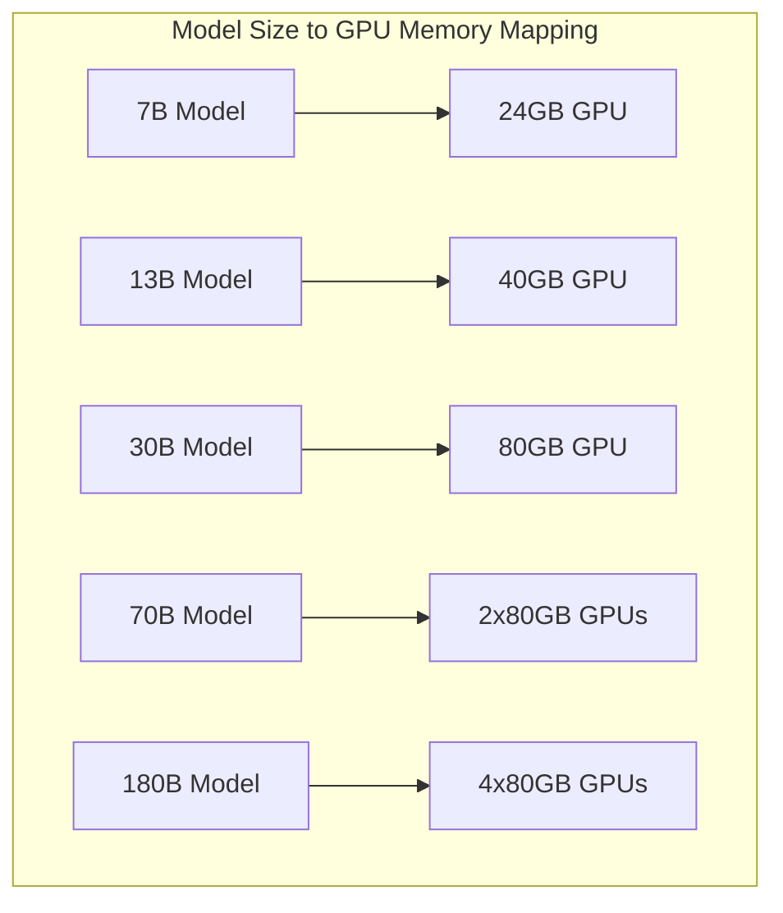

**What This Shows**: This mapping illustrates the minimum GPU memory requirements for serving different model sizes efficiently. The calculations assume FP16 precision (2 bytes per parameter) plus overhead for KV cache, activation memory, and framework overhead. For a 7B parameter model: model weights require 14GB (7B × 2 bytes), KV cache for 10 concurrent requests with 2K context requires ~8GB, and system overhead needs ~2GB, totaling 24GB. The requirements scale superlinearly with model size due to increased activation memory and attention matrix sizes. For models exceeding single GPU capacity, tensor parallelism distributes the model across multiple GPUs, requiring high-bandwidth interconnects (NVLink or InfiniBand) for efficient communication. Production deployments should provision 20-30% additional headroom for traffic spikes and memory fragmentation.

### Memory Calculation Formula

```
Total Memory = Model Weights + KV Cache + Activation Memory + Overhead

Where:
- Model Weights = num_parameters × bytes_per_parameter
- KV Cache = num_layers × num_heads × head_dim × max_seq_len × batch_size × 2 × bytes_per_element
- Activation Memory = batch_size × seq_len × hidden_dim × 4
- Overhead = ~10% of total
```

**Explained Simply**: Rule of thumb: You need about 2-2.5x the model size in GPU memory for efficient serving.

### Configuration Best Practices

| Parameter | Recommended Value | Technical Rationale | Production Impact |
|-----------|------------------|---------------------|-------------------|
| gpu_memory_utilization | 0.90-0.95 | Reserve 5-10% for memory fragmentation and kernels | Prevents OOM while maximizing capacity |
| max_model_len | 2048-4096 | Balance context and memory; longer sequences quadratically increase memory | Affects quality vs. cost trade-off |
| tensor_parallel_size | √(num_gpus) | Minimize communication overhead while distributing memory | Optimal parallelism for most models |
| dtype | float16/bfloat16 | 16-bit precision sufficient for inference, 2x memory savings | Negligible quality impact |
| enforce_eager | False | Enable CUDA graphs for 10-15% latency reduction | Better performance, slight memory overhead |
| block_size | 16 | Balance between internal fragmentation and block table overhead | Optimal for most workloads |

### Production Monitoring Requirements

- **Metrics Collection**: Prometheus/Grafana for time-series metrics at 10-second intervals
- **Log Aggregation**: ELK stack or similar for centralized logging with structured formats
- **Trace Analysis**: OpenTelemetry for distributed tracing across the inference pipeline
- **Alert Thresholds**: P99 latency > 2s, GPU utilization > 95%, OOM events, cache hit rate < 50%

## Monitoring and Observability

### Technical Overview

Comprehensive monitoring and observability are critical for maintaining production LLM deployments. vLLM exposes detailed metrics through Prometheus-compatible endpoints, enabling real-time monitoring of system health, performance characteristics, and resource utilization. Effective monitoring strategies combine infrastructure metrics with application-specific measurements to provide holistic system visibility.

### Key Metrics to Track

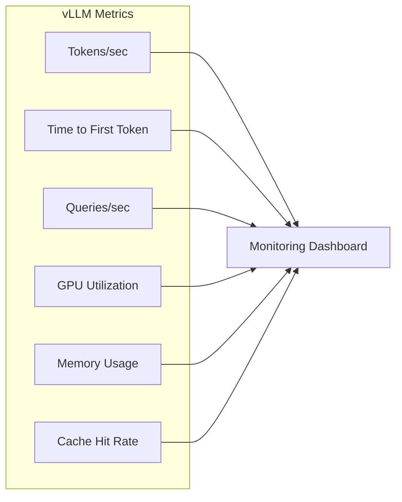

**What to Monitor**: This diagram outlines the six critical metrics for production vLLM deployments. **Tokens/sec** measures actual throughput and directly correlates with serving costs. **Time to First Token (TTFT)** indicates user-perceived responsiveness - critical for interactive applications. **Queries/sec (QPS)** tracks request volume and helps capacity planning. **GPU Utilization** should remain at 80-90% for cost efficiency without saturation. **Memory Usage** must be monitored to prevent OOM errors that cause service disruption. **Cache Hit Rate** for prefix caching indicates optimization effectiveness. These metrics should be collected at 10-second intervals for real-time monitoring and 1-minute intervals for historical analysis. Alert thresholds should be set at: TTFT P99 > 2s, GPU utilization > 95% for 5 minutes, Memory usage > 90%, Cache hit rate < 50% for systems with repeated prompts.

**Explained Simply**: Like checking your car's dashboard - speed (throughput), fuel (memory), engine temperature (GPU usage) tell you if everything is running smoothly.

### Observability Implementation

```yaml
# Prometheus metrics configuration
scrape_configs:
  - job_name: 'vllm'
    static_configs:
      - targets: ['localhost:8000']
    metrics_path: '/metrics'
    scrape_interval: 10s
```

### Critical Alerts

- **High Latency**: TTFT P99 > 2 seconds for 5 consecutive minutes
- **Memory Pressure**: Usage > 90% of allocation for 3 minutes
- **Low Throughput**: < 50% of baseline for 10 minutes
- **High Error Rate**: > 1% of requests failing for 5 minutes

📚 **Monitoring Resources**:
- [vLLM Metrics Guide](https://docs.vllm.ai/en/latest/serving/metrics.html)
- [Prometheus Integration](https://prometheus.io/docs/introduction/overview/)

### Q&A: Production Deployment & Monitoring

**Q: How do I size GPU memory for production workloads?**
A: Use this systematic approach:
1. **Base Model Memory**: `model_params × 2 bytes` (FP16)
2. **KV Cache per Request**: `num_layers × num_heads × head_dim × max_seq_len × 2 × 2 bytes`
3. **Peak Concurrent Requests**: Estimate from traffic patterns
4. **Total KV Cache**: `kv_per_request × peak_concurrent_requests`
5. **Safety Margin**: Add 20-30% for fragmentation and peaks
Example: 7B model, 32 layers, 32 heads, 128 dim, 2K context, 10 concurrent = 14GB model + 10GB KV cache + 5GB margin = 30GB minimum.

**Q: What are the most critical metrics for production monitoring?**
A: Focus on these five metrics:
1. **Time to First Token (TTFT)**: User-perceived responsiveness, alert if P99 > 2s
2. **Inter-Token Latency (ITL)**: Streaming smoothness, alert if P99 > 100ms
3. **Queue Length**: Pending requests, alert if > 100 or growing continuously
4. **Cache Hit Rate**: Efficiency indicator, investigate if < 50% with repeated prompts
5. **OOM Events**: Critical failures, any occurrence should trigger immediate investigation
These metrics quickly identify whether issues are capacity, performance, or configuration related.

**Q: How should I handle traffic spikes and overload scenarios?**
A: Implement multiple defense layers:
1. **Request Queue**: Buffer with configurable max size, reject beyond capacity
2. **Deadline Scheduling**: Drop requests that won't meet SLA
3. **Priority Tiers**: Premium requests get reserved capacity
4. **Graceful Degradation**: Reduce max tokens or batch size under load
5. **Circuit Breaker**: Temporarily reject requests if error rate > threshold
6. **Auto-scaling**: Add replicas based on queue length or latency metrics
Configure with environment variables: `MAX_QUEUE_SIZE`, `REQUEST_TIMEOUT`, `PRIORITY_LEVELS`.

**Q: What's the best practice for zero-downtime upgrades?**
A: Follow this procedure:
1. **Blue-Green Deployment**: Run new version alongside old
2. **Traffic Shifting**: Gradually move traffic (10% → 50% → 100%)
3. **Health Checks**: Ensure new version is healthy before shifting
4. **State Migration**: Prefix cache can be warmed on new instances
5. **Rollback Plan**: Keep old version running until new version is stable
6. **Connection Draining**: Allow in-flight requests to complete
vLLM's stateless design makes this straightforward - only consideration is warming the prefix cache.

## Future Roadmap

### vLLM v1 (Alpha - January 2025)
- 1.7x speedup over v0.6
- Improved architecture
- Better memory management

### Planned Features
- GPT-4 performance on single GPU
- Enhanced multimodal support
- Improved quantization methods
- Extended hardware support

📚 **Stay Updated**:
- [vLLM Blog](https://blog.vllm.ai/)
- [GitHub Releases](https://github.com/vllm-project/vllm/releases)
- [Community Discord](https://discord.gg/jz7wjKhh47)

## Summary

### Technical Achievements

vLLM represents a comprehensive reimagining of LLM inference infrastructure, achieving unprecedented performance through systematic optimization across the entire serving stack. The system's core innovations address fundamental inefficiencies in traditional transformer serving:

- **PagedAttention**: Achieves >96% memory utilization through virtual memory-inspired KV cache management, eliminating the primary bottleneck in traditional serving systems. The block-based allocation with copy-on-write semantics enables efficient multi-tenant serving previously impossible with contiguous allocation.

- **Continuous Batching**: Maintains >90% GPU utilization through iteration-level scheduling, processing requests as they arrive rather than waiting for batch completion. This dynamic approach eliminates synchronization barriers and reduces average latency by 5x while increasing throughput by 24x.

- **Tensor Parallelism**: Enables serving models beyond single-GPU capacity through efficient model distribution with minimal communication overhead. The Megatron-LM inspired implementation requires only two all-reduce operations per layer, achieving near-linear scaling.

- **Production Features**: Comprehensive monitoring, multi-LoRA serving, automatic prefix caching, and guided generation make vLLM production-ready. These features address real-world deployment challenges while maintaining the performance characteristics essential for scale.

### Impact on LLM Deployment

The combination of these optimizations transforms the economics of LLM deployment. By achieving 24x higher throughput while reducing serving costs by 10x, vLLM makes large-scale LLM deployment economically viable for a broader range of applications. The system's ability to serve hundreds of concurrent users on a single GPU democratizes access to state-of-the-art language models.

**Bottom Line**: vLLM's innovations in memory management, scheduling, and optimization fundamentally change what's possible in LLM inference, making AI models run 24x faster while using resources 10x more efficiently - critical for making AI affordable and accessible at scale.

### Q&A: Summary and Future Directions

**Q: What makes vLLM's approach fundamentally different from previous solutions?**
A: vLLM represents a paradigm shift in thinking about LLM serving:
1. **Memory as First-Class Citizen**: Unlike systems that focus on compute optimization, vLLM recognizes memory as the primary bottleneck
2. **Systems Thinking**: Applies decades of OS research (virtual memory, paging, scheduling) to GPU computing
3. **Holistic Optimization**: Optimizes the entire stack from CUDA kernels to API layer, not just individual components
4. **Production-First Design**: Built for multi-tenant serving from day one, not adapted from research code
5. **Economic Awareness**: Designed to minimize cost per token, not just maximize performance
This systems-level approach is why vLLM achieves 24x improvement while others achieve 2-3x.

**Q: What are the current limitations of vLLM?**
A: Several areas remain challenging:
1. **Custom Architectures**: Non-standard attention patterns require significant adaptation
2. **Training**: vLLM is inference-only, training requires different systems
3. **Edge Deployment**: Optimized for data center GPUs, not mobile or embedded devices
4. **Dynamic Shapes**: Models with variable architecture (like some multimodal models) are complex
5. **CPU/NPU Support**: Currently GPU-focused, though CPU backend exists with limited performance
These limitations define the boundary between where vLLM excels and where other solutions might be better.

**Q: How will vLLM evolve with new hardware like H100/H200?**
A: vLLM is adapting to leverage new hardware features:
1. **FP8 Support**: H100's FP8 tensor cores provide 2x compute with minimal quality loss
2. **Larger HBM**: H200's 141GB memory enables serving 70B models on single GPU
3. **Transformer Engine**: Hardware acceleration specifically for transformer operations
4. **Better Interconnects**: 900GB/s NVLink enables efficient 8-way tensor parallelism
5. **Confidential Computing**: Hardware-based trusted execution for sensitive workloads
vLLM v1.0 is being designed with these capabilities in mind, expecting another 2-3x improvement.

**Q: What impact will vLLM have on the broader AI ecosystem?**
A: vLLM is democratizing LLM deployment:
1. **Cost Reduction**: 10x lower serving costs make LLMs viable for more applications
2. **Latency Improvement**: Sub-second responses enable conversational AI at scale
3. **Accessibility**: Efficient serving on single GPUs brings LLMs to smaller organizations
4. **Innovation Enabler**: Researchers can experiment with larger models on limited hardware
5. **Environmental Impact**: 10x efficiency improvement significantly reduces carbon footprint
The long-term impact is making AI capabilities that were exclusive to tech giants available to everyone.

Next: [llm-d Architecture →](./03-llm-d-architecture.md)