# llm-d Architecture: Kubernetes-Native Distributed LLM Inference

## What is llm-d?

**llm-d** (LLM Daemon) is a Kubernetes-native high-performance distributed Large Language Model inference framework launched by Red Hat in 2024. It addresses the critical need for scalable, efficient LLM inference in production environments by orchestrating vLLM instances intelligently across Kubernetes clusters.

## The Problem llm-d Solves

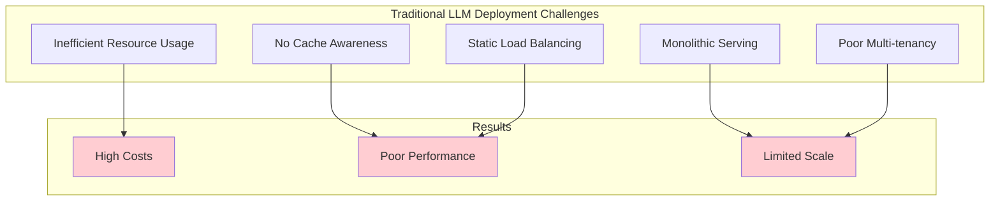

## Core Architecture

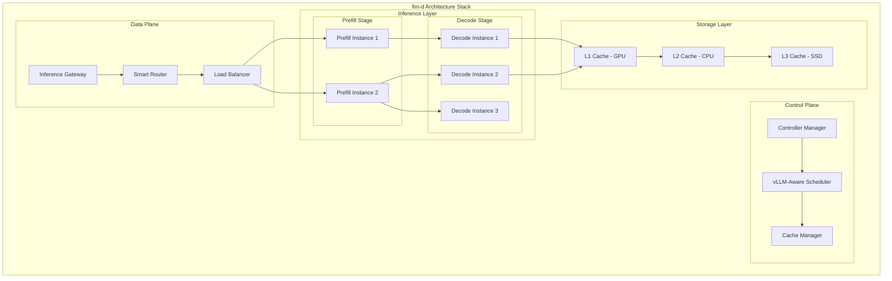

## Key Components

### 1. Inference Gateway (IGW)

The Inference Gateway extends Kubernetes Gateway API with inference-specific capabilities:

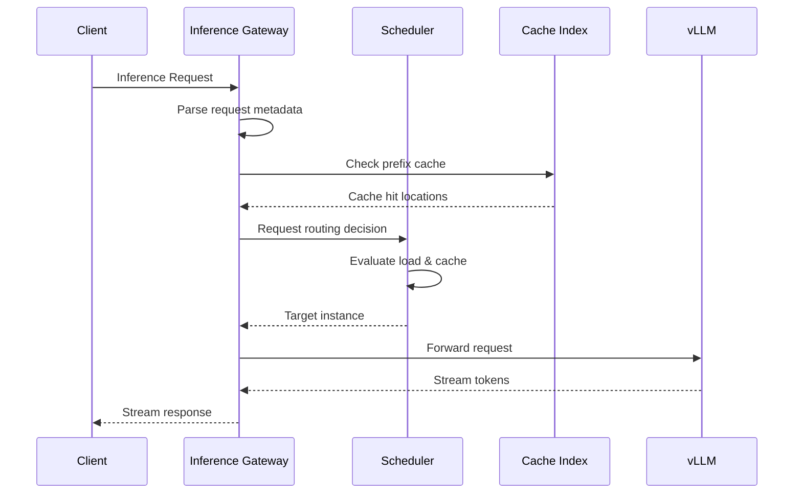

**Features:**
- **Request Classification**: Identifies prefill vs decode requests
- **Metadata Extraction**: Parses model, prompt prefix, parameters
- **Stream Management**: Handles token streaming efficiently
- **Protocol Translation**: Supports multiple inference protocols

### 2. vLLM-Aware Scheduler

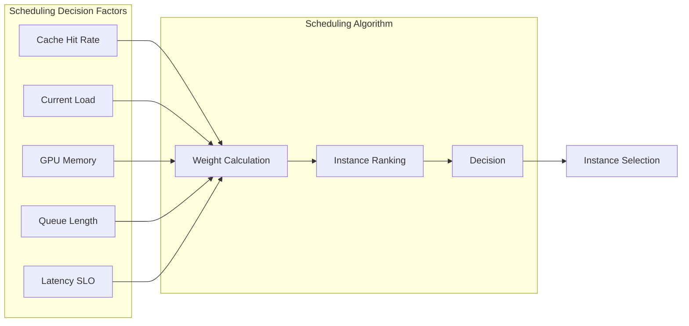

**Scheduling Strategies:**

| Strategy | Description | Use Case |
|----------|-------------|----------|
| **Cache-Affinity** | Route to instances with warm cache | Repeated prompts |
| **Load-Balanced** | Distribute based on current load | General traffic |
| **Latency-Optimized** | Route to least loaded instance | Low-latency requirements |
| **Throughput-Optimized** | Maximize batch sizes | Bulk processing |

### 3. Multi-Tier KV Cache

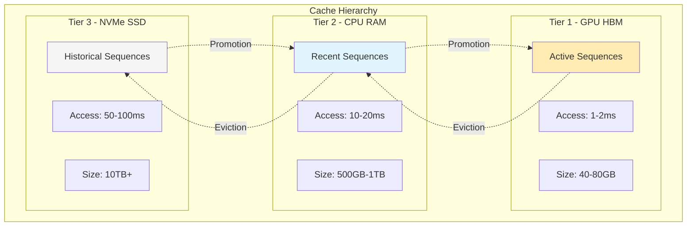

**Cache Management:**
- **LRU Eviction**: Least Recently Used policy
- **Prefix Deduplication**: Share common prefixes
- **Compression**: Quantize cached values
- **Preloading**: Warm cache for expected prompts

## Disaggregated Serving

### Traditional vs Disaggregated Architecture

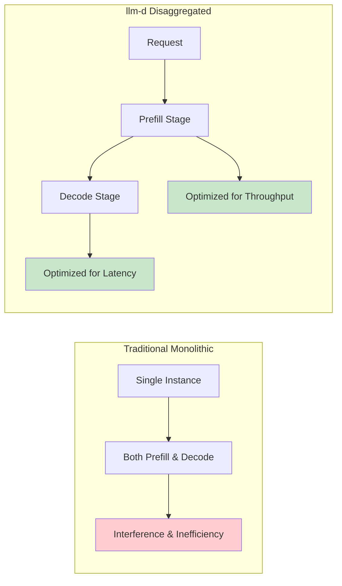

### Prefill Stage Optimization

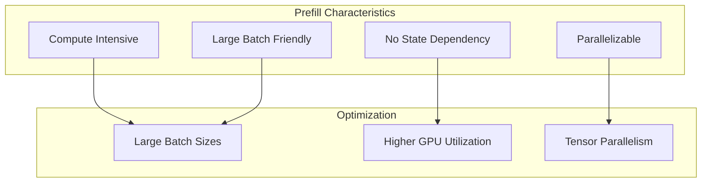

### Decode Stage Optimization

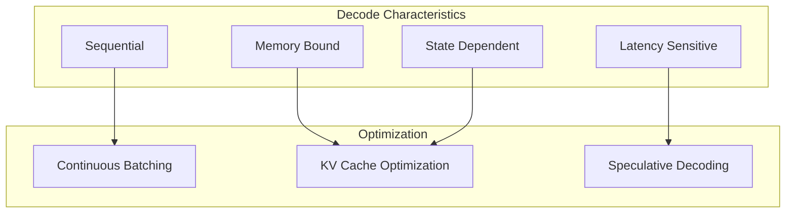

## Request Flow Architecture

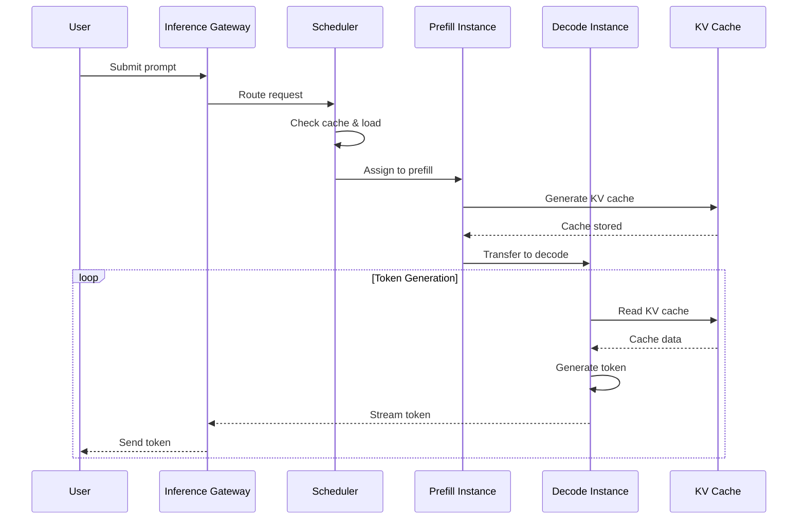

## Deployment Patterns

### 1. Basic Deployment

```yaml
apiVersion: llm-d.io/v1alpha1
kind: LLMDeployment
metadata:
  name: llama-deployment
spec:
  model:
    name: meta-llama/Llama-2-7b-hf
    runtime: vllm
  serving:
    mode: unified  # Both prefill and decode
    replicas: 3
  resources:
    gpu: nvidia.com/gpu
    count: 1
    memory: 40Gi
```

### 2. Disaggregated Deployment

```yaml
apiVersion: llm-d.io/v1alpha1
kind: LLMDeployment
metadata:
  name: llama-disaggregated
spec:
  model:
    name: meta-llama/Llama-2-70b-hf
    runtime: vllm
  serving:
    mode: disaggregated
    prefill:
      replicas: 2
      resources:
        gpu: 2
        memory: 80Gi
    decode:
      replicas: 6
      resources:
        gpu: 1
        memory: 40Gi
  cache:
    tiers:
      - type: gpu
        size: 40Gi
      - type: cpu
        size: 500Gi
      - type: ssd
        size: 2Ti
```

## Performance Benefits

### Throughput Improvements

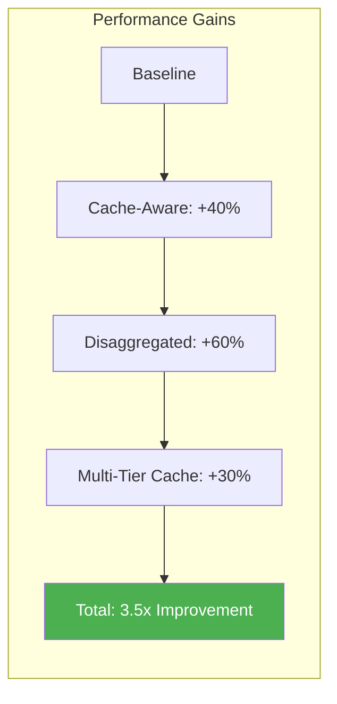

### Resource Efficiency

| Metric | Traditional | llm-d | Improvement |
|--------|------------|-------|-------------|
| GPU Utilization | 40-50% | 85-95% | 2x |
| Memory Efficiency | 60% | 95% | 1.6x |
| Cost per Token | $0.01 | $0.003 | 3.3x |
| Latency P99 | 2000ms | 500ms | 4x |

## Integration with Kubernetes

### Custom Resources

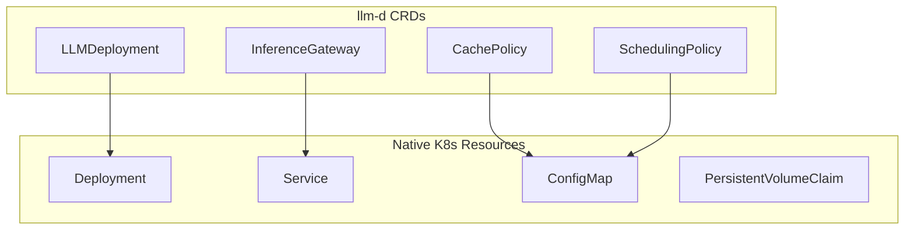

### Operator Pattern

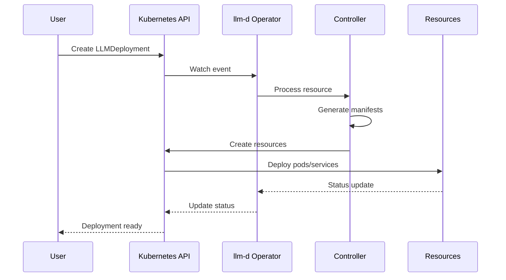

## Monitoring and Observability

### Key Metrics

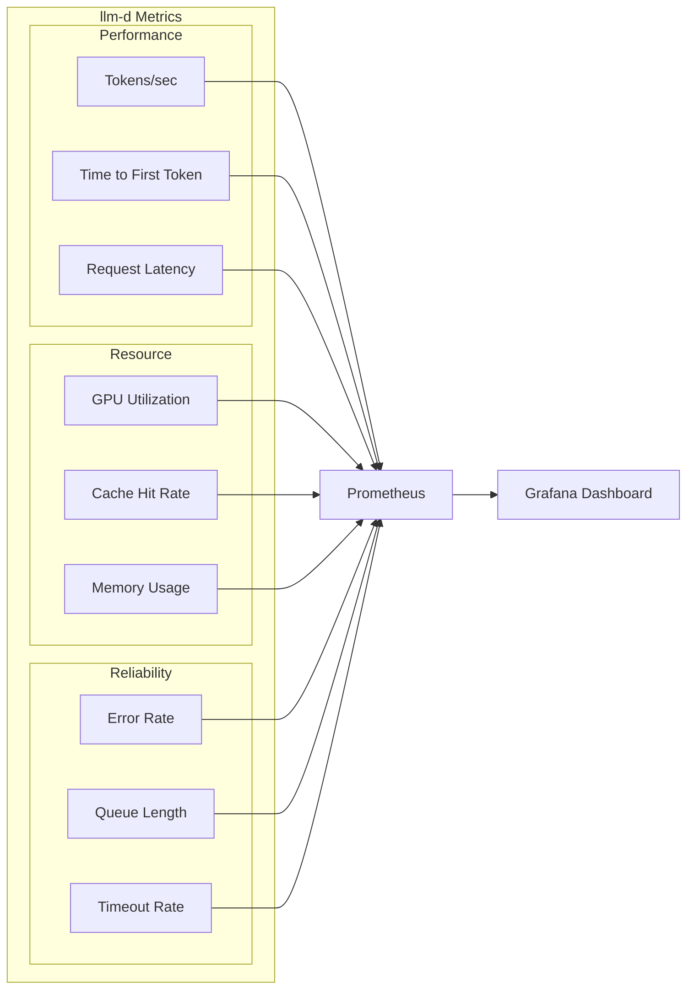

## Production Deployment Considerations

### High Availability Setup

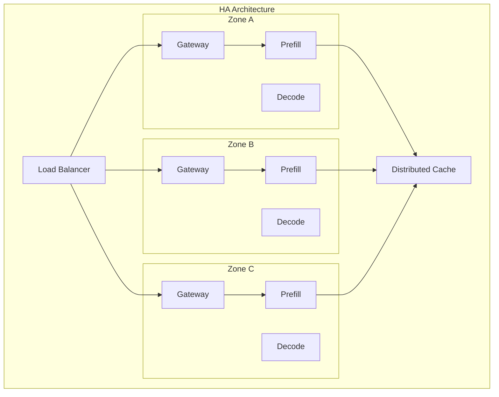

### Scaling Strategies

| Strategy | Trigger | Action | Use Case |
|----------|---------|--------|----------|
| **Horizontal Pod Autoscaling** | CPU/Memory | Add pods | General load |
| **Vertical Pod Autoscaling** | Resource limits | Resize pods | Right-sizing |
| **Cluster Autoscaling** | Node capacity | Add nodes | Peak traffic |
| **Predictive Scaling** | Traffic patterns | Pre-scale | Known patterns |

## Industry Support and Ecosystem

### Founding Contributors
- **Red Hat**: Project initiator and lead
- **CoreWeave**: Cloud infrastructure
- **Google Cloud**: Kubernetes expertise
- **IBM Research**: AI research
- **NVIDIA**: GPU optimization

### Technology Partners
- **AMD**: GPU support
- **Cisco**: Networking
- **Hugging Face**: Model hub
- **Intel**: CPU optimization
- **Lambda**: Cloud compute
- **Mistral AI**: Model provider

## Future Roadmap

### 2025 Planned Features
- **Enhanced multi-cloud support**
- **Federated inference**
- **Advanced caching algorithms**
- **Native function calling**
- **Improved observability**
- **Cost optimization features**

## Summary

llm-d transforms LLM serving through:
- **Intelligent routing** with cache awareness
- **Disaggregated serving** for efficiency
- **Multi-tier caching** for cost optimization
- **Native Kubernetes integration**
- **Production-grade reliability**

Next: [KServe Integration →](./04-kserve-integration.md)