# KServe Integration: Production Model Serving on Kubernetes

## What is KServe?

**KServe** (formerly KFServing) is a standard, cloud-native model serving platform on Kubernetes. It provides a Kubernetes Custom Resource Definition (CRD) for serving machine learning models, enabling production-grade deployments with features like auto-scaling, monitoring, and multi-framework support.

## KServe Architecture

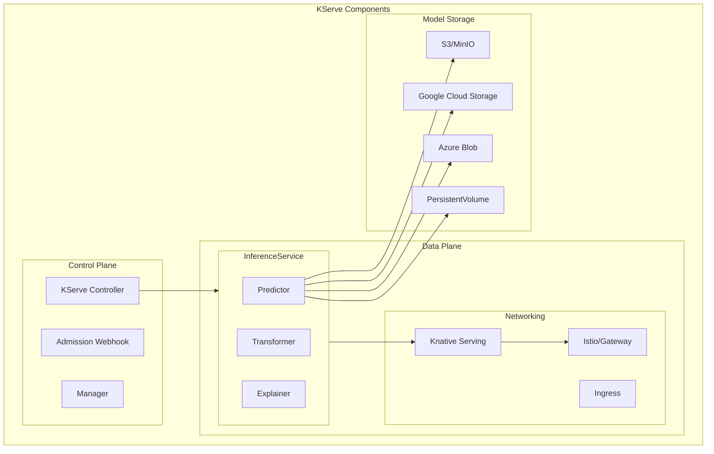

## Core Concepts

### InferenceService CRD

The InferenceService is the primary abstraction for deploying models:

```yaml
apiVersion: serving.kserve.io/v1beta1
kind: InferenceService
metadata:
  name: llama-2-7b
  namespace: model-serving
spec:
  predictor:
    model:
      modelFormat:
        name: vllm
      runtime: kserve-vllmserver
      storageUri: s3://models/llama-2-7b
      resources:
        requests:
          cpu: "4"
          memory: "50Gi"
          nvidia.com/gpu: "1"
        limits:
          cpu: "8"
          memory: "60Gi"
          nvidia.com/gpu: "1"
    minReplicas: 1
    maxReplicas: 10
    scaleTarget: 60
    scaleMetric: concurrency
  transformer:
    containers:
    - image: myregistry/prompt-processor:latest
      name: prompt-processor
  explainer:
    containers:
    - image: myregistry/llm-explainer:latest
      name: explainer
```

### Component Architecture

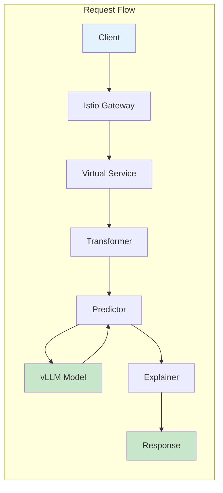

## vLLM Runtime in KServe

### Setting Up vLLM Runtime

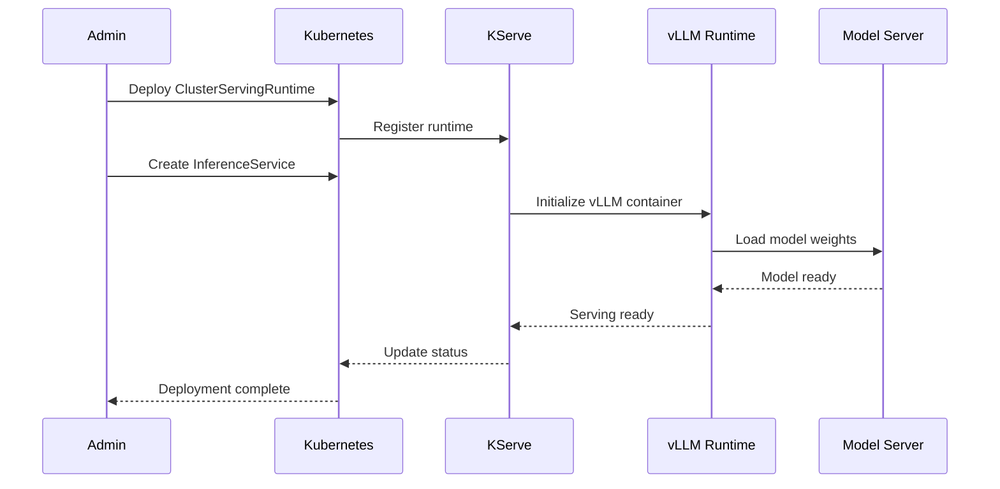

### ClusterServingRuntime Configuration

```yaml
apiVersion: serving.kserve.io/v1alpha1
kind: ClusterServingRuntime
metadata:
  name: kserve-vllmserver
spec:
  supportedModelFormats:
  - name: vllm
    version: "1"
    autoSelect: true
  containers:
  - name: kserve-container
    image: kserve/vllmserver:latest
    args:
    - --model_name={{.Name}}
    - --model_dir=/mnt/models
    - --port=8080
    - --max_model_len=32768
    - --gpu_memory_utilization=0.95
    - --tensor_parallel_size={{.TensorParallelSize}}
    env:
    - name: STORAGE_URI
      value: "{{.StorageUri}}"
    resources:
      requests:
        cpu: "4"
        memory: "50Gi"
        nvidia.com/gpu: "{{.GPUs}}"
```

## Auto-scaling with KServe

### Scaling Metrics

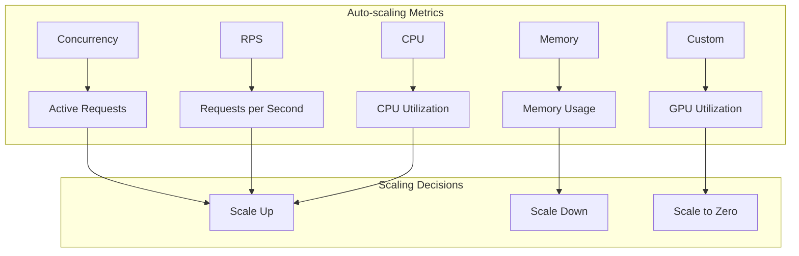

### Knative Pod Autoscaler (KPA)

```yaml
apiVersion: v1
kind: ConfigMap
metadata:
  name: config-autoscaler
  namespace: knative-serving
data:
  # Scale to zero configuration
  enable-scale-to-zero: "true"
  scale-to-zero-grace-period: "30s"
  
  # Scaling rates
  max-scale-up-rate: "1000.0"
  max-scale-down-rate: "2.0"
  
  # Target utilization
  container-concurrency-target-percentage: "70"
  
  # Scaling bounds
  min-scale: "1"
  max-scale: "100"
```

### HPA vs KPA Comparison

| Feature | HPA (Horizontal Pod Autoscaler) | KPA (Knative Pod Autoscaler) |
|---------|----------------------------------|------------------------------|
| **Scale to Zero** | ❌ Not supported | ✅ Supported |
| **Metrics** | CPU, Memory, Custom | Concurrency, RPS |
| **Response Time** | Minutes | Seconds |
| **Use Case** | General workloads | Request-driven |
| **Cold Start** | Not applicable | Optimized |

## Model Storage and Loading

### Storage Options

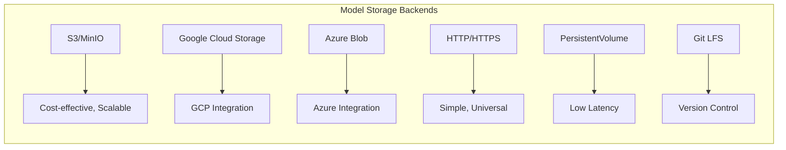

### Model Loading Process

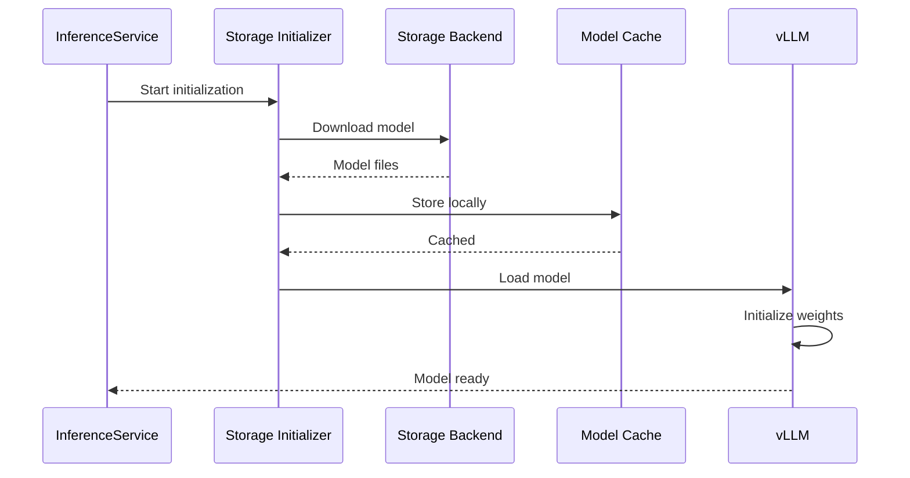

## Deployment Patterns

### 1. Single Model Deployment

```yaml
apiVersion: serving.kserve.io/v1beta1
kind: InferenceService
metadata:
  name: single-llm
spec:
  predictor:
    model:
      modelFormat:
        name: vllm
      runtime: kserve-vllmserver
      storageUri: s3://models/llama-2-7b
    minReplicas: 1
    maxReplicas: 5
```

### 2. Multi-Model Serving (Model Mesh)

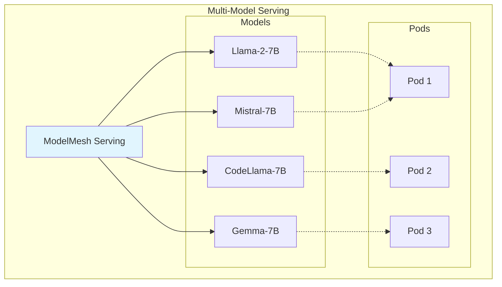

### 3. A/B Testing Deployment

```yaml
apiVersion: serving.kserve.io/v1beta1
kind: InferenceService
metadata:
  name: ab-test-llm
spec:
  predictor:
    canaryTrafficPercent: 20
    model:
      modelFormat:
        name: vllm
      runtime: kserve-vllmserver
      storageUri: s3://models/llama-2-7b-v2  # New version
  default:
    predictor:
      model:
        modelFormat:
          name: vllm
        runtime: kserve-vllmserver
        storageUri: s3://models/llama-2-7b-v1  # Stable version
```

## Monitoring and Observability

### Metrics Collection

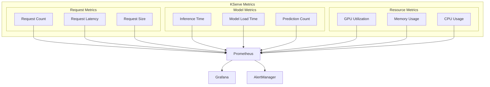

### Sample Grafana Dashboard

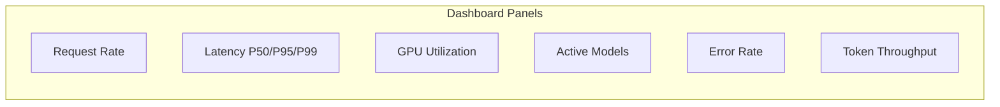

## Security and Access Control

### Authentication and Authorization

```mermaid
graph TB
    subgraph "Security Layers"
        subgraph "Authentication"
            OAuth[OAuth 2.0]
            JWT[JWT Tokens]
            mTLS[Mutual TLS]
        end
        
        subgraph "Authorization"
            RBAC[RBAC Policies]
            NetworkPolicy[Network Policies]
            AuthzPolicy[Istio AuthZ]
        end
        
        subgraph "Encryption"
            TLS[TLS in Transit]
            Encryption[Encryption at Rest]
        end
    end
    
    Client --> OAuth
    OAuth --> JWT
    JWT --> RBAC
    RBAC --> NetworkPolicy
    NetworkPolicy --> TLS
```

### RBAC Configuration

```yaml
apiVersion: rbac.authorization.k8s.io/v1
kind: Role
metadata:
  name: inferenceservice-admin
  namespace: model-serving
rules:
- apiGroups: ["serving.kserve.io"]
  resources: ["inferenceservices"]
  verbs: ["get", "list", "watch", "create", "update", "patch", "delete"]
---
apiVersion: rbac.authorization.k8s.io/v1
kind: RoleBinding
metadata:
  name: inferenceservice-admin-binding
  namespace: model-serving
roleRef:
  apiGroup: rbac.authorization.k8s.io
  kind: Role
  name: inferenceservice-admin
subjects:
- kind: User
  name: ml-engineer
  apiGroup: rbac.authorization.k8s.io
```

## Integration with llm-d

### Combined Architecture

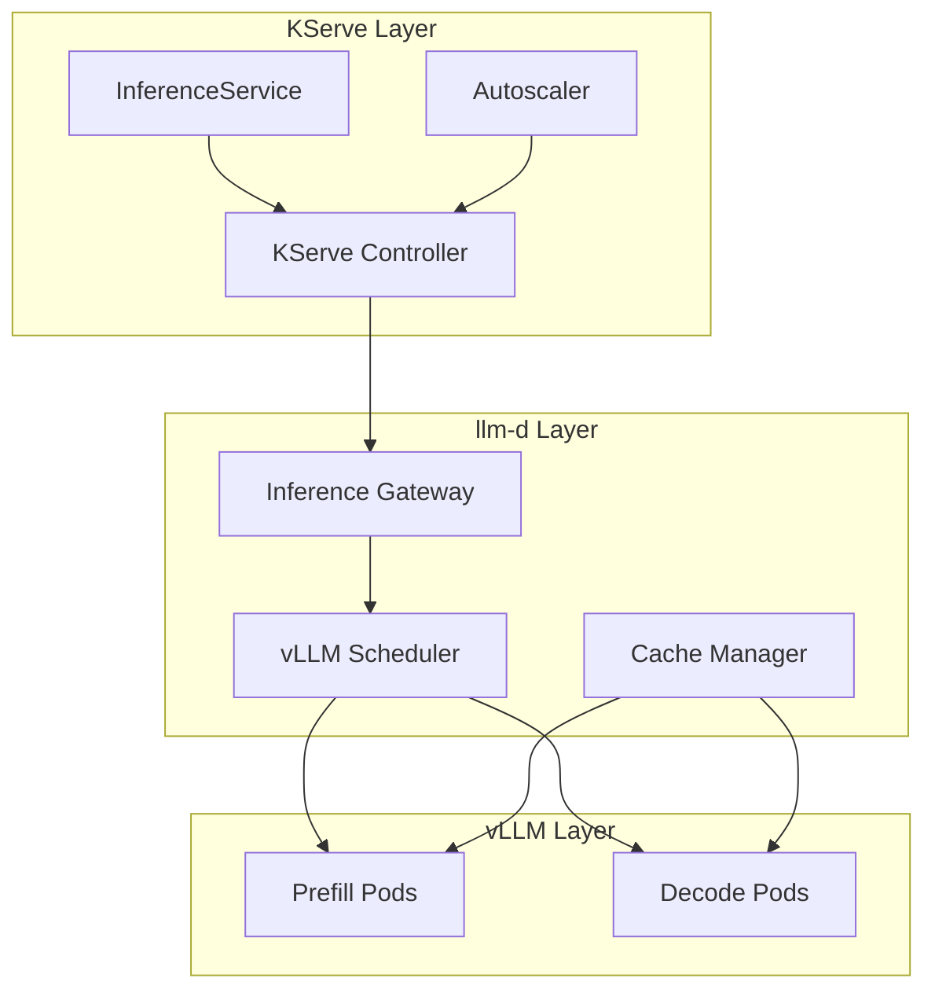

## Best Practices

### Resource Allocation

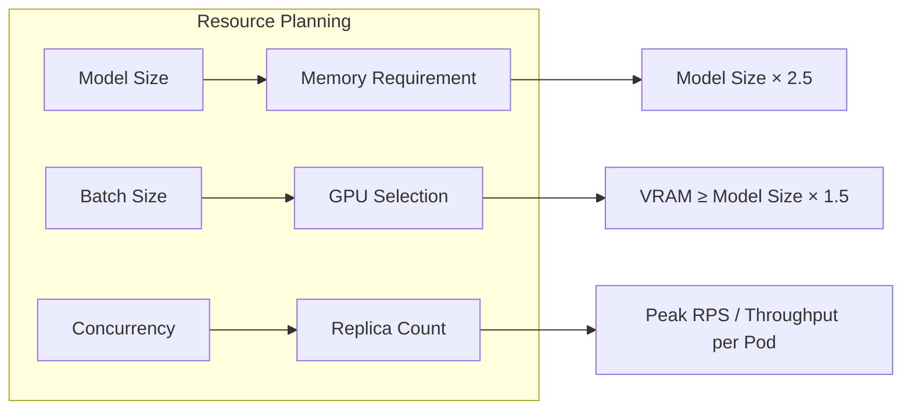

### Configuration Recommendations

| Configuration | Development | Production |
|--------------|-------------|------------|
| **Min Replicas** | 0-1 | 2-3 |
| **Max Replicas** | 3 | 10-100 |
| **GPU Memory Util** | 0.8 | 0.95 |
| **Request Timeout** | 60s | 300s |
| **Scale Target** | 80% | 60% |
| **Storage** | PVC | S3/GCS |

## Troubleshooting Common Issues

### Issue Resolution Matrix

| Issue | Symptoms | Solution |
|-------|----------|----------|
| **Model Load Failure** | CrashLoopBackOff | Check storage URI, permissions |
| **OOM Errors** | Pod killed | Increase memory limits |
| **Slow Inference** | High latency | Check GPU utilization, batch size |
| **Scale Issues** | Pods not scaling | Verify metrics server, HPA config |
| **Network Timeout** | 504 errors | Increase timeout, check Istio config |

## Production Deployment Example

### Complete Production Setup

```yaml
# Namespace
apiVersion: v1
kind: Namespace
metadata:
  name: llm-production
  labels:
    istio-injection: enabled
---
# Storage Secret
apiVersion: v1
kind: Secret
metadata:
  name: s3-secret
  namespace: llm-production
type: Opaque
data:
  AWS_ACCESS_KEY_ID: <base64>
  AWS_SECRET_ACCESS_KEY: <base64>
---
# InferenceService
apiVersion: serving.kserve.io/v1beta1
kind: InferenceService
metadata:
  name: production-llm
  namespace: llm-production
  annotations:
    serving.kserve.io/enable-prometheus-scraping: "true"
    serving.kserve.io/enable-logger: "true"
spec:
  predictor:
    model:
      modelFormat:
        name: vllm
      runtime: kserve-vllmserver
      storageUri: s3://production-models/llama-2-70b
      env:
      - name: TENSOR_PARALLEL_SIZE
        value: "4"
      - name: MAX_MODEL_LEN
        value: "32768"
      - name: GPU_MEMORY_UTILIZATION
        value: "0.95"
      resources:
        requests:
          cpu: "16"
          memory: "200Gi"
          nvidia.com/gpu: "4"
        limits:
          cpu: "32"
          memory: "250Gi"
          nvidia.com/gpu: "4"
    minReplicas: 2
    maxReplicas: 20
    scaleTarget: 60
    scaleMetric: concurrency
    containerConcurrency: 100
  transformer:
    containers:
    - image: company/prompt-validator:v1.0
      name: validator
      resources:
        requests:
          cpu: "2"
          memory: "4Gi"
```

## Summary

KServe provides production-grade model serving with:
- **Standardized deployment** via InferenceService CRD
- **Auto-scaling** including scale-to-zero
- **Multi-framework support** including vLLM
- **Production features** like monitoring, A/B testing
- **Seamless integration** with llm-d and vLLM

Next: [Architecture Patterns →](./05-architecture-patterns.md)