# Architecture Patterns for LLM Inference

## Overview

This document explores various architectural patterns for deploying Large Language Models using vLLM, llm-d, and KServe, helping you choose the right approach for your use case.

## Pattern Decision Matrix

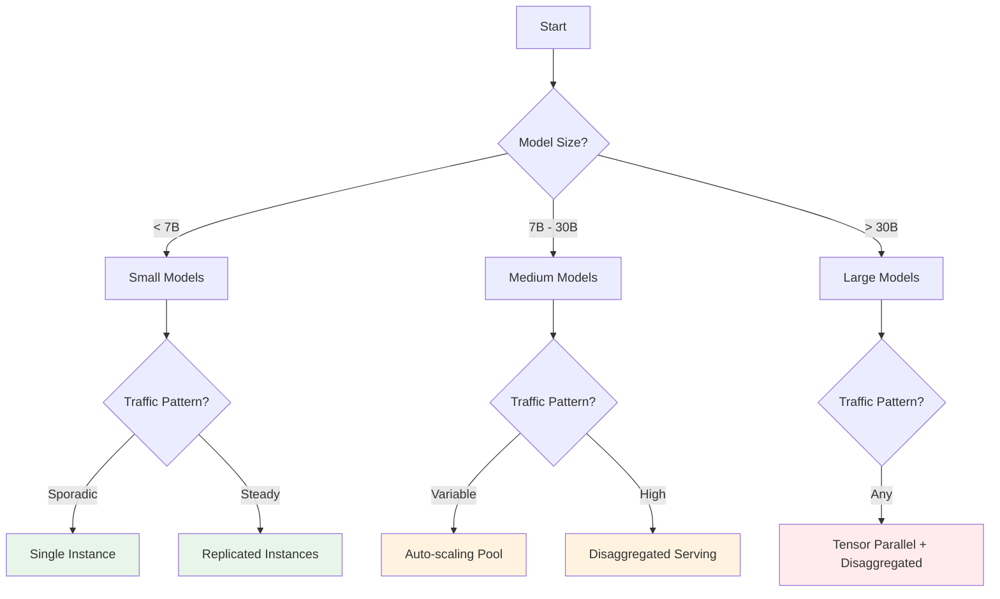

## Pattern 1: Single Instance Serving

### Architecture

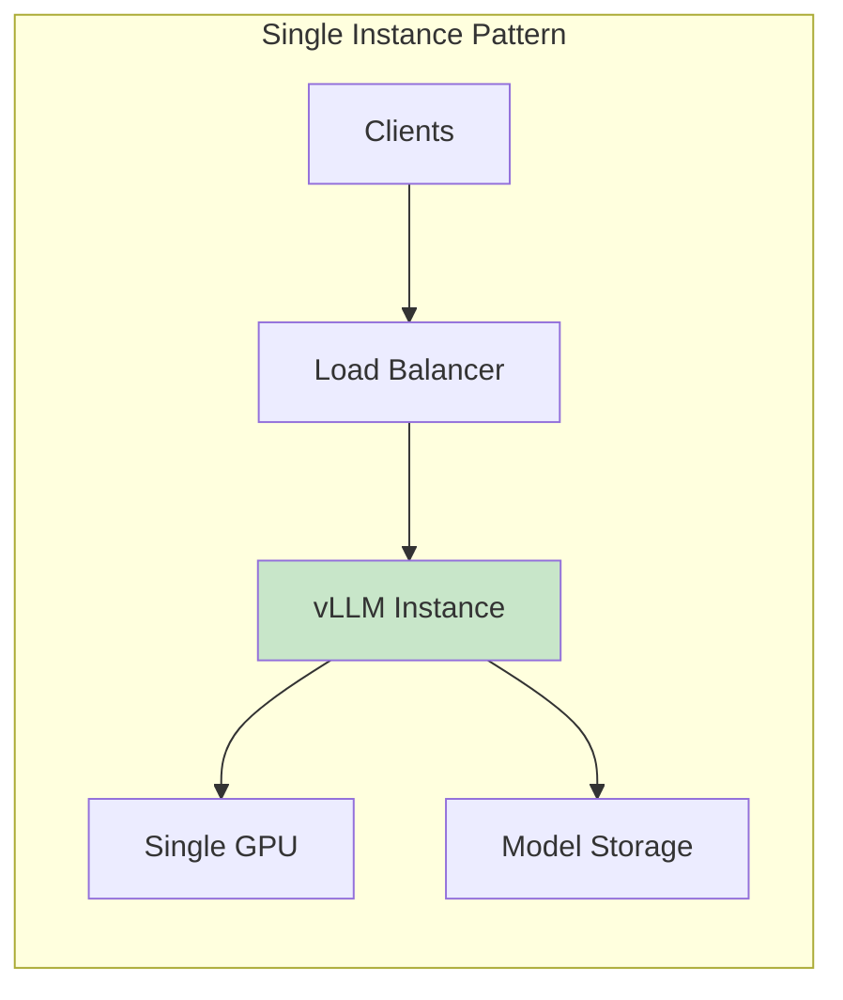

### Use Cases
- **Development and testing environments**
- **Small models (< 7B parameters)**
- **Low traffic applications**
- **Cost-sensitive deployments**

### Configuration Example

```yaml
apiVersion: serving.kserve.io/v1beta1
kind: InferenceService
metadata:
  name: single-instance-llm
spec:
  predictor:
    model:
      modelFormat:
        name: vllm
      runtime: kserve-vllmserver
      storageUri: s3://models/llama-2-7b
    minReplicas: 1
    maxReplicas: 1  # Fixed single instance
    resources:
      requests:
        nvidia.com/gpu: "1"
        memory: "30Gi"
```

### Pros and Cons

| Pros | Cons |
|------|------|
| ✅ Simple to deploy | ❌ No redundancy |
| ✅ Low cost | ❌ Limited throughput |
| ✅ Easy to debug | ❌ Single point of failure |
| ✅ Minimal overhead | ❌ No scale capability |

## Pattern 2: Replicated Instances

### Architecture

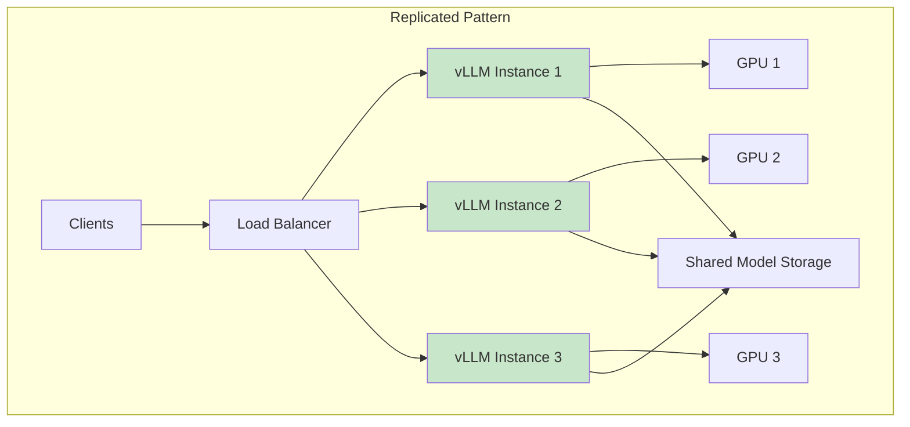

### Implementation

```yaml
apiVersion: serving.kserve.io/v1beta1
kind: InferenceService
metadata:
  name: replicated-llm
spec:
  predictor:
    model:
      modelFormat:
        name: vllm
      runtime: kserve-vllmserver
      storageUri: s3://models/mistral-7b
    minReplicas: 3
    maxReplicas: 3  # Fixed replication
    resources:
      requests:
        nvidia.com/gpu: "1"
        memory: "40Gi"
```

### Load Balancing Strategies

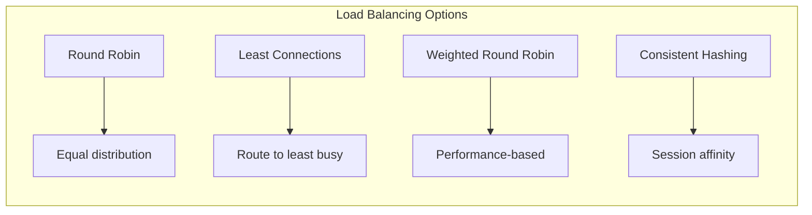

## Pattern 3: Auto-scaling Pool

### Architecture

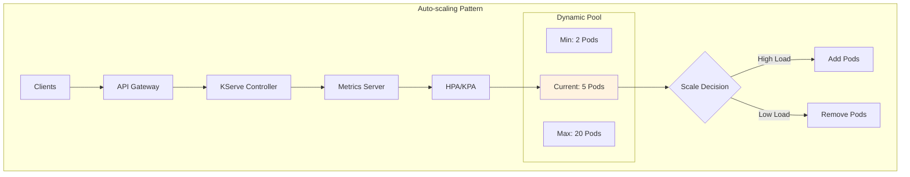

### Configuration

```yaml
apiVersion: serving.kserve.io/v1beta1
kind: InferenceService
metadata:
  name: autoscaling-llm
spec:
  predictor:
    model:
      modelFormat:
        name: vllm
      runtime: kserve-vllmserver
      storageUri: s3://models/llama-2-13b
    minReplicas: 2
    maxReplicas: 20
    scaleTarget: 60  # Target utilization %
    scaleMetric: concurrency
    containerConcurrency: 10
    resources:
      requests:
        nvidia.com/gpu: "1"
        memory: "50Gi"
```

### Scaling Behavior

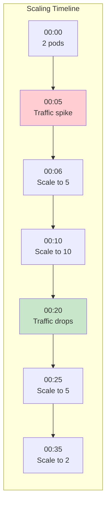

## Pattern 4: Disaggregated Serving

### Architecture

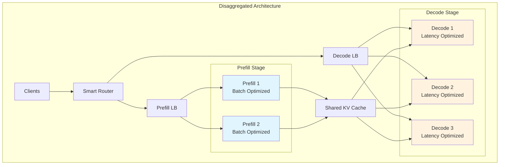

### Implementation with llm-d

```yaml
apiVersion: llm-d.io/v1alpha1
kind: LLMDeployment
metadata:
  name: disaggregated-llm
spec:
  model:
    name: meta-llama/Llama-2-30b-hf
    runtime: vllm
  serving:
    mode: disaggregated
    prefill:
      replicas: 2
      batchSize: 32
      resources:
        gpu: 2
        memory: 80Gi
    decode:
      replicas: 5
      batchSize: 8
      resources:
        gpu: 1
        memory: 40Gi
  cache:
    type: distributed
    size: 500Gi
```

### Performance Characteristics

| Stage | Optimization | Benefit |
|-------|-------------|---------|
| **Prefill** | Large batches | 3x throughput |
| **Decode** | Low latency | 2x faster TTFT |
| **Cache** | Shared across stages | 40% memory savings |

## Pattern 5: Tensor Parallel Serving

### Architecture

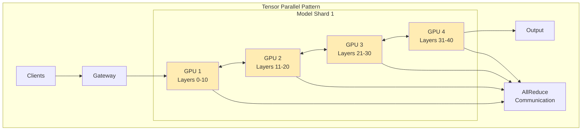

### Configuration

```yaml
apiVersion: serving.kserve.io/v1beta1
kind: InferenceService
metadata:
  name: tensor-parallel-llm
spec:
  predictor:
    model:
      modelFormat:
        name: vllm
      runtime: kserve-vllmserver
      storageUri: s3://models/llama-2-70b
      env:
      - name: TENSOR_PARALLEL_SIZE
        value: "4"
      - name: PIPELINE_PARALLEL_SIZE
        value: "1"
    minReplicas: 1
    maxReplicas: 5
    resources:
      requests:
        nvidia.com/gpu: "4"  # 4 GPUs per replica
        memory: "320Gi"
```

## Pattern 6: Hybrid Multi-Tier

### Architecture

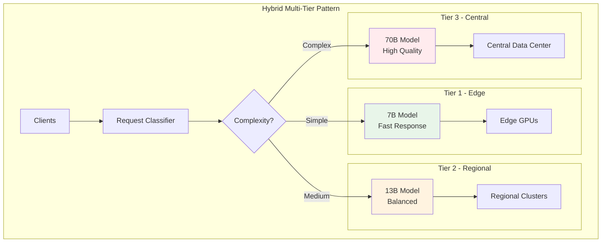

### Routing Logic

```python
# Pseudo-code for request routing
def route_request(prompt, requirements):
    complexity = analyze_complexity(prompt)
    latency_requirement = requirements.get('max_latency_ms')
    quality_requirement = requirements.get('min_quality_score')
    
    if latency_requirement < 100:
        return "edge-7b-model"
    elif complexity == "simple" and quality_requirement < 0.8:
        return "regional-13b-model"
    else:
        return "central-70b-model"
```

## Pattern 7: Federation Pattern

### Architecture

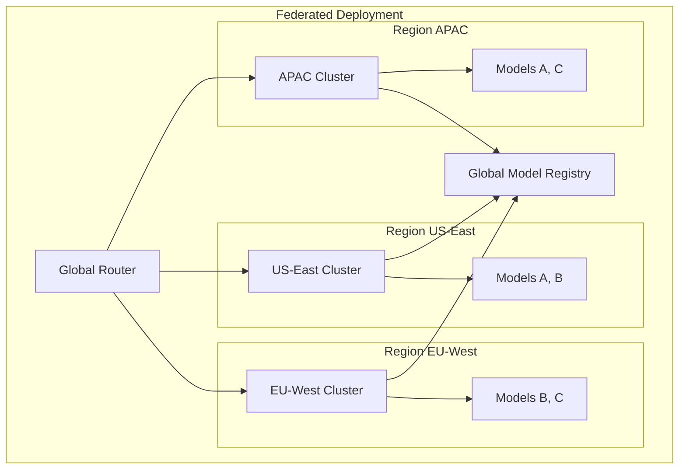

### Benefits

- **Data sovereignty compliance**
- **Reduced latency for regional users**
- **Disaster recovery capability**
- **Cost optimization via regional pricing**

## Pattern 8: Caching-First Architecture

### Architecture

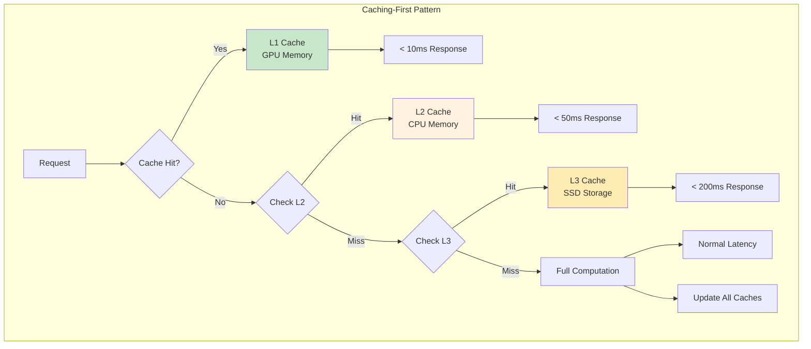

### Cache Strategy

```yaml
apiVersion: llm-d.io/v1alpha1
kind: CachePolicy
metadata:
  name: multi-tier-cache
spec:
  tiers:
  - name: l1-gpu
    type: gpu
    size: 40Gi
    eviction: lru
    ttl: 1h
  - name: l2-cpu
    type: memory
    size: 500Gi
    eviction: lfu
    ttl: 6h
  - name: l3-ssd
    type: disk
    size: 5Ti
    eviction: fifo
    ttl: 24h
  prefixSharing:
    enabled: true
    minLength: 10
```

## Pattern Selection Guide

### Decision Criteria

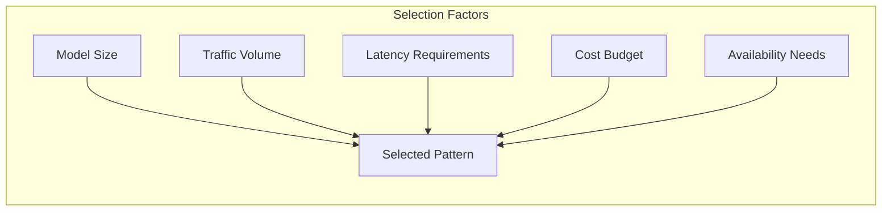

### Pattern Comparison Matrix

| Pattern | Model Size | Traffic | Latency | Cost | Complexity |
|---------|------------|---------|---------|------|------------|
| **Single Instance** | < 7B | Low | Medium | $ | Low |
| **Replicated** | < 13B | Medium | Low | $$ | Low |
| **Auto-scaling** | < 30B | Variable | Low | $$$ | Medium |
| **Disaggregated** | Any | High | Very Low | $$$ | High |
| **Tensor Parallel** | > 30B | Any | Medium | $$$$ | High |
| **Hybrid Multi-Tier** | Mixed | High | Variable | $$$$ | Very High |
| **Federation** | Any | Global | Low | $$$$$ | Very High |
| **Caching-First** | Any | Repeated | Very Low | $$ | Medium |

## Implementation Best Practices

### 1. Start Simple, Scale Gradually

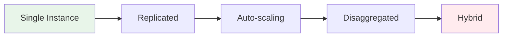

### 2. Monitor Key Metrics

- **Latency**: P50, P95, P99
- **Throughput**: Tokens/second
- **Utilization**: GPU, Memory, Network
- **Errors**: Rate, types, recovery
- **Cost**: Per token, per request

### 3. Optimize for Your Use Case

| Use Case | Recommended Pattern | Key Optimization |
|----------|-------------------|------------------|
| **Chatbot** | Auto-scaling | Low latency |
| **Batch Processing** | Replicated | High throughput |
| **Real-time API** | Disaggregated | Consistent latency |
| **Research** | Single Instance | Cost efficiency |
| **Enterprise** | Hybrid Multi-Tier | Flexibility |

## Anti-Patterns to Avoid

### 1. Over-Engineering

❌ **Don't**: Start with complex patterns for simple use cases
✅ **Do**: Begin with simple patterns and evolve based on needs

### 2. Ignoring Cache Potential

❌ **Don't**: Compute everything from scratch
✅ **Do**: Implement intelligent caching strategies

### 3. Fixed Scaling

❌ **Don't**: Use fixed replicas for variable traffic
✅ **Do**: Implement auto-scaling based on actual metrics

### 4. Single Point of Failure

❌ **Don't**: Deploy single instances for production
✅ **Do**: Ensure redundancy and failover capabilities

## Summary

Choose your architecture pattern based on:
- **Model size and complexity**
- **Traffic patterns and volume**
- **Latency and throughput requirements**
- **Budget constraints**
- **Operational complexity tolerance**

Start simple, measure everything, and evolve your architecture as needs grow.

Next: [Deployment Guide →](./06-deployment-guide.md)