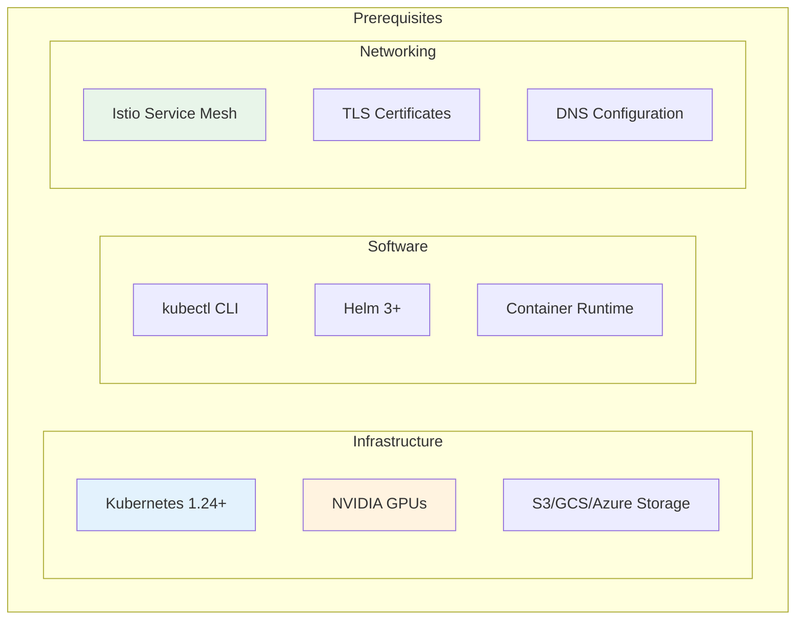
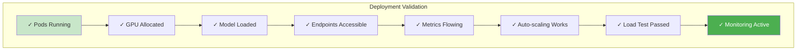

# Production Deployment Guide

## Overview

This comprehensive guide walks through deploying a production-ready LLM inference stack using vLLM, llm-d, and KServe on Kubernetes.

## Prerequisites Checklist



### System Requirements

| Component | Minimum | Recommended | Production |
|-----------|---------|-------------|------------|
| **Kubernetes Nodes** | 3 | 5 | 10+ |
| **GPU per Node** | 1 × V100 | 2 × A100 | 4 × A100/H100 |
| **CPU per Node** | 16 cores | 32 cores | 64 cores |
| **Memory per Node** | 64 GB | 128 GB | 256 GB |
| **Storage** | 500 GB SSD | 1 TB NVMe | 2 TB NVMe |
| **Network** | 10 Gbps | 25 Gbps | 100 Gbps |

## Step 1: Kubernetes Cluster Setup

### 1.1 Create GPU-Enabled Cluster

```bash
# For cloud providers (example: GKE)
gcloud container clusters create llm-cluster \
  --zone us-central1-a \
  --machine-type n1-standard-32 \
  --accelerator type=nvidia-tesla-a100,count=4 \
  --num-nodes 3 \
  --node-locations us-central1-a,us-central1-b \
  --enable-autoscaling \
  --min-nodes 3 \
  --max-nodes 10

# Install NVIDIA GPU Operator
helm repo add nvidia https://helm.ngc.nvidia.com/nvidia
helm repo update
helm install --wait --generate-name \
  -n gpu-operator --create-namespace \
  nvidia/gpu-operator \
  --set driver.enabled=true \
  --set toolkit.enabled=true
```

### 1.2 Verify GPU Availability

```bash
# Check GPU nodes
kubectl get nodes -L nvidia.com/gpu.present

# Verify GPU resources
kubectl describe nodes | grep -A 5 "nvidia.com/gpu"

# Test GPU pod
cat <<EOF | kubectl apply -f -
apiVersion: v1
kind: Pod
metadata:
  name: gpu-test
spec:
  containers:
  - name: cuda-test
    image: nvidia/cuda:12.0-base
    command: ["nvidia-smi"]
    resources:
      limits:
        nvidia.com/gpu: 1
EOF

kubectl logs gpu-test
```

## Step 2: Install Core Components

### 2.1 Install Istio

```bash
# Download Istio
curl -L https://istio.io/downloadIstio | sh -
cd istio-*
export PATH=$PWD/bin:$PATH

# Install Istio with production profile
istioctl install --set profile=production -y

# Enable sidecar injection for namespaces
kubectl label namespace default istio-injection=enabled
kubectl label namespace model-serving istio-injection=enabled
```

### 2.2 Install Knative Serving

```bash
# Install Knative Serving CRDs
kubectl apply -f https://github.com/knative/serving/releases/download/knative-v1.12.0/serving-crds.yaml

# Install Knative Serving core
kubectl apply -f https://github.com/knative/serving/releases/download/knative-v1.12.0/serving-core.yaml

# Install Istio controller for Knative
kubectl apply -f https://github.com/knative/net-istio/releases/download/knative-v1.12.0/net-istio.yaml

# Configure DNS
kubectl apply -f https://github.com/knative/serving/releases/download/knative-v1.12.0/serving-default-domain.yaml
```

### 2.3 Install KServe

```bash
# Install KServe
curl -s "https://raw.githubusercontent.com/kserve/kserve/release-0.11/hack/quick_install.sh" | bash

# Wait for KServe controller to be ready
kubectl wait --for=condition=ready pod \
  -l control-plane=kserve-controller-manager \
  -n kserve --timeout=300s
```

## Step 3: Configure Storage

### 3.1 S3-Compatible Storage Setup

```yaml
# storage-secret.yaml
apiVersion: v1
kind: Secret
metadata:
  name: s3-secret
  namespace: model-serving
type: Opaque
stringData:
  AWS_ACCESS_KEY_ID: "your-access-key"
  AWS_SECRET_ACCESS_KEY: "your-secret-key"
---
# storage-config.yaml
apiVersion: v1
kind: ConfigMap
metadata:
  name: storage-config
  namespace: model-serving
data:
  S3_ENDPOINT: "https://s3.amazonaws.com"
  S3_REGION: "us-east-1"
  S3_BUCKET: "llm-models"
  S3_USE_HTTPS: "true"
  S3_VERIFY_SSL: "true"
```

```bash
kubectl apply -f storage-secret.yaml
kubectl apply -f storage-config.yaml
```

### 3.2 Model Upload Script

```python
#!/usr/bin/env python3
# upload_model.py
import boto3
import os
from pathlib import Path

def upload_model_to_s3(local_path, s3_path, bucket_name):
    s3 = boto3.client('s3')
    
    for root, dirs, files in os.walk(local_path):
        for file in files:
            local_file = os.path.join(root, file)
            relative_path = os.path.relpath(local_file, local_path)
            s3_file = os.path.join(s3_path, relative_path)
            
            print(f"Uploading {local_file} to s3://{bucket_name}/{s3_file}")
            s3.upload_file(local_file, bucket_name, s3_file)

# Usage
upload_model_to_s3(
    local_path="/models/llama-2-7b",
    s3_path="llama-2-7b",
    bucket_name="llm-models"
)
```

## Step 4: Deploy vLLM Runtime

### 4.1 Create vLLM Serving Runtime

```yaml
# vllm-runtime.yaml
apiVersion: serving.kserve.io/v1alpha1
kind: ClusterServingRuntime
metadata:
  name: kserve-vllmserver
spec:
  annotations:
    prometheus.io/scrape: "true"
    prometheus.io/port: "8080"
  supportedModelFormats:
  - name: vllm
    version: "1"
    autoSelect: true
  containers:
  - name: kserve-container
    image: kserve/vllmserver:v0.11.0
    command: ["/bin/sh"]
    args:
    - -c
    - |
      python -m vllm.entrypoints.openai.api_server \
        --model /mnt/models \
        --port 8080 \
        --max-model-len {{.MaxModelLen}} \
        --gpu-memory-utilization {{.GpuMemoryUtilization}} \
        --tensor-parallel-size {{.TensorParallelSize}} \
        --dtype {{.Dtype}} \
        --trust-remote-code
    env:
    - name: STORAGE_URI
      value: "{{.StorageUri}}"
    - name: HUGGING_FACE_HUB_TOKEN
      valueFrom:
        secretKeyRef:
          name: hf-token
          key: token
          optional: true
    resources:
      requests:
        cpu: "{{.Cpu}}"
        memory: "{{.Memory}}"
        nvidia.com/gpu: "{{.Gpu}}"
      limits:
        cpu: "{{.CpuLimit}}"
        memory: "{{.MemoryLimit}}"
        nvidia.com/gpu: "{{.Gpu}}"
    readinessProbe:
      httpGet:
        path: /health
        port: 8080
      initialDelaySeconds: 30
      periodSeconds: 10
    livenessProbe:
      httpGet:
        path: /health
        port: 8080
      initialDelaySeconds: 60
      periodSeconds: 30
```

```bash
kubectl apply -f vllm-runtime.yaml
```

## Step 5: Deploy llm-d (Optional)

### 5.1 Install llm-d Operator

```bash
# Add llm-d Helm repository
helm repo add llm-d https://charts.llm-d.io
helm repo update

# Install llm-d operator
helm install llm-d llm-d/llm-d-operator \
  --namespace llm-d-system \
  --create-namespace \
  --set controller.image.tag=v0.1.0 \
  --set webhook.enabled=true
```

### 5.2 Configure llm-d Deployment

```yaml
# llm-d-deployment.yaml
apiVersion: llm-d.io/v1alpha1
kind: LLMDeployment
metadata:
  name: production-llm
  namespace: model-serving
spec:
  model:
    name: meta-llama/Llama-2-70b-hf
    runtime: vllm
  serving:
    mode: disaggregated
    gateway:
      replicas: 3
      resources:
        cpu: 4
        memory: 8Gi
    prefill:
      replicas: 2
      batchSize: 32
      resources:
        gpu: 4
        memory: 200Gi
    decode:
      replicas: 6
      batchSize: 8
      resources:
        gpu: 2
        memory: 100Gi
  cache:
    enabled: true
    tiers:
    - type: gpu
      size: 80Gi
    - type: memory
      size: 500Gi
    - type: disk
      size: 2Ti
  monitoring:
    enabled: true
    prometheus:
      endpoint: http://prometheus:9090
```

```bash
kubectl apply -f llm-d-deployment.yaml
```

## Step 6: Deploy Model with KServe

### 6.1 Create InferenceService

```yaml
# inference-service.yaml
apiVersion: serving.kserve.io/v1beta1
kind: InferenceService
metadata:
  name: llama-2-70b
  namespace: model-serving
  annotations:
    serving.kserve.io/deploymentMode: "RawDeployment"
    serving.kserve.io/autoscalerClass: "hpa"
    prometheus.io/scrape: "true"
spec:
  predictor:
    timeout: 600
    model:
      modelFormat:
        name: vllm
      runtime: kserve-vllmserver
      storageUri: s3://llm-models/llama-2-70b
      env:
      - name: MAX_MODEL_LEN
        value: "32768"
      - name: GPU_MEMORY_UTILIZATION
        value: "0.95"
      - name: TENSOR_PARALLEL_SIZE
        value: "4"
      - name: DTYPE
        value: "float16"
      resources:
        requests:
          cpu: "16"
          memory: "200Gi"
          nvidia.com/gpu: "4"
        limits:
          cpu: "32"
          memory: "250Gi"
          nvidia.com/gpu: "4"
    minReplicas: 2
    maxReplicas: 10
    scaleTarget: 60
    scaleMetric: concurrency
    containerConcurrency: 100
  transformer:
    containers:
    - name: prompt-validator
      image: myregistry/prompt-validator:v1.0
      resources:
        requests:
          cpu: "2"
          memory: "4Gi"
        limits:
          cpu: "4"
          memory: "8Gi"
```

```bash
kubectl apply -f inference-service.yaml

# Wait for deployment
kubectl wait --for=condition=Ready \
  inferenceservice/llama-2-70b \
  -n model-serving \
  --timeout=600s

# Get service endpoint
kubectl get inferenceservice llama-2-70b -n model-serving
```

## Step 7: Configure Monitoring

### 7.1 Install Prometheus and Grafana

```bash
# Install Prometheus
helm repo add prometheus-community https://prometheus-community.github.io/helm-charts
helm install prometheus prometheus-community/kube-prometheus-stack \
  --namespace monitoring \
  --create-namespace \
  --set prometheus.prometheusSpec.serviceMonitorSelectorNilUsesHelmValues=false \
  --set grafana.adminPassword=admin

# Expose Grafana
kubectl port-forward -n monitoring svc/prometheus-grafana 3000:80
```

### 7.2 Configure Service Monitor

```yaml
# service-monitor.yaml
apiVersion: monitoring.coreos.com/v1
kind: ServiceMonitor
metadata:
  name: vllm-metrics
  namespace: model-serving
spec:
  selector:
    matchLabels:
      serving.kserve.io/inferenceservice: llama-2-70b
  endpoints:
  - port: http
    interval: 30s
    path: /metrics
```

### 7.3 Import Grafana Dashboard

```json
{
  "dashboard": {
    "title": "vLLM Performance Dashboard",
    "panels": [
      {
        "title": "Tokens per Second",
        "targets": [{
          "expr": "rate(vllm_generation_tokens_total[5m])"
        }]
      },
      {
        "title": "GPU Utilization",
        "targets": [{
          "expr": "nvidia_gpu_utilization"
        }]
      },
      {
        "title": "Request Latency",
        "targets": [{
          "expr": "histogram_quantile(0.99, vllm_request_latency_seconds)"
        }]
      },
      {
        "title": "Active Requests",
        "targets": [{
          "expr": "vllm_num_requests_running"
        }]
      }
    ]
  }
}
```

## Step 8: Configure Security

### 8.1 Network Policies

```yaml
# network-policy.yaml
apiVersion: networking.k8s.io/v1
kind: NetworkPolicy
metadata:
  name: llm-serving-policy
  namespace: model-serving
spec:
  podSelector:
    matchLabels:
      serving.kserve.io/inferenceservice: llama-2-70b
  policyTypes:
  - Ingress
  - Egress
  ingress:
  - from:
    - namespaceSelector:
        matchLabels:
          name: istio-system
    - podSelector:
        matchLabels:
          app: api-gateway
    ports:
    - protocol: TCP
      port: 8080
  egress:
  - to:
    - namespaceSelector: {}
    ports:
    - protocol: TCP
      port: 443  # S3 access
    - protocol: TCP
      port: 53   # DNS
```

### 8.2 RBAC Configuration

```yaml
# rbac.yaml
apiVersion: rbac.authorization.k8s.io/v1
kind: Role
metadata:
  name: llm-operator
  namespace: model-serving
rules:
- apiGroups: ["serving.kserve.io"]
  resources: ["inferenceservices"]
  verbs: ["get", "list", "watch", "create", "update", "patch"]
- apiGroups: [""]
  resources: ["pods", "services"]
  verbs: ["get", "list", "watch"]
---
apiVersion: rbac.authorization.k8s.io/v1
kind: RoleBinding
metadata:
  name: llm-operator-binding
  namespace: model-serving
roleRef:
  apiGroup: rbac.authorization.k8s.io
  kind: Role
  name: llm-operator
subjects:
- kind: ServiceAccount
  name: llm-operator
  namespace: model-serving
```

## Step 9: Load Testing and Validation

### 9.1 Load Testing Script

```python
#!/usr/bin/env python3
# load_test.py
import asyncio
import aiohttp
import time
import json
from typing import List

async def send_request(session, url, prompt):
    payload = {
        "model": "llama-2-70b",
        "prompt": prompt,
        "max_tokens": 100,
        "temperature": 0.7
    }
    
    start = time.time()
    async with session.post(url, json=payload) as response:
        result = await response.json()
        latency = time.time() - start
        return latency, len(result.get("choices", [{}])[0].get("text", ""))

async def load_test(url: str, prompts: List[str], concurrency: int):
    async with aiohttp.ClientSession() as session:
        tasks = []
        for i in range(concurrency):
            prompt = prompts[i % len(prompts)]
            tasks.append(send_request(session, url, prompt))
        
        results = await asyncio.gather(*tasks)
        
        latencies = [r[0] for r in results]
        tokens = [r[1] for r in results]
        
        print(f"Concurrency: {concurrency}")
        print(f"Avg Latency: {sum(latencies)/len(latencies):.2f}s")
        print(f"P99 Latency: {sorted(latencies)[int(len(latencies)*0.99)]:.2f}s")
        print(f"Total Tokens: {sum(tokens)}")
        print(f"Tokens/sec: {sum(tokens)/sum(latencies):.2f}")

# Run load test
prompts = [
    "Explain quantum computing",
    "Write a Python function",
    "Describe machine learning"
]

asyncio.run(load_test(
    url="http://llama-2-70b.model-serving.svc.cluster.local/v1/completions",
    prompts=prompts,
    concurrency=50
))
```

### 9.2 Validation Checklist



## Step 10: Production Operations

### 10.1 Health Checks

```bash
# Check pod status
kubectl get pods -n model-serving -l serving.kserve.io/inferenceservice=llama-2-70b

# Check GPU utilization
kubectl exec -n model-serving -it <pod-name> -- nvidia-smi

# Check model endpoint
curl -X POST http://llama-2-70b.model-serving.svc.cluster.local/v1/models

# Check metrics
curl http://llama-2-70b.model-serving.svc.cluster.local:8080/metrics | grep vllm
```

### 10.2 Troubleshooting Commands

```bash
# View logs
kubectl logs -n model-serving -l serving.kserve.io/inferenceservice=llama-2-70b --tail=100

# Describe inference service
kubectl describe inferenceservice llama-2-70b -n model-serving

# Check events
kubectl get events -n model-serving --sort-by='.lastTimestamp'

# Debug pod
kubectl debug -n model-serving <pod-name> -it --image=busybox
```

### 10.3 Maintenance Procedures

#### Rolling Update

```bash
# Update model version
kubectl patch inferenceservice llama-2-70b -n model-serving --type='json' \
  -p='[{"op": "replace", "path": "/spec/predictor/model/storageUri", "value": "s3://llm-models/llama-2-70b-v2"}]'

# Monitor rollout
kubectl rollout status deployment/llama-2-70b-predictor -n model-serving
```

#### Scaling Operations

```bash
# Manual scale
kubectl scale inferenceservice llama-2-70b -n model-serving --replicas=5

# Update auto-scaling
kubectl patch inferenceservice llama-2-70b -n model-serving --type='merge' \
  -p='{"spec":{"predictor":{"maxReplicas":20}}}'
```

## Best Practices Summary

### Do's ✅

- **Monitor continuously** - Set up comprehensive monitoring
- **Test thoroughly** - Load test before production
- **Plan capacity** - Size resources appropriately
- **Implement HA** - Use multiple replicas
- **Secure properly** - Enable all security features
- **Document everything** - Maintain runbooks

### Don'ts ❌

- **Don't skip monitoring** - You can't optimize what you don't measure
- **Don't undersize** - GPU OOM kills are hard to recover from
- **Don't ignore security** - Implement defense in depth
- **Don't forget backups** - Have model versioning strategy
- **Don't neglect updates** - Keep components current

## Conclusion

You now have a production-ready LLM inference deployment with:
- ✅ High-performance vLLM serving
- ✅ Intelligent routing with llm-d
- ✅ Production features via KServe
- ✅ Comprehensive monitoring
- ✅ Security hardening
- ✅ Auto-scaling capabilities

Next: [Glossary →](./07-glossary.md)