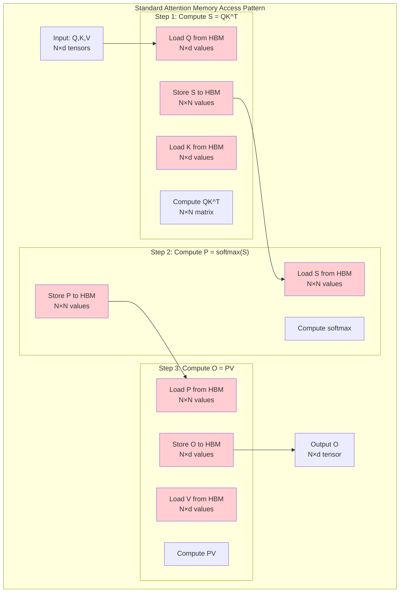
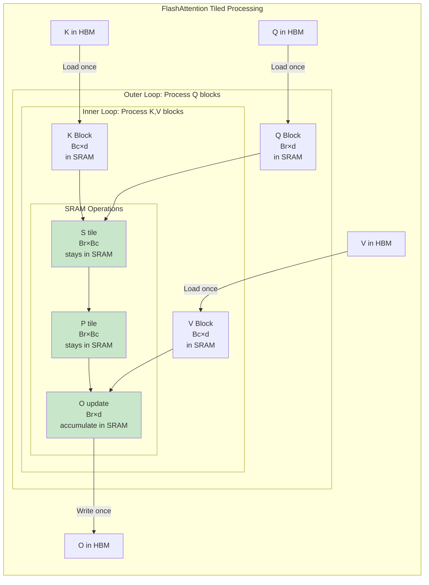
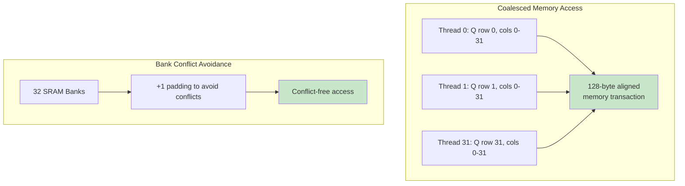
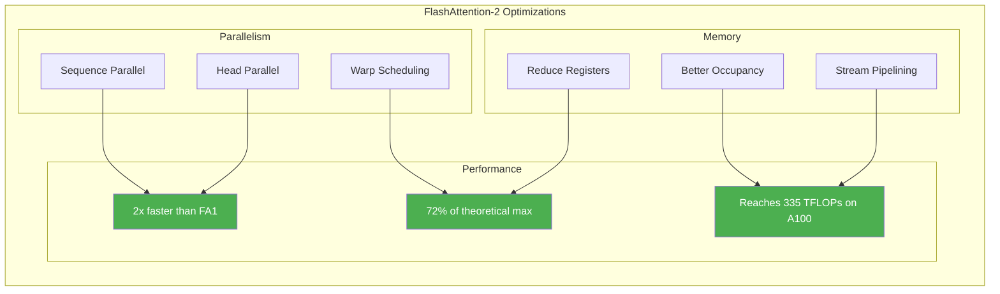
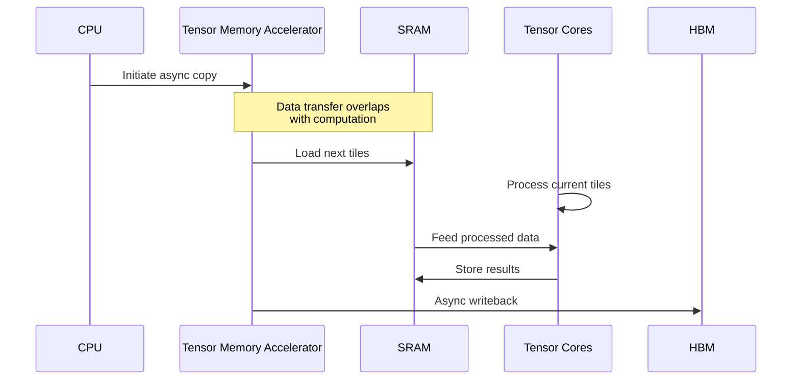

# FlashAttention Kernel Deep Dive: IO-Aware Attention Optimization

## Overview

FlashAttention is a groundbreaking algorithm that revolutionizes attention computation by minimizing memory movement between GPU memory hierarchies. This guide follows the Pareto Principle: master these core concepts to understand how FlashAttention achieves 2-3x speedup over standard attention implementations.

## The Memory Bandwidth Bottleneck



**Understanding the Memory Bottleneck**: This diagram reveals why standard attention is memory-bound rather than compute-bound on modern GPUs. The visualization traces the complete data flow through the three stages of attention computation: computing attention scores (S = QK^T), applying softmax normalization (P = softmax(S)), and computing the weighted output (O = PV). The red-highlighted boxes indicate every point where data must be read from or written to HBM (High Bandwidth Memory), the GPU's main memory. For a typical sequence of 2048 tokens with 64-dimensional embeddings, the intermediate attention matrices S and P each contain over 4 million elements, requiring 32MB of storage in FP16 precision. These massive matrices must be written to HBM after computation and read back for the next stage, creating a memory bandwidth bottleneck that dominates execution time.

**The Problem**: Memory movement, not computation, is the bottleneck. Modern GPUs can perform the matrix multiplications in microseconds, but waiting for data transfer takes milliseconds.

## FlashAttention Solution: Tiled Computation



**The Tiling Solution**: This diagram demonstrates FlashAttention's revolutionary approach to eliminating the memory bottleneck through intelligent tiling. The algorithm divides the input matrices Q, K, and V into small blocks that fit entirely within the GPU's SRAM (Static RAM), which provides 10x higher bandwidth than HBM. The nested loop structure shows how each Query block (Br×d in size) is loaded once into SRAM and then reused while iterating through all Key and Value blocks. The green-highlighted components (S_tile, P_tile, O_tile) represent the critical innovation: these intermediate results never leave SRAM throughout the entire computation. Instead of materializing the full N×N attention matrix in HBM, FlashAttention computes attention scores incrementally in small Br×Bc tiles, accumulating partial results in the fast SRAM. This transforms the memory access pattern from O(N²) reads/writes to just O(N), as only the input blocks and final output need to touch HBM.

## Core Algorithm: Online Softmax

The key innovation enabling tiled processing is **online softmax** - computing softmax incrementally without materializing the full attention matrix.

```mermaid
graph TB
    subgraph "Online Softmax Computation"
        Init[Initialize:<br/>m = -∞<br/>l = 0<br/>O = 0]
        
        subgraph "For each K,V block j"
            Load[Load Kj, Vj to SRAM]
            Compute_S[Compute Sij = Qi × Kj^T<br/>Size: Br × Bc]
            
            subgraph "Update Statistics"
                Update_m[m_new = max(m, rowmax(Sij))]
                Rescale[Rescale O and l by exp(m - m_new)]
                Update_P[Pij = exp(Sij - m_new)]
                Update_l[l_new = l × exp(m - m_new) + rowsum(Pij)]
                Update_O[O_new = O × exp(m - m_new) + Pij × Vj]
            end
            
            Next[m = m_new<br/>l = l_new<br/>O = O_new]
        end
        
        Final[O = O / l]
        
        Init --> Load
        Load --> Compute_S
        Compute_S --> Update_m
        Update_m --> Rescale
        Rescale --> Update_P
        Update_P --> Update_l
        Update_l --> Update_O
        Update_O --> Next
        Next -->|Next block| Load
        Next -->|All blocks done| Final
    end
    
    style Update_m fill:#fff3e0
    style Update_l fill:#fff3e0
    style Update_O fill:#e3f2fd
```

**Online Softmax Algorithm**: This flowchart illustrates the mathematical foundation that enables FlashAttention's tiled processing - the online softmax algorithm. Traditional softmax requires two passes over the data: first to find the maximum (for numerical stability) and compute the sum of exponentials, then to normalize. Online softmax cleverly maintains running statistics (m for row-wise maximum values, l for the sum of exponentials) that are updated incrementally as each new block is processed. When a new K,V block arrives, the algorithm computes its contribution to the attention scores, updates the running maximum (m_new), and then performs a critical rescaling step: all previously accumulated values in O and l are adjusted by exp(m - m_new) to account for the new maximum. This rescaling ensures numerical stability while allowing single-pass processing. The algorithm then adds the new block's contribution to the accumulator. After processing all blocks, a simple division by l produces the final normalized output, mathematically equivalent to standard softmax but computed without ever materializing the full attention matrix.

## Pseudo-Code Implementation

```python
def flash_attention_forward(Q, K, V, block_size_q, block_size_kv):
    """
    FlashAttention Forward Pass
    
    Args:
        Q: Query tensor [N, d]
        K: Key tensor [N, d]
        V: Value tensor [N, d]
        block_size_q: Block size for Q (Br)
        block_size_kv: Block size for K,V (Bc)
    
    Returns:
        O: Output tensor [N, d]
    """
    N, d = Q.shape
    Br = block_size_q
    Bc = block_size_kv
    
    # Initialize output and statistics
    O = zeros([N, d])
    l = zeros([N, 1])  # Normalization factor
    m = full([N, 1], -inf)  # Row-wise max for numerical stability
    
    # Outer loop: iterate over Q blocks
    for i in range(0, N, Br):
        # Load Q block to SRAM
        Qi = Q[i:i+Br, :]  # Shape: [Br, d]
        
        # Initialize block statistics
        mi = full([Br, 1], -inf)
        li = zeros([Br, 1])
        Oi = zeros([Br, d])
        
        # Inner loop: iterate over K,V blocks
        for j in range(0, N, Bc):
            # Load K,V blocks to SRAM
            Kj = K[j:j+Bc, :]  # Shape: [Bc, d]
            Vj = V[j:j+Bc, :]  # Shape: [Bc, d]
            
            # Compute attention scores for this tile
            Sij = Qi @ Kj.T / sqrt(d)  # Shape: [Br, Bc]
            
            # Online softmax update
            mi_new = maximum(mi, rowmax(Sij))  # Shape: [Br, 1]
            
            # Rescale previous accumulator
            Oi = Oi * exp(mi - mi_new)
            li = li * exp(mi - mi_new)
            
            # Compute attention probabilities for this tile
            Pij = exp(Sij - mi_new)  # Shape: [Br, Bc]
            
            # Update accumulator
            li = li + rowsum(Pij)  # Shape: [Br, 1]
            Oi = Oi + Pij @ Vj  # Shape: [Br, d]
            
            # Update max for next iteration
            mi = mi_new
        
        # Normalize and write to HBM
        O[i:i+Br, :] = Oi / li
        l[i:i+Br] = li
        m[i:i+Br] = mi
    
    return O

def flash_attention_backward(Q, K, V, O, dO, block_size_q, block_size_kv):
    """
    FlashAttention Backward Pass (Simplified)
    
    The backward pass recomputes attention on-the-fly rather than storing it,
    trading computation for memory savings.
    """
    N, d = Q.shape
    Br = block_size_q
    Bc = block_size_kv
    
    # Initialize gradients
    dQ = zeros_like(Q)
    dK = zeros_like(K)
    dV = zeros_like(V)
    
    # Similar tiled approach but computing gradients
    for i in range(0, N, Br):
        for j in range(0, N, Bc):
            # Recompute attention for this tile
            Sij = Q[i:i+Br] @ K[j:j+Bc].T / sqrt(d)
            Pij = softmax(Sij)  # Simplified for clarity
            
            # Compute gradients for this tile
            dPij = dO[i:i+Br] @ V[j:j+Bc].T
            dSij = gradient_softmax(Pij, dPij)
            
            # Accumulate gradients
            dQ[i:i+Br] += dSij @ K[j:j+Bc] / sqrt(d)
            dK[j:j+Bc] += dSij.T @ Q[i:i+Br] / sqrt(d)
            dV[j:j+Bc] += Pij.T @ dO[i:i+Br]
    
    return dQ, dK, dV
```

## Performance Optimization Techniques

### 1. Block Size Selection

```mermaid
graph LR
    subgraph "Block Size Trade-offs"
        subgraph "Small Blocks"
            SB1[Br=16, Bc=16]
            SB2[More iterations]
            SB3[Less SRAM usage]
            SB4[More kernel launches]
        end
        
        subgraph "Optimal Blocks"
            OB1[Br=64, Bc=64]
            OB2[Balanced iterations]
            OB3[Fits in SRAM]
            OB4[Good occupancy]
        end
        
        subgraph "Large Blocks"
            LB1[Br=128, Bc=128]
            LB2[Fewer iterations]
            LB3[May spill to HBM]
            LB4[Lower occupancy]
        end
        
        SB1 --> SB2 --> SB3 --> SB4
        OB1 --> OB2 --> OB3 --> OB4
        LB1 --> LB2 --> LB3 --> LB4
    end
    
    style OB1 fill:#c8e6c9
    style OB2 fill:#c8e6c9
    style OB3 fill:#c8e6c9
    style OB4 fill:#c8e6c9
```



**Block Size Selection Strategy**: This diagram compares the trade-offs between different block sizes in FlashAttention implementation. Small blocks (16×16) minimize SRAM usage and fit comfortably in the limited on-chip memory, but require many more iterations and kernel launches, increasing overhead. Large blocks (128×128) reduce the number of iterations and amortize kernel launch costs, but risk exceeding SRAM capacity, causing register spilling to slower memory and reducing SM occupancy. The optimal choice (64×64, highlighted in green) balances these competing factors: it's large enough to minimize iteration overhead while small enough to fit comfortably in SRAM with room for other data structures. This size also aligns well with GPU warp sizes and tensor core dimensions, maximizing hardware utilization.

**Optimal Block Size Formula**:
```
SRAM_available = 96KB (typical per SM)
Block_size = sqrt(SRAM_available / (3 × sizeof(dtype)))

For FP16: Block_size ≈ 64
For FP32: Block_size ≈ 45
```

### 2. Warp-Level Optimizations

```cuda
// Warp-level matrix multiplication using Tensor Cores
__device__ void flash_attention_matmul_tile(
    half* Q_tile,     // [WARP_SIZE, HEAD_DIM]
    half* K_tile,     // [WARP_SIZE, HEAD_DIM]
    float* S_tile     // [WARP_SIZE, WARP_SIZE]
) {
    // Use WMMA (Warp Matrix Multiply Accumulate) for Tensor Cores
    wmma::fragment<wmma::matrix_a, 16, 16, 16, half, wmma::row_major> q_frag;
    wmma::fragment<wmma::matrix_b, 16, 16, 16, half, wmma::col_major> k_frag;
    wmma::fragment<wmma::accumulator, 16, 16, 16, float> s_frag;
    
    // Load tiles into fragments
    wmma::load_matrix_sync(q_frag, Q_tile, 16);
    wmma::load_matrix_sync(k_frag, K_tile, 16);
    
    // Compute using Tensor Cores
    wmma::fill_fragment(s_frag, 0.0f);
    wmma::mma_sync(s_frag, q_frag, k_frag, s_frag);
    
    // Store result
    wmma::store_matrix_sync(S_tile, s_frag, 16, wmma::mem_row_major);
}
```

### 3. Memory Access Patterns



**Memory Access Pattern Optimization**: This diagram illustrates two critical memory optimization techniques in FlashAttention. The left side shows coalesced memory access, where 32 threads in a warp each access consecutive memory locations, allowing the GPU to combine these into a single 128-byte transaction instead of 32 separate transactions. This is crucial because uncoalesced access can be up to 32x slower. The right side demonstrates bank conflict avoidance in shared memory (SRAM), where adding padding prevents multiple threads from accessing the same memory bank simultaneously. Without this optimization, threads would serialize their access, destroying parallelism and causing significant performance degradation.

## FlashAttention-2 Improvements



**FlashAttention-2 Architecture**: This diagram maps the key optimizations introduced in FlashAttention-2 that collectively achieve 2x speedup over the original. The improvements are organized into three categories: parallelism enhancements (sequence-level and head-level parallelism, better warp scheduling), memory optimizations (reduced register usage from 96 to 64 per thread, improved occupancy, stream pipelining), and the resulting performance gains. The green-highlighted performance metrics show the dramatic improvements: FA2 reaches 72% of theoretical maximum throughput and achieves 335 TFLOPs on A100 GPUs. The connections between optimizations and results show how each improvement contributes to the overall performance gain - for instance, reduced register pressure enables higher occupancy, which in turn allows more warps to hide memory latency.

**Key FA2 Improvements**:
1. **Sequence-level parallelism**: Different warps process different sequence positions
2. **Reduced register pressure**: 96 → 64 registers per thread
3. **Better work partitioning**: 4 warps per block vs 8 in FA1
4. **Non-square block tiles**: Br ≠ Bc for better hardware utilization

## FlashAttention-3 and Future Directions

### Asynchronous Execution (H100/H200)



**Asynchronous Execution Pipeline**: This sequence diagram illustrates FlashAttention-3's revolutionary use of the H100's Tensor Memory Accelerator (TMA) for asynchronous memory operations. Unlike previous versions where memory transfers block computation, FA3 overlaps data movement with tensor core operations. The TMA independently manages memory transfers in the background while tensor cores process previously loaded tiles. This creates a pipeline where the next tiles are being loaded while current tiles are being processed, and results are being written back while new computations begin. This asynchronous execution model, combined with warp specialization (some warps handle memory, others handle compute), enables FA3 to achieve near-perfect hardware utilization and the dramatic speedups shown in the benchmark table.

**FA3 Features**:
- **Warp Specialization**: Producer warps handle memory, consumer warps compute
- **FP8 Support**: 1.2x speedup with minimal accuracy loss
- **Persistent Kernels**: Reduces kernel launch overhead
- **Incoherent Processing**: Processes blocks out-of-order for better scheduling

## Real-World Performance Impact

### Benchmark Results

| Configuration | Standard Attention | FlashAttention | FlashAttention-2 | FlashAttention-3 |
|--------------|-------------------|----------------|------------------|------------------|
| Seq Length 2K | 10.3 ms | 4.2 ms (2.5x) | 2.1 ms (4.9x) | 1.7 ms (6.1x) |
| Seq Length 8K | 164 ms | 41 ms (4x) | 18 ms (9.1x) | 14 ms (11.7x) |
| Seq Length 16K | OOM | 163 ms | 72 ms | 56 ms |
| Memory Usage | O(N²) | O(N) | O(N) | O(N) |

### Production Deployment (vLLM Integration)

```python
# vLLM automatically uses FlashAttention when available
from vllm import LLM

llm = LLM(
    model="meta-llama/Llama-2-7b-hf",
    gpu_memory_utilization=0.95,
    # FlashAttention enabled by default if installed
    # Falls back to xFormers or standard attention
)

# Configuration for optimal FlashAttention performance
os.environ["FLASH_ATTENTION_BLOCK_SIZE"] = "64"  # Tune based on GPU
os.environ["FLASH_ATTENTION_CAUSAL"] = "1"  # For autoregressive models
```

## Common Pitfalls and Solutions

| Challenge | Impact | Solution |
|-----------|--------|----------|
| Variable sequence lengths | Wasted computation on padding | FlashAttention handles variable lengths natively |
| Custom attention masks | Can't use FlashAttention | Use block-sparse FlashAttention variant |
| Non-standard attention | Incompatible algorithm | Fall back to standard attention for those layers |
| Debugging attention scores | Can't inspect intermediate values | Use FlashAttention debug mode (slower) |
| Numerical differences | Small variations from standard | Expected due to different reduction order |

## Quick Reference: When to Use FlashAttention

**Always Use When**:
- Sequence length > 512
- Memory-constrained deployment
- Standard causal or bidirectional attention
- Training or inference of transformers

**Consider Alternatives When**:
- Custom attention patterns (use FlashAttention variants)
- Sequence length < 128 (overhead may dominate)
- Debugging attention weights (use standard for inspection)
- Hardware without Tensor Cores (limited benefit)

## The 80/20 Rule for FlashAttention

**Focus on these 20% of concepts for 80% of benefits**:
1. **Tiling Strategy**: Process in SRAM-sized blocks
2. **Online Softmax**: Incremental computation without full matrix
3. **IO Complexity**: Reduce from O(N²) to O(N)
4. **Block Size Tuning**: Match SRAM capacity
5. **Hardware Alignment**: Use Tensor Cores when available

## Learn More

📚 **Essential Resources**:
- [FlashAttention Paper](https://arxiv.org/abs/2205.14135) - Original algorithm
- [FlashAttention-2 Paper](https://arxiv.org/abs/2307.08691) - Parallelism improvements
- [Tri Dao's Blog](https://tridao.me/) - Author's insights and updates
- [FlashAttention GitHub](https://github.com/Dao-AILab/flash-attention) - Implementation
- [vLLM Integration](docs/llm-inference/02-vllm-deep-dive.md#kernel-optimizations) - Production usage

## Summary

FlashAttention revolutionizes attention computation by:
- **Minimizing memory movement** through tiled computation in SRAM
- **Enabling longer sequences** that would otherwise cause OOM
- **Achieving near-optimal hardware utilization** (>70% of peak FLOPS)
- **Maintaining exact results** (not an approximation)

The key insight: memory bandwidth, not compute, is the bottleneck in attention. By keeping data in fast SRAM and computing incrementally, FlashAttention transforms an IO-bound operation into a compute-bound one, unlocking the true potential of modern GPUs.

Next: [GEMM Optimization Deep Dive →](./gemm-optimization-deep-dive.md)