# GEMM Optimization Deep Dive: Matrix Multiplication at Scale

## Overview

General Matrix-Matrix Multiplication (GEMM) is the computational backbone of deep learning, accounting for >90% of the compute in transformer models. This guide explores how modern GPUs achieve near-peak performance through sophisticated optimization techniques, from cache-aware tiling to Tensor Core utilization.

## The GEMM Performance Challenge

```mermaid
graph TB
    subgraph "GEMM Computation: C = A × B"
        A[Matrix A<br/>M×K elements]
        B[Matrix B<br/>K×N elements]
        C[Matrix C<br/>M×N elements]
        
        subgraph "Naive Implementation"
            Loop1[for i in 0..M]
            Loop2[for j in 0..N]
            Loop3[for k in 0..K]
            MAC["C(i,j) += A(i,k) × B(k,j)"]
        end
        
        A --> Loop1
        B --> Loop1
        Loop1 --> Loop2
        Loop2 --> Loop3
        Loop3 --> MAC
        MAC --> C
        
        Complexity[O(M×N×K) operations<br/>O(M×K + K×N + M×N) memory]
    end
    
    style MAC fill:#ffcdd2
    style Complexity fill:#fff3e0
```

**Diagram Explanation**: The naive GEMM implementation has three nested loops performing M×N×K multiply-accumulate operations. For a 4096×4096 matrix multiplication with K=4096, this means 69 billion operations. The red highlighting shows the innermost operation that executes billions of times. Without optimization, each operation requires memory access, making the algorithm memory-bound despite being compute-intensive.

**The Challenge**: Modern GPUs can perform 312 TFLOPS (A100) but have only 1.5 TB/s memory bandwidth. For FP16, this means the GPU can process 208 elements per memory access - but naive GEMM needs 3 memory accesses per 2 operations.

## Memory Hierarchy Optimization

```mermaid
graph LR
    subgraph "Hierarchical Tiling Strategy"
        subgraph "L2 Tile (Grid-level)"
            GridA[A block: 256×256]
            GridB[B block: 256×256]
            GridC[C block: 256×256]
        end
        
        subgraph "L1/Shared Memory Tile (Block-level)"
            BlockA[A tile: 64×64]
            BlockB[B tile: 64×64]
            BlockC[C tile: 64×64]
        end
        
        subgraph "Register Tile (Thread-level)"
            RegA[A frag: 8×8]
            RegB[B frag: 8×8]
            RegC[C frag: 8×8]
        end
        
        subgraph "Memory Hierarchy"
            HBM[HBM: 1.5 TB/s]
            L2[L2 Cache: 6 TB/s]
            SMEM[Shared Mem: 19 TB/s]
            REG[Registers: 100+ TB/s]
        end
        
        GridA --> BlockA
        GridB --> BlockB
        BlockA --> RegA
        BlockB --> RegB
        
        HBM --> L2
        L2 --> SMEM
        SMEM --> REG
    end
    
    style REG fill:#c8e6c9
    style SMEM fill:#e3f2fd
    style L2 fill:#fff3e0
```



**Diagram Explanation**: Hierarchical tiling breaks the large matrix multiplication into smaller tiles that fit in progressively faster memory levels. Grid-level tiles (256×256) fit in L2 cache, block-level tiles (64×64) fit in shared memory, and thread-level tiles (8×8) fit in registers. Each level provides higher bandwidth - from 1.5 TB/s in HBM to over 100 TB/s in registers. This 70x bandwidth improvement is key to achieving high performance.

## Optimized GEMM Algorithm

### Level 1: Cache-Aware Blocking

```python
def blocked_gemm(A, B, C, BLOCK_SIZE=64):
    """
    Cache-aware blocked GEMM
    Processes matrices in tiles that fit in L1/L2 cache
    """
    M, K = A.shape
    K2, N = B.shape
    assert K == K2, "Matrix dimensions must match"
    
    # Outer loops: iterate over C in blocks
    for i0 in range(0, M, BLOCK_SIZE):
        for j0 in range(0, N, BLOCK_SIZE):
            # This C block will be computed incrementally
            for k0 in range(0, K, BLOCK_SIZE):
                # Load blocks into cache
                A_block = A[i0:i0+BLOCK_SIZE, k0:k0+BLOCK_SIZE]
                B_block = B[k0:k0+BLOCK_SIZE, j0:j0+BLOCK_SIZE]
                
                # Inner loops: compute within blocks
                for i in range(BLOCK_SIZE):
                    for j in range(BLOCK_SIZE):
                        # This inner loop should vectorize
                        for k in range(BLOCK_SIZE):
                            if i0+i < M and j0+j < N and k0+k < K:
                                C[i0+i, j0+j] += A_block[i, k] * B_block[k, j]
    
    return C
```

### Level 2: Shared Memory Optimization

```python
def shared_memory_gemm(A, B, C, M, N, K, TILE_SIZE=32):
    """
    Shared memory optimized GEMM algorithm.
    
    In GPU execution:
    - Each thread block loads tiles into shared memory
    - All threads in block collaborate to load data
    - Threads compute in parallel using shared data
    - Synchronization ensures data consistency
    """
    import numpy as np
    
    # Simulate GPU block/thread structure
    # In real GPU: blockDim = (TILE_SIZE, TILE_SIZE)
    # Each block computes one TILE_SIZE x TILE_SIZE output tile
    
    num_blocks_y = (M + TILE_SIZE - 1) // TILE_SIZE
    num_blocks_x = (N + TILE_SIZE - 1) // TILE_SIZE
    
    # Process each output tile (parallel on GPU)
    for block_y in range(num_blocks_y):
        for block_x in range(num_blocks_x):
            
            # Shared memory tiles (on-chip SRAM in GPU)
            tile_A = np.zeros((TILE_SIZE, TILE_SIZE))
            tile_B = np.zeros((TILE_SIZE, TILE_SIZE))
            
            # Each thread computes one output element
            # Thread (ty, tx) computes C[block_y*TILE_SIZE+ty][block_x*TILE_SIZE+tx]
            for thread_y in range(TILE_SIZE):
                for thread_x in range(TILE_SIZE):
                    
                    # Global position for this thread
                    row = block_y * TILE_SIZE + thread_y
                    col = block_x * TILE_SIZE + thread_x
                    
                    if row >= M or col >= N:
                        continue
                    
                    accumulator = 0.0
                    
                    # Loop over K dimension in tiles
                    num_k_tiles = (K + TILE_SIZE - 1) // TILE_SIZE
                    
                    for k_tile in range(num_k_tiles):
                        
                        # COLLABORATIVE LOADING PHASE
                        # Each thread loads one element of A and B tiles
                        # On GPU, this happens in parallel across all threads
                        
                        # Thread (ty, tx) loads A[row][k_tile*TILE_SIZE + tx]
                        a_col = k_tile * TILE_SIZE + thread_x
                        if row < M and a_col < K:
                            tile_A[thread_y][thread_x] = A[row][a_col]
                        else:
                            tile_A[thread_y][thread_x] = 0.0
                        
                        # Thread (ty, tx) loads B[k_tile*TILE_SIZE + ty][col]
                        b_row = k_tile * TILE_SIZE + thread_y
                        if b_row < K and col < N:
                            tile_B[thread_y][thread_x] = B[b_row][col]
                        else:
                            tile_B[thread_y][thread_x] = 0.0
                        
                        # SYNCHRONIZATION BARRIER (all threads wait here)
                        # Ensures all threads have loaded their data
                        # This is __syncthreads() on GPU
                        
                        # COMPUTATION PHASE
                        # Each thread computes partial dot product
                        for k in range(TILE_SIZE):
                            accumulator += tile_A[thread_y][k] * tile_B[k][thread_x]
                        
                        # SYNCHRONIZATION BARRIER before next tile
                        # Ensures all threads are done computing
                    
                    # Write final result
                    C[row][col] = accumulator
    
    return C

# Performance characteristics:
# - Shared memory bandwidth: ~19 TB/s (vs 1.5 TB/s global memory)
# - Data reuse: Each element loaded once per block
# - Arithmetic intensity: O(TILE_SIZE) operations per memory access
```

## Tensor Core Optimization


**Diagram Explanation**: Tensor Cores perform 4×4 matrix multiplications in a single operation, dramatically accelerating GEMM. The WMMA (Warp Matrix Multiply Accumulate) API allows warps to collectively compute 16×16×16 matrix multiplications. Each Tensor Core can perform 64 FMA operations per cycle, and with 432 Tensor Cores on an A100, the theoretical peak reaches 312 TFLOPS - 19x faster than using CUDA cores alone.

### Tensor Core GEMM Implementation

```python
def tensor_core_gemm(A, B, C, M, N, K):
    """
    Tensor Core accelerated GEMM algorithm.
    
    Tensor Cores perform 4x4 matrix multiplications in hardware:
    - 1 Tensor Core = 64 FMA operations per cycle
    - Warp (32 threads) collectively compute 16x16x16 GEMM
    - 19x faster than CUDA cores for eligible operations
    """
    import numpy as np
    
    # Tensor Core fragment dimensions
    WMMA_M = 16  # Fragment height
    WMMA_N = 16  # Fragment width  
    WMMA_K = 16  # Fragment depth
    
    # Warp size (fundamental GPU execution unit)
    WARP_SIZE = 32
    
    # Calculate number of warps needed
    # Each warp processes one 16x16 output tile
    num_warps_m = (M + WMMA_M - 1) // WMMA_M
    num_warps_n = (N + WMMA_N - 1) // WMMA_N
    
    # Process each output tile (parallel across warps on GPU)
    for warp_m in range(num_warps_m):
        for warp_n in range(num_warps_n):
            
            # WARP-LEVEL COMPUTATION
            # All 32 threads in warp collaborate on this tile
            
            # Accumulator fragment (stored in registers)
            # Each thread holds part of the 16x16 result
            c_fragment = np.zeros((WMMA_M, WMMA_N), dtype=np.float32)
            
            # Loop over K dimension in 16-element chunks
            for k in range(0, K, WMMA_K):
                
                # Calculate positions for this iteration
                a_row = warp_m * WMMA_M
                a_col = k
                b_row = k
                b_col = warp_n * WMMA_N
                
                # LOAD PHASE: Load matrix fragments
                # On GPU, threads collaboratively load data
                # Each thread loads specific elements based on its ID
                
                # Load A fragment (16x16 from A matrix)
                if a_row < M and a_col < K:
                    a_fragment = A[a_row:min(a_row+WMMA_M, M), 
                                  a_col:min(a_col+WMMA_K, K)]
                    # Pad if necessary
                    if a_fragment.shape != (WMMA_M, WMMA_K):
                        padded = np.zeros((WMMA_M, WMMA_K))
                        padded[:a_fragment.shape[0], :a_fragment.shape[1]] = a_fragment
                        a_fragment = padded
                else:
                    a_fragment = np.zeros((WMMA_M, WMMA_K))
                
                # Load B fragment (16x16 from B matrix)
                if b_row < K and b_col < N:
                    b_fragment = B[b_row:min(b_row+WMMA_K, K),
                                  b_col:min(b_col+WMMA_N, N)]
                    # Pad if necessary
                    if b_fragment.shape != (WMMA_K, WMMA_N):
                        padded = np.zeros((WMMA_K, WMMA_N))
                        padded[:b_fragment.shape[0], :b_fragment.shape[1]] = b_fragment
                        b_fragment = padded
                else:
                    b_fragment = np.zeros((WMMA_K, WMMA_N))
                
                # TENSOR CORE OPERATION
                # This is a single instruction on GPU!
                # Hardware performs 16x16x16 matrix multiply-accumulate
                # Each of 4 Tensor Cores in SM computes 4x4 sub-tile
                c_fragment += np.dot(a_fragment, b_fragment)
                
                # Note: On actual GPU, this happens in specialized hardware:
                # - 4 Tensor Cores per SM work in parallel
                # - Each performs 64 FMA ops per cycle
                # - Total: 256 FMA ops per cycle per SM
            
            # STORE PHASE: Write result back to global memory
            # Threads collaboratively store their fragment parts
            c_row = warp_m * WMMA_M
            c_col = warp_n * WMMA_N
            
            if c_row < M and c_col < N:
                # Store the computed tile
                end_row = min(c_row + WMMA_M, M)
                end_col = min(c_col + WMMA_N, N)
                C[c_row:end_row, c_col:end_col] = c_fragment[:end_row-c_row, :end_col-c_col]
    
    return C

# Tensor Core performance characteristics:
# - 312 TFLOPS FP16 on A100 (vs 19.5 TFLOPS FP32 without TC)
# - Mixed precision: FP16 inputs, FP32 accumulation
# - Requires aligned memory access and dimensions
# - Automatic in cuBLAS/cuDNN when conditions met
```

## Advanced Optimization Techniques

### 1. Double Buffering


**Implementation Strategy**:
```python
def double_buffered_gemm(A, B, C, TILE_SIZE=32):
    """
    Double buffering technique for overlapping computation and memory transfer.
    
    Key concept: Use two sets of buffers (ping-pong) to hide memory latency
    - While computing with buffer 0, load data into buffer 1
    - While computing with buffer 1, load data into buffer 0
    """
    import numpy as np
    
    M, K = A.shape
    K2, N = B.shape
    
    # Double buffers in shared memory (on-chip SRAM)
    # Index 0 and 1 alternate (ping-pong pattern)
    tile_A_buffers = [np.zeros((TILE_SIZE, TILE_SIZE)) for _ in range(2)]
    tile_B_buffers = [np.zeros((TILE_SIZE, TILE_SIZE)) for _ in range(2)]
    
    num_tiles_k = (K + TILE_SIZE - 1) // TILE_SIZE
    
    # Process each output tile
    for i in range(0, M, TILE_SIZE):
        for j in range(0, N, TILE_SIZE):
            
            # Output tile accumulator
            c_tile = np.zeros((TILE_SIZE, TILE_SIZE))
            
            # Current buffer index
            buffer_idx = 0
            
            # PREFETCH: Load first tile into buffer 0
            # This happens before computation starts
            k_start = 0
            tile_A_buffers[0][:] = A[i:min(i+TILE_SIZE, M), 
                                     k_start:min(k_start+TILE_SIZE, K)]
            tile_B_buffers[0][:] = B[k_start:min(k_start+TILE_SIZE, K),
                                     j:min(j+TILE_SIZE, N)]
            
            # Main loop with overlapped loads
            for k_tile_idx in range(num_tiles_k):
                k = k_tile_idx * TILE_SIZE
                
                # ASYNC LOAD PHASE (would be async on GPU)
                # Start loading NEXT tile while computing CURRENT
                if k_tile_idx < num_tiles_k - 1:
                    next_buffer = 1 - buffer_idx
                    next_k = (k_tile_idx + 1) * TILE_SIZE
                    
                    # Simulate async DMA transfer to shared memory
                    # On GPU, this uses cuda::pipeline or cp.async
                    tile_A_buffers[next_buffer][:] = A[i:min(i+TILE_SIZE, M),
                                                       next_k:min(next_k+TILE_SIZE, K)]
                    tile_B_buffers[next_buffer][:] = B[next_k:min(next_k+TILE_SIZE, K),
                                                       j:min(j+TILE_SIZE, N)]
                
                # COMPUTE PHASE with current buffer
                # This overlaps with the async load above
                current_A = tile_A_buffers[buffer_idx]
                current_B = tile_B_buffers[buffer_idx]
                
                # Matrix multiply for this tile
                # On GPU, this would be highly parallel
                for ii in range(TILE_SIZE):
                    for jj in range(TILE_SIZE):
                        for kk in range(TILE_SIZE):
                            c_tile[ii, jj] += current_A[ii, kk] * current_B[kk, jj]
                
                # SYNCHRONIZATION POINT
                # Wait for async load to complete before switching
                # This is __syncthreads() on GPU
                
                # Switch to the other buffer for next iteration
                buffer_idx = 1 - buffer_idx
            
            # Store result tile
            C[i:min(i+TILE_SIZE, M), j:min(j+TILE_SIZE, N)] = \
                c_tile[:min(TILE_SIZE, M-i), :min(TILE_SIZE, N-j)]
    
    return C

# Performance benefits of double buffering:
# - Hides memory latency (up to 100% of transfer time)
# - Keeps compute units busy while waiting for memory
# - Critical for achieving peak throughput
# - Requires 2x shared memory but worth the tradeoff
```

### 2. Register Blocking


```python
def register_blocked_compute(smem_A, smem_B, thread_y, thread_x, TILE_SIZE=32):
    """
    Register-level blocking for maximum data reuse.
    
    Key concepts:
    - Each thread computes an 8x8 tile of output
    - Uses ~96 registers per thread (64 for C, 16 for A, 16 for B)
    - Maximizes arithmetic intensity at thread level
    - All loops fully unrolled by compiler
    """
    import numpy as np
    
    # Register tile dimensions (per thread)
    REG_TILE_M = 8  # Height of output tile per thread
    REG_TILE_N = 8  # Width of output tile per thread
    
    # REGISTER ALLOCATION
    # These arrays simulate GPU registers (fastest memory)
    # On GPU: stored in 32-bit register file, not memory
    reg_A = np.zeros(REG_TILE_M)      # Column strip from A
    reg_B = np.zeros(REG_TILE_N)      # Row strip from B
    reg_C = np.zeros((REG_TILE_M, REG_TILE_N))  # Output tile
    
    # Initialize accumulator registers to zero
    # Compiler unrolls this completely (no loop overhead)
    for i in range(REG_TILE_M):
        for j in range(REG_TILE_N):
            reg_C[i, j] = 0.0
    
    # Main computation loop
    # Each iteration processes one column of A and one row of B
    for k in range(TILE_SIZE):
        
        # LOAD PHASE: Shared memory → Registers
        # Load a column strip from tile_A into registers
        # Thread (ty, tx) loads elements for its 8x8 output tile
        for i in range(REG_TILE_M):
            row_idx = thread_y * REG_TILE_M + i
            if row_idx < smem_A.shape[0] and k < smem_A.shape[1]:
                reg_A[i] = smem_A[row_idx, k]
            else:
                reg_A[i] = 0.0
        
        # Load a row strip from tile_B into registers
        for j in range(REG_TILE_N):
            col_idx = thread_x * REG_TILE_N + j
            if k < smem_B.shape[0] and col_idx < smem_B.shape[1]:
                reg_B[j] = smem_B[k, col_idx]
            else:
                reg_B[j] = 0.0
        
        # COMPUTE PHASE: Outer product in registers
        # This is the key optimization: 64 FMA operations
        # All operands in registers (100+ TB/s bandwidth)
        # Compiler fully unrolls these loops
        for i in range(REG_TILE_M):
            for j in range(REG_TILE_N):
                # Each thread performs 8x8=64 FMA ops per iteration
                # Total: 64 * TILE_SIZE FMA ops per thread
                reg_C[i, j] += reg_A[i] * reg_B[j]
    
    return reg_C

# Performance analysis:
# - Data reuse: Each A element used 8 times, each B element used 8 times
# - Arithmetic intensity: 64 FMA ops per 16 loads = 4 ops/load
# - Register pressure: ~96 registers per thread (out of 255 available)
# - Occupancy: Can run ~42 warps per SM with this register usage

def full_register_blocked_gemm(A, B, C):
    """
    Complete GEMM with register blocking at thread level.
    """
    M, K = A.shape
    _, N = B.shape
    
    TILE_SIZE = 32
    REG_TILE_M = 8
    REG_TILE_N = 8
    
    # Each thread block processes a TILE_SIZE x TILE_SIZE output
    # Each thread computes REG_TILE_M x REG_TILE_N elements
    threads_per_block_y = TILE_SIZE // REG_TILE_M  # 4 threads
    threads_per_block_x = TILE_SIZE // REG_TILE_N  # 4 threads
    
    # Process all output tiles
    for block_y in range(0, M, TILE_SIZE):
        for block_x in range(0, N, TILE_SIZE):
            
            # Each thread in this block computes part of the tile
            for thread_y in range(threads_per_block_y):
                for thread_x in range(threads_per_block_x):
                    
                    # Global position for this thread's output
                    global_y = block_y + thread_y * REG_TILE_M
                    global_x = block_x + thread_x * REG_TILE_N
                    
                    # Compute 8x8 output tile for this thread
                    # In practice, this would use the register blocking above
                    for i in range(REG_TILE_M):
                        for j in range(REG_TILE_N):
                            if global_y + i < M and global_x + j < N:
                                for k in range(K):
                                    C[global_y + i, global_x + j] += \
                                        A[global_y + i, k] * B[k, global_x + j]
    
    return C
```

### 3. Vectorized Memory Access


```python
def vectorized_load(global_memory, shared_memory, stride, thread_id):
    """
    Vectorized memory access pattern for coalesced loads.
    
    Key optimization:
    - Load 4 floats (128 bits) in a single transaction
    - Adjacent threads access adjacent memory (coalesced)
    - Reduces memory transactions by 4x
    - Critical for achieving peak memory bandwidth
    """
    import numpy as np
    
    # VECTOR WIDTH: 128 bits = 4 floats
    VECTOR_SIZE = 4  # float4 in CUDA
    
    # Calculate this thread's load position
    # Each thread loads VECTOR_SIZE consecutive elements
    vec_offset = thread_id * VECTOR_SIZE
    
    if vec_offset + VECTOR_SIZE <= stride:
        # VECTORIZED LOAD (single transaction on GPU)
        # On GPU, this compiles to a single LD.E.128 instruction
        # Loads 128 bits from global memory in one cycle
        vector_data = global_memory[vec_offset:vec_offset + VECTOR_SIZE]
        
        # Store to shared memory (also vectorized)
        shared_memory[vec_offset:vec_offset + VECTOR_SIZE] = vector_data
        
        return True  # Load successful
    else:
        # Handle boundary case with scalar loads
        remaining = stride - vec_offset
        if remaining > 0:
            # Load remaining elements (less efficient)
            for i in range(remaining):
                shared_memory[vec_offset + i] = global_memory[vec_offset + i]
        return False  # Partial load

def optimized_matrix_load(matrix, block_y, block_x, TILE_SIZE=32):
    """
    Optimized matrix tile loading with vectorization.
    
    Demonstrates how threads collaborate to load a tile efficiently.
    """
    import numpy as np
    
    # Shared memory tile
    shared_tile = np.zeros((TILE_SIZE, TILE_SIZE))
    
    # Simulate thread block (would be parallel on GPU)
    THREADS_PER_BLOCK = 256  # Common configuration
    VECTOR_SIZE = 4
    
    # Calculate loads per thread
    elements_per_tile = TILE_SIZE * TILE_SIZE
    vectors_per_tile = elements_per_tile // VECTOR_SIZE
    vectors_per_thread = (vectors_per_tile + THREADS_PER_BLOCK - 1) // THREADS_PER_BLOCK
    
    # Each thread loads multiple vectors
    for thread_id in range(THREADS_PER_BLOCK):
        for vec_idx in range(vectors_per_thread):
            # Global vector index
            global_vec_idx = thread_id * vectors_per_thread + vec_idx
            
            if global_vec_idx < vectors_per_tile:
                # Convert to 2D coordinates
                linear_idx = global_vec_idx * VECTOR_SIZE
                tile_y = linear_idx // TILE_SIZE
                tile_x = linear_idx % TILE_SIZE
                
                # Global matrix coordinates
                global_y = block_y + tile_y
                global_x = block_x + tile_x
                
                # Vectorized load (4 elements at once)
                if tile_x + VECTOR_SIZE <= TILE_SIZE:
                    # Aligned vector load
                    if global_y < matrix.shape[0] and global_x + VECTOR_SIZE <= matrix.shape[1]:
                        shared_tile[tile_y, tile_x:tile_x+VECTOR_SIZE] = \
                            matrix[global_y, global_x:global_x+VECTOR_SIZE]
                else:
                    # Unaligned load (less efficient)
                    for i in range(min(VECTOR_SIZE, TILE_SIZE - tile_x)):
                        if global_y < matrix.shape[0] and global_x + i < matrix.shape[1]:
                            shared_tile[tile_y, tile_x + i] = matrix[global_y, global_x + i]
    
    return shared_tile

# Memory access patterns comparison:
# Scalar access: 1024 loads for 32x32 tile = 1024 transactions
# Vector access: 256 loads of float4 = 256 transactions (4x reduction)
# Bandwidth utilization: ~90% with vectorization vs ~25% without
```

## Performance Analysis and Tuning

### Arithmetic Intensity

```mermaid
graph TB
    subgraph "GEMM Arithmetic Intensity"
        Formula[AI = FLOPs / Bytes]
        
        subgraph "Different Scenarios"
            SmallMatrix[Small Matrices<br/>M=N=K=128<br/>AI = 10.7]
            MediumMatrix[Medium Matrices<br/>M=N=K=1024<br/>AI = 85.3]
            LargeMatrix[Large Matrices<br/>M=N=K=4096<br/>AI = 341.3]
        end
        
        subgraph "Roofline Model"
            MemBound[Memory Bound<br/>AI < 50]
            Balanced[Balanced<br/>AI ≈ 50-200]
            ComputeBound[Compute Bound<br/>AI > 200]
        end
        
        SmallMatrix --> MemBound
        MediumMatrix --> Balanced
        LargeMatrix --> ComputeBound
    end
    
    style MemBound fill:#ffcdd2
    style Balanced fill:#fff3e0
    style ComputeBound fill:#c8e6c9
```



**Arithmetic Intensity Calculation**:
```
For GEMM: C = A × B where A is M×K, B is K×N
FLOPs = 2 × M × N × K (multiply-add)
Bytes = sizeof(type) × (M×K + K×N + M×N)

AI = (2 × M × N × K) / (sizeof(type) × (M×K + K×N + M×N))

For square matrices (M = N = K):
AI = (2 × N³) / (3 × N² × sizeof(type))
AI = (2 × N) / (3 × sizeof(type))

For FP16 (2 bytes): AI = N / 3
For FP32 (4 bytes): AI = N / 6
```

### Auto-Tuning Parameters

```python
def auto_tune_gemm(M, N, K, dtype='float16'):
    """
    Auto-tune GEMM parameters for specific matrix size
    """
    # Hardware constraints
    SHARED_MEM_SIZE = 48 * 1024  # 48KB shared memory
    MAX_THREADS = 1024
    WARP_SIZE = 32
    
    # Calculate optimal tile size
    element_size = 2 if dtype == 'float16' else 4
    
    # Tile size should fit in shared memory
    # Need space for A tile + B tile + C tile
    max_tile = int(np.sqrt(SHARED_MEM_SIZE / (3 * element_size)))
    
    # Round down to warp size multiple
    tile_size = (max_tile // WARP_SIZE) * WARP_SIZE
    
    # Calculate block dimensions
    block_dim_x = min(tile_size, WARP_SIZE)
    block_dim_y = min(tile_size // block_dim_x, MAX_THREADS // block_dim_x)
    
    # Calculate grid dimensions
    grid_dim_x = (N + tile_size - 1) // tile_size
    grid_dim_y = (M + tile_size - 1) // tile_size
    
    # Register blocking
    reg_tile_m = 8 if M >= 1024 else 4
    reg_tile_n = 8 if N >= 1024 else 4
    
    return {
        'tile_size': tile_size,
        'block_dim': (block_dim_x, block_dim_y),
        'grid_dim': (grid_dim_x, grid_dim_y),
        'reg_tile': (reg_tile_m, reg_tile_n),
        'use_tensor_cores': dtype in ['float16', 'bfloat16'],
        'double_buffer': K >= 1024
    }
```

## cuBLAS vs Custom Kernels

### Decision Matrix

| Scenario | Recommendation | Reasoning |
|----------|---------------|-----------|
| Square matrices > 512 | cuBLAS | Highly optimized for standard cases |
| Irregular shapes | Custom | cuBLAS may have poor tiling |
| Batched small matrices | Custom | Reduce kernel launch overhead |
| Fused operations | Custom | Eliminate intermediate memory writes |
| Standard GEMM | cuBLAS | Years of optimization |
| Research/experimentation | Custom | Full control over algorithm |

### Performance Comparison


## Production Integration with vLLM

```python
# vLLM's GEMM strategy selection
class GEMMOptimizer:
    def __init__(self):
        self.strategies = {
            'small': self.small_gemm,      # < 256
            'medium': self.medium_gemm,     # 256-2048
            'large': self.large_gemm,       # > 2048
            'quantized': self.quantized_gemm
        }
    
    def select_strategy(self, M, N, K, dtype):
        """Select optimal GEMM strategy based on dimensions"""
        size = max(M, N, K)
        
        if dtype in ['int8', 'int4']:
            return self.strategies['quantized']
        elif size < 256:
            return self.strategies['small']
        elif size < 2048:
            return self.strategies['medium']
        else:
            return self.strategies['large']
    
    def small_gemm(self, A, B):
        # Custom kernel for small matrices
        # Optimized for low latency
        return custom_small_gemm_kernel(A, B)
    
    def medium_gemm(self, A, B):
        # CUTLASS-generated kernel
        # Balance between flexibility and performance
        return cutlass_gemm(A, B)
    
    def large_gemm(self, A, B):
        # cuBLAS for large matrices
        # Maximum throughput
        return cublas.gemm(A, B)
    
    def quantized_gemm(self, A, B):
        # Specialized INT8/INT4 GEMM
        # Uses DP4A/DP2A instructions
        return quantized_gemm_kernel(A, B)
```

## Common Pitfalls and Solutions

| Problem | Symptom | Solution |
|---------|---------|----------|
| Low occupancy | <30% SM utilization | Reduce register usage, smaller tiles |
| Bank conflicts | 32x slowdown in shared memory | Pad shared memory arrays |
| Uncoalesced access | Low memory bandwidth utilization | Transpose in shared memory |
| Register spilling | Sudden performance drop | Reduce register tile size |
| Poor tiling | Low arithmetic intensity | Increase tile size if possible |

## Quick Reference: GEMM Optimization Checklist

**Memory Optimization**:
- ✓ Hierarchical tiling (L2 → Shared → Registers)
- ✓ Coalesced global memory access
- ✓ Bank conflict-free shared memory
- ✓ Double buffering for overlap

**Compute Optimization**:
- ✓ Tensor Cores for eligible types
- ✓ Register blocking for data reuse
- ✓ Loop unrolling with #pragma unroll
- ✓ Vectorized loads (float4)

**System-Level**:
- ✓ Optimal block/grid dimensions
- ✓ Sufficient occupancy (>50%)
- ✓ Minimal kernel launch overhead
- ✓ Stream-based concurrency

## The 80/20 Rule for GEMM Optimization

**Focus on these 20% of optimizations for 80% of performance**:
1. **Use Tensor Cores** when available (10x speedup)
2. **Tile for shared memory** (3-5x speedup)
3. **Vectorized memory access** (2x speedup)
4. **Proper block dimensions** (2x speedup)
5. **Choose right tool** (cuBLAS vs custom)

## Learn More

📚 **Essential Resources**:
- [CUTLASS GitHub](https://github.com/NVIDIA/cutlass) - Template library for GEMM
- [cuBLAS Documentation](https://docs.nvidia.com/cuda/cublas/) - NVIDIA's BLAS library
- [How to Optimize GEMM](https://github.com/flame/how-to-optimize-gemm) - Step-by-step tutorial
- [Tensor Core Programming](https://developer.nvidia.com/blog/programming-tensor-cores-cuda-9/) - NVIDIA guide
- [vLLM GEMM Implementation](docs/llm-inference/02-vllm-deep-dive.md#kernel-optimizations) - Production usage

## Summary

GEMM optimization is critical for LLM performance because:
- **Dominates compute time** - >90% of transformer operations are matrix multiplications
- **Memory bandwidth limited** - Naive implementation achieves <5% of peak FLOPS
- **Hierarchical optimization required** - Must optimize for registers, shared memory, L2, and HBM
- **Hardware-specific** - Tensor Cores provide 10x speedup but require careful programming

The key insight: treat GEMM as a memory optimization problem, not just a compute problem. By maximizing data reuse through hierarchical tiling and leveraging specialized hardware like Tensor Cores, modern implementations achieve >90% of theoretical peak performance.

Next: [Quantization Kernels Deep Dive →](./quantization-kernels-deep-dive.md)