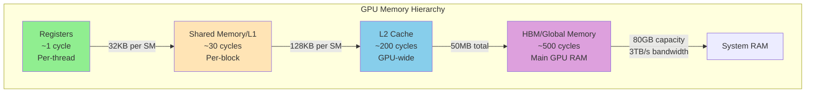
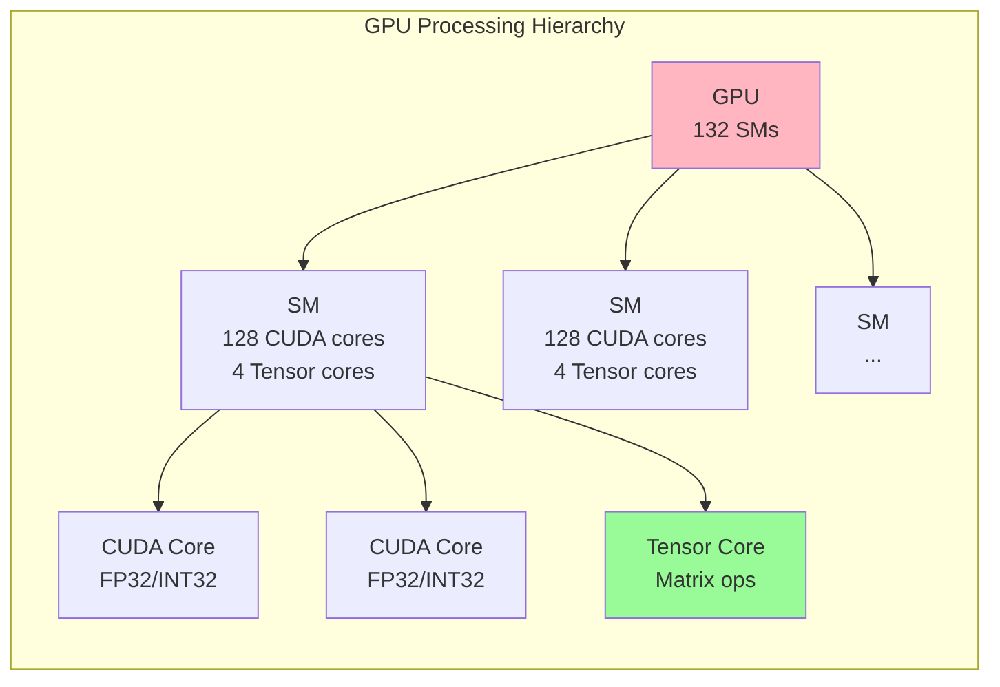
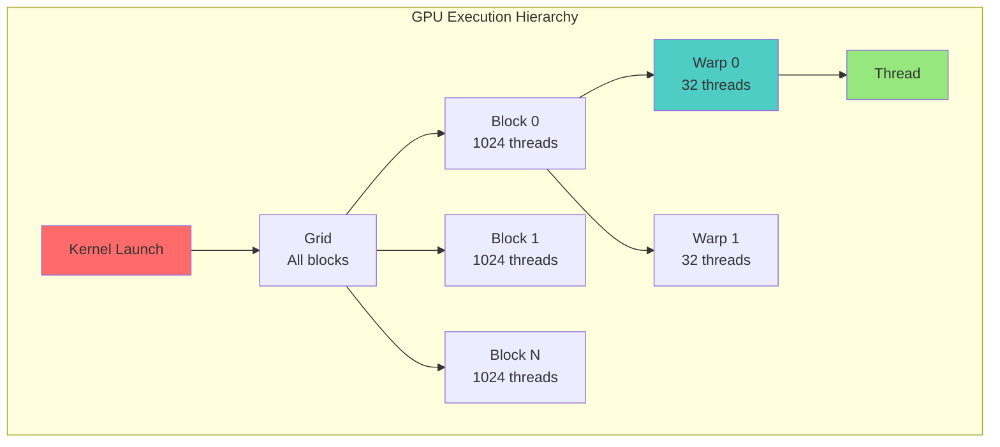
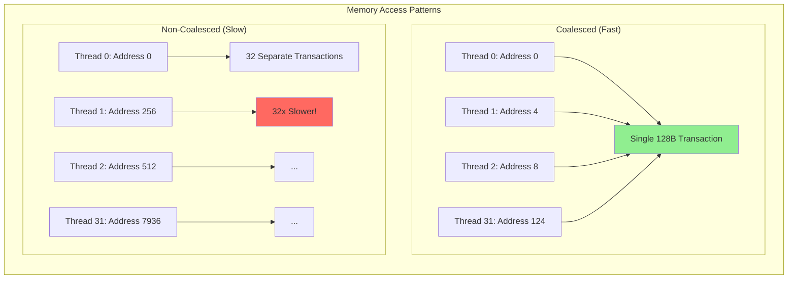
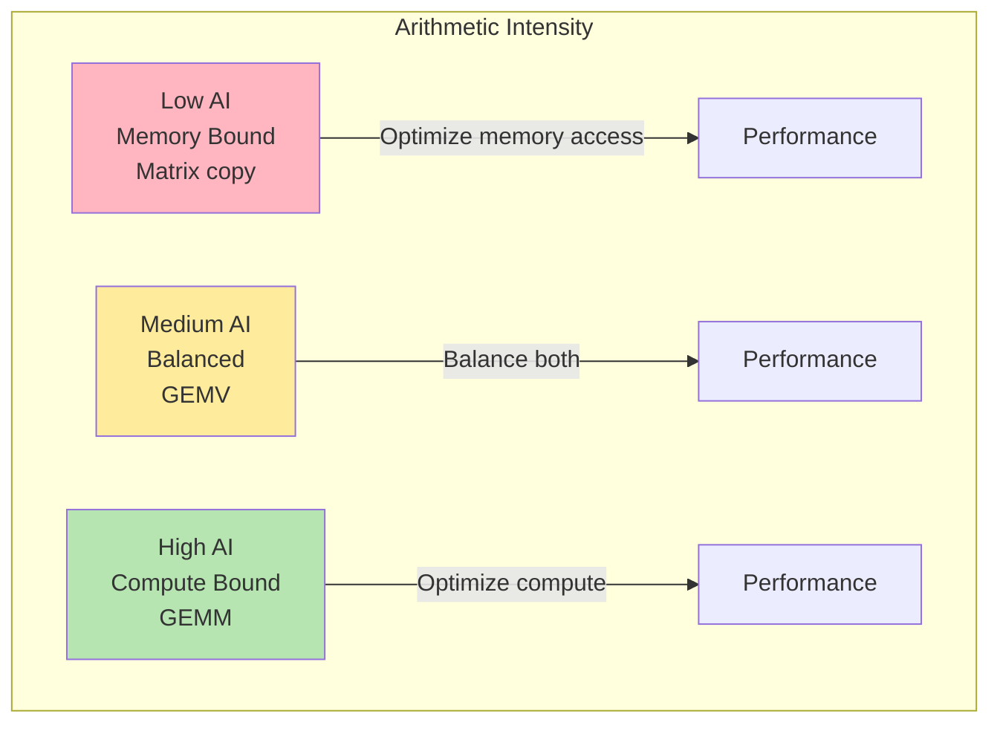
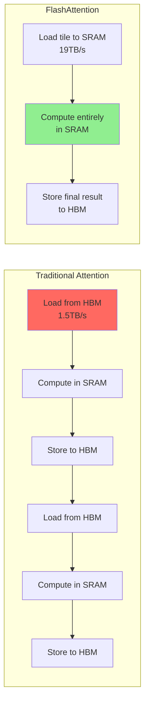
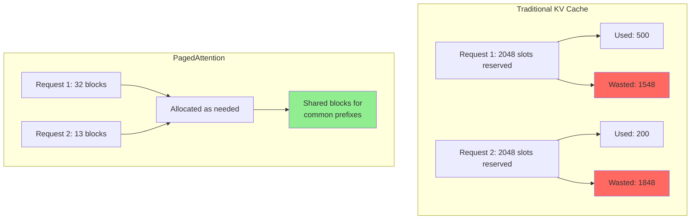

# GPU Architecture Essentials: The 20% You Need to Know

## Overview

This guide follows the Pareto Principle: master these 20% of GPU concepts to understand 80% of GPU computing discussions. These terms appear frequently in performance optimization contexts like vLLM's kernel optimizations.

## GPU Memory Hierarchy: From Fastest to Slowest



**Diagram Explanation**: This hierarchy shows data flow from fastest (Registers) to slowest (System RAM) memory. Each level has different capacity and access times measured in GPU clock cycles. The arrows show the relationship and data flow direction - data moves up when fetched for computation, and down when results are stored. The annotations (like "32KB per SM") indicate the capacity relationship between levels.

**What "KB per SM" means**: "KB per SM" means kilobytes of memory available per Streaming Multiprocessor. Each SM is an independent processor on the GPU, and "128KB per SM" means each SM has 128 kilobytes of shared memory/L1 cache available for its threads to use collaboratively.

**Real-Life Analogy - A Restaurant Kitchen**:
- **Registers** (1 cycle): Your hands holding ingredients - instant access, very limited capacity
- **Shared Memory/L1** (30 cycles): The prep station counter - quick access, shared by your team
- **L2 Cache** (200 cycles): The pantry in the kitchen - walk a few steps, shared by all stations
- **HBM** (500 cycles): The walk-in freezer - takes time to fetch, but lots of storage
- **System RAM**: The warehouse across town - huge capacity but very slow to access

**Data Flow Example**: When computing a matrix multiplication:
1. Thread loads data from HBM into L2 cache
2. L2 cache feeds data to L1/Shared Memory
3. Shared Memory provides data to Registers
4. Computation happens using Register values
5. Results flow back down: Registers → Shared Memory → L2 → HBM

### 1. HBM (High Bandwidth Memory)
**What it is**: The main GPU memory, like your computer's RAM but much faster. Modern GPUs use HBM2e or HBM3. HBM stands for High Bandwidth Memory - it's stacked memory chips connected through thousands of wires providing massive parallel data transfer.

**Key specs**:
- Capacity: 24GB (RTX 4090) to 80GB (H100)
- Bandwidth: 1TB/s (consumer) to 3TB/s (data center)
- Latency: ~500 GPU cycles

**Why it matters**: This is where your model weights, activations, and data live. Running out of HBM causes out-of-memory (OOM) errors.

**Real Use Case - LLM Serving**: 
- A 7B parameter model in FP16 requires 14GB just for weights
- Add KV cache for 10 concurrent users: +8GB
- Result: Need at least 24GB HBM to serve this model
- If you only have 16GB, you'll get OOM errors

**Simple analogy**: Like a warehouse - lots of storage but takes time to fetch items.

### 2. SRAM (Static RAM) / Shared Memory
**What it is**: Ultra-fast on-chip memory shared within a thread block. Part of each Streaming Multiprocessor (SM). SRAM stands for Static Random Access Memory - it's built directly into the processor chip using transistors, making it extremely fast but expensive and limited in size.

**Key specs**:
- Capacity: 100-228KB per SM (an H100 has 132 SMs, so ~30MB total SRAM)
- Bandwidth: 19TB/s (over 6x faster than HBM)
- Latency: ~30 cycles

**Why it matters**: Keeping data in SRAM instead of HBM is the key to algorithms like FlashAttention. It's why "tiling" strategies work.

**What is Tiling?**: Tiling means breaking a large computation into smaller chunks (tiles) that fit in fast memory. Instead of processing a huge matrix that requires HBM access, you process small tiles that fit in SRAM.

**Real Use Case - FlashAttention**:
- Traditional attention: Loads full attention matrix from HBM repeatedly (slow)
- FlashAttention: Breaks attention into 64×64 tiles that fit in SRAM
- Result: 2-3x speedup by avoiding HBM round trips
- Each tile computation stays entirely in SRAM

**Simple analogy**: Like a workbench - limited space but everything is within arm's reach.

## GPU Processing Units



**Diagram Explanation**: This shows the hierarchical organization of processing units. A GPU contains many SMs (Streaming Multiprocessors). Each SM contains multiple CUDA cores for general computation and Tensor cores for matrix operations. The arrows show the containment relationship - the GPU contains SMs, and each SM contains CUDA and Tensor cores.

**Acronym Breakdown**:
- **SM**: Streaming Multiprocessor - an independent processor unit
- **CUDA**: Compute Unified Device Architecture - NVIDIA's parallel computing platform
- **FP32**: 32-bit floating point (single precision)
- **INT32**: 32-bit integer

### 3. CUDA Cores
**What it is**: Basic processing units that execute one floating-point or integer operation per cycle.

**Key facts**:
- Modern GPUs have thousands (4,608 in RTX 4090, 18,432 in H100)
- Handle general computation (FP32, INT32)
- Execute in groups of 32 (called warps)

**Why it matters**: More CUDA cores = more parallel computation capacity.

**Real Use Case - Element-wise Operations**:
- Computing activation functions (ReLU, sigmoid) on a tensor
- Each CUDA core processes one element
- A 1M element tensor on 10,000 CUDA cores: processed in ~100 iterations
- Without parallelism: would take 1M iterations

**Simple analogy**: Like workers in a factory - each can do one simple task at a time.

### 4. Tensor Cores
**What it is**: Specialized units for matrix multiplication, crucial for AI workloads.

**Key facts**:
- 4-10x faster than CUDA cores for matrix ops
- Support mixed precision (FP16, BF16, INT8, FP8)
- One tensor core can compute a 4×4 matrix multiply per cycle

**Why it matters**: The reason modern GPUs are so fast at AI - they're purpose-built for the matrix operations that dominate neural networks.

**Real Use Case - GEMM (General Matrix Multiplication)**:
- Computing attention scores in transformers
- CUDA cores: Process element by element
- Tensor cores: Process 4×4 blocks at once
- Result: 10x speedup for the same operation
- This is why V100 (with tensor cores) revolutionized AI training

**What is GEMM vs GEMV?**:
- **GEMM**: General Matrix-Matrix multiplication (Matrix × Matrix)
  - Example: Computing attention scores (Query × Key^T)
  - Highly parallel, perfect for tensor cores
- **GEMV**: General Matrix-Vector multiplication (Matrix × Vector)
  - Example: Applying weights to a single input
  - Less parallel, often memory-bound

**Simple analogy**: Like a specialized calculator that can multiply entire spreadsheets at once instead of cell by cell.

## GPU Execution Model



**Diagram Explanation**: This shows how GPU execution is organized hierarchically. A kernel launch creates a Grid containing all blocks. Each block contains up to 1024 threads, organized into warps of 32 threads each. The arrows show the decomposition - a Grid decomposes into Blocks, Blocks into Warps, and Warps into individual Threads. This hierarchy determines how work is distributed and executed across the GPU.

**Data Flow in Execution**:
1. CPU launches a kernel with grid dimensions
2. Grid is distributed across SMs
3. Each SM executes one or more blocks
4. Blocks are broken into warps for scheduling
5. Warps execute in SIMT fashion (all 32 threads run the same instruction)

### 5. Warp
**What it is**: A group of 32 threads that execute instructions in lockstep (SIMT - Single Instruction, Multiple Thread). SIMT means all threads in a warp execute the same instruction simultaneously on different data.

**Key facts**:
- Fundamental scheduling unit on NVIDIA GPUs
- All 32 threads must execute the same instruction
- Divergent branches (if/else) serialize execution

**Why it matters**: Understanding warps is crucial for optimization. Memory accesses should be "coalesced" (consecutive) across a warp for best performance.

**Real Use Case - Branch Divergence Problem**:
```
if (threadIdx < 16) {
    // Half the warp executes this (16 threads idle)
    expensive_operation_A();
} else {
    // Other half executes this (16 threads idle)
    expensive_operation_B();
}
// Result: 2x slower due to serialization
```

**Simple analogy**: Like a synchronized swimming team - everyone does the same move at the same time.

### 6. Thread Block
**What it is**: A group of threads (max 1024) that can cooperate through shared memory and synchronization.

**Key facts**:
- Executes on a single SM
- Threads within a block can share SRAM
- Can synchronize with `__syncthreads()`

**Why it matters**: Block size affects occupancy and resource usage. Too small wastes resources, too large may not fit.

**Simple analogy**: Like a team working on the same project - they can share tools (shared memory) and coordinate.

### 7. Kernel
**What it is**: A function that runs on the GPU, launched from CPU code.

**Key facts**:
- Executed by thousands/millions of threads in parallel
- Written in CUDA C++ or compiled from higher-level frameworks
- Each thread typically processes one data element

**Why it matters**: Kernel optimization is where the performance gains happen. Custom kernels (like in vLLM) can be 10x faster than generic ones.

**Simple analogy**: Like a recipe that thousands of cooks follow simultaneously, each making their own dish.

## Critical Performance Concepts



**Diagram Explanation**: This shows the dramatic difference between coalesced and non-coalesced memory access. In the coalesced case (left), threads access consecutive addresses (0, 4, 8...124), allowing the GPU to fetch all data in a single 128-byte transaction. In the non-coalesced case (right), threads access scattered addresses (0, 256, 512...7936), forcing 32 separate memory transactions - one per thread.

### 8. Memory Coalescing
**What "Coalesced" Means**: Coalesced means "combined together." When memory accesses are coalesced, the GPU hardware combines multiple thread requests into a single memory transaction. Think of it as carpooling - instead of 32 separate trips, everyone rides together.

**What it is**: When threads in a warp access consecutive memory addresses, the hardware combines them into a single transaction.

**Impact**: 32x performance difference between coalesced and non-coalesced access patterns.

**Why it matters**: The #1 cause of slow GPU code is poor memory access patterns.

**Real Use Case - Matrix Transpose**:
```cuda
// Bad: Non-coalesced writes (32x slower)
output[threadIdx.x * width + threadIdx.y] = input[threadIdx.y * width + threadIdx.x];

// Good: Coalesced writes (32x faster)
__shared__ float tile[32][33];  // 33 to avoid bank conflicts
tile[threadIdx.y][threadIdx.x] = input[...];
__syncthreads();
output[...] = tile[threadIdx.x][threadIdx.y];
```

**Simple analogy**: Like carpooling vs everyone driving separately - one bus for 32 people vs 32 cars.

### 9. Occupancy
**What it is**: The ratio of active warps to maximum possible warps on an SM.

**Target**: Usually >30%, ideally >50%

**Factors**:
- Registers per thread
- Shared memory per block
- Block size

**Why it matters**: Low occupancy means the GPU is underutilized. High occupancy hides memory latency.

**Simple analogy**: Like hotel room occupancy - you want most rooms filled to be profitable.

### 10. Memory Bandwidth vs Compute - Understanding Kernel Bounds
**The fundamental bottleneck**: Most GPU kernels are memory-bound, not compute-bound.



**Diagram Explanation**: This shows how Arithmetic Intensity (AI) determines optimization strategy. Low AI operations are bottlenecked by memory bandwidth, high AI by compute capacity. The arrows show the optimization focus for each category.

**What is Memory-Bound vs Compute-Bound?**:
- **Memory-Bound**: The kernel spends most time waiting for data from memory. Even if you had infinite compute power, it wouldn't run faster because memory can't feed data quickly enough.
- **Compute-Bound**: The kernel spends most time doing calculations. Even with infinite memory bandwidth, it wouldn't run faster because the compute units are saturated.

**Arithmetic Intensity (AI)**: Ratio of compute operations (FLOPs) to memory operations (bytes moved).
- Low (<10 FLOPs/byte): Memory-bound (optimize data movement)
- Medium (10-100): Balanced
- High (>100): Compute-bound (rare in practice)

**Contrastive Examples**:

**Memory-Bound Example - Vector Addition (AI = 0.25)**:
```cuda
// Loading 2 floats (8 bytes), 1 addition, storing 1 float (4 bytes)
// AI = 1 FLOP / 12 bytes = 0.08 FLOPs/byte
c[i] = a[i] + b[i];
// Performance limited by memory bandwidth, not compute
```

**Compute-Bound Example - Dense Matrix Multiplication (AI = 100+)**:
```cuda
// For N×N matrices: 2N³ FLOPs, 2N² memory reads
// AI = 2N³ / (2N² × 4 bytes) = N/4 FLOPs/byte
// For N=1024: AI = 256 FLOPs/byte
for(i...) for(j...) for(k...)
    C[i][j] += A[i][k] * B[k][j];
// Performance limited by compute capacity
```

**Real-World Impact**:
- **Memory-bound (Attention without FlashAttention)**: Achieves only 10% of GPU's theoretical FLOPs
- **Compute-bound (Large GEMM with Tensor Cores)**: Achieves 80-90% of theoretical FLOPs

**Why it matters**: Determines optimization strategy. FlashAttention works because attention is memory-bound - by keeping data in SRAM, it transforms a memory-bound problem into a more balanced one.

## Practical Examples

### Why FlashAttention is Fast


**Diagram Explanation**: Traditional attention (top) repeatedly moves data between HBM and SRAM - load, compute, store, repeat. Each round trip is bottlenecked by HBM's 1.5TB/s bandwidth. FlashAttention (bottom) loads a tile once into SRAM, performs all computations there using 19TB/s bandwidth, then stores only the final result. The red highlighting shows the bottleneck (HBM access), while green shows the optimized path (SRAM computation).

**Real Numbers**:
- Traditional: For a 2048×2048 attention matrix, moves 48MB through HBM multiple times
- FlashAttention: Processes 64×64 tiles (32KB each) entirely in SRAM
- Result: 10x less memory traffic

FlashAttention keeps intermediate results in SRAM (19TB/s) instead of writing to HBM (1.5TB/s), achieving 2-3x speedup.

### Why PagedAttention Saves Memory


**Diagram Explanation**: Traditional KV cache (left) pre-allocates maximum sequence length for each request, wasting most of it (shown in red). PagedAttention (right) allocates blocks dynamically as needed and can share common prefix blocks between requests (shown in green). The arrows show memory allocation flow.

**Real Use Case - Chatbot Serving**:
- System prompt: "You are a helpful assistant..." (100 tokens)
- 10 concurrent users, each with different questions
- Traditional: 10 × 100 tokens = 1000 token slots for the same prompt
- PagedAttention: 1 × 100 tokens shared by all 10 users
- Memory saved: 90% for the system prompt portion

PagedAttention allocates memory in small blocks on-demand, eliminating waste from pre-allocation.

## Common Pitfalls and Solutions

| Pitfall | Impact | Solution |
|---------|--------|----------|
| Non-coalesced memory access | 32x slowdown | Restructure data layout |
| Bank conflicts in shared memory | 32x slowdown | Padding or different access pattern |
| Low occupancy | Underutilization | Reduce register/shared memory usage |
| Warp divergence | Serialized execution | Restructure conditionals |
| Small kernels | Launch overhead | Kernel fusion |

## Quick Reference: Which Memory for What?

- **Registers**: Loop counters, temporary variables
- **Shared Memory**: Data reused by multiple threads in a block
- **L1/L2 Cache**: Automatic caching of global memory
- **Global Memory (HBM)**: Large data structures, model weights
- **Constant Memory**: Read-only data used by all threads
- **Texture Memory**: Spatially local data with irregular access

## The 80/20 Rule for GPU Optimization

**Focus on these 20% of optimizations for 80% of gains:**
1. **Coalesced memory access** - Biggest impact
2. **Use shared memory** - For data reuse within blocks
3. **Adequate occupancy** - Keep the GPU busy
4. **Minimize HBM traffic** - Cache and reuse
5. **Leverage tensor cores** - For matrix operations

## Learn More

📚 **Essential Resources**:
- [NVIDIA CUDA Programming Guide](https://docs.nvidia.com/cuda/cuda-c-programming-guide/index.html) - The definitive reference
- [CUDA Best Practices Guide](https://docs.nvidia.com/cuda/cuda-c-best-practices-guide/index.html) - Optimization strategies
- [Nsight Compute](https://developer.nvidia.com/nsight-compute) - Profiling and optimization tool
- [GPU Architecture Deep Dives](https://developer.nvidia.com/blog/nvidia-hopper-architecture-in-depth/) - Hardware details

## Summary

Understanding these core concepts explains most GPU performance discussions:
- **Memory hierarchy** (HBM → L2 → SRAM → Registers) determines optimization strategies
- **Execution model** (Thread → Warp → Block → Grid) shapes parallel algorithms
- **Memory bandwidth** is usually the bottleneck, not compute
- **Coalesced access** and **shared memory** usage are the biggest optimization levers

These fundamentals apply whether you're optimizing CUDA kernels, understanding frameworks like vLLM, or debugging performance issues. Master these, and you'll understand 80% of GPU computing discussions.