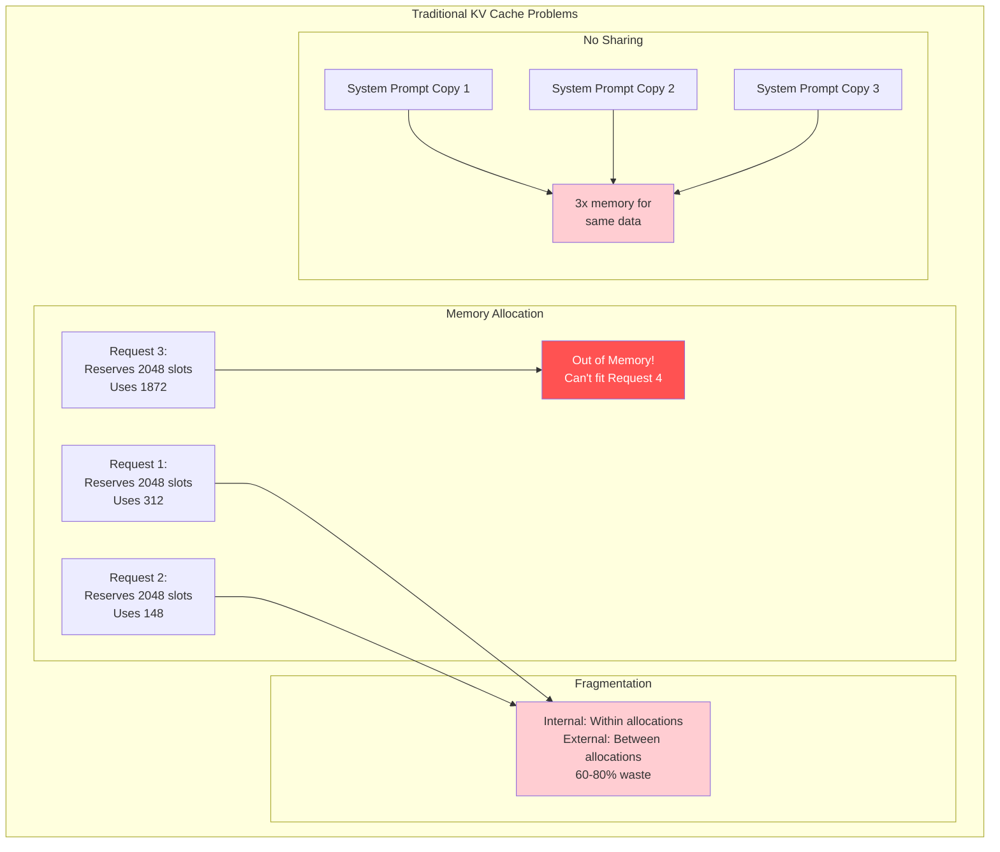
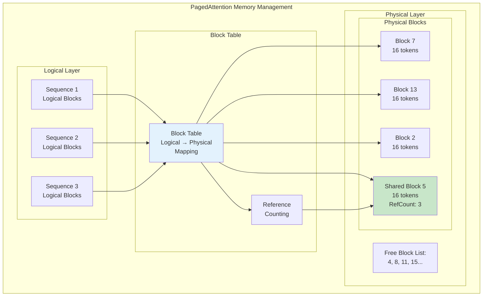
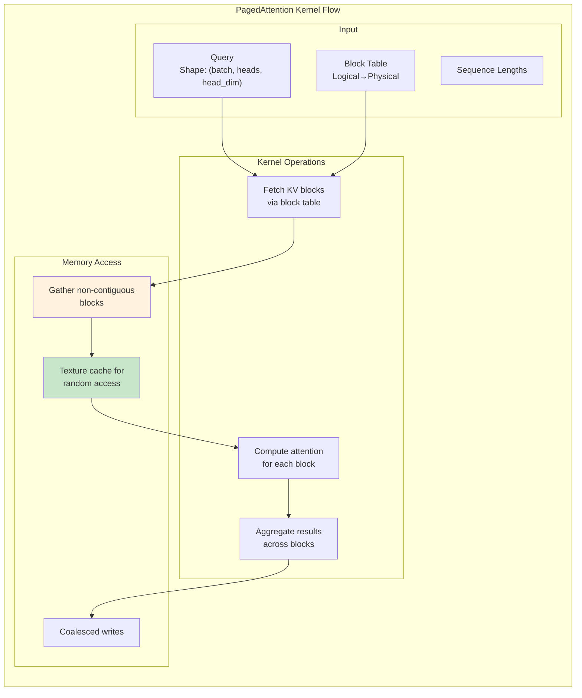
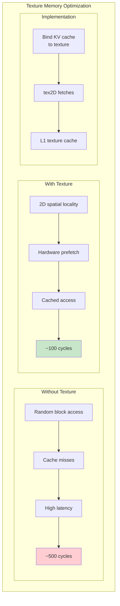
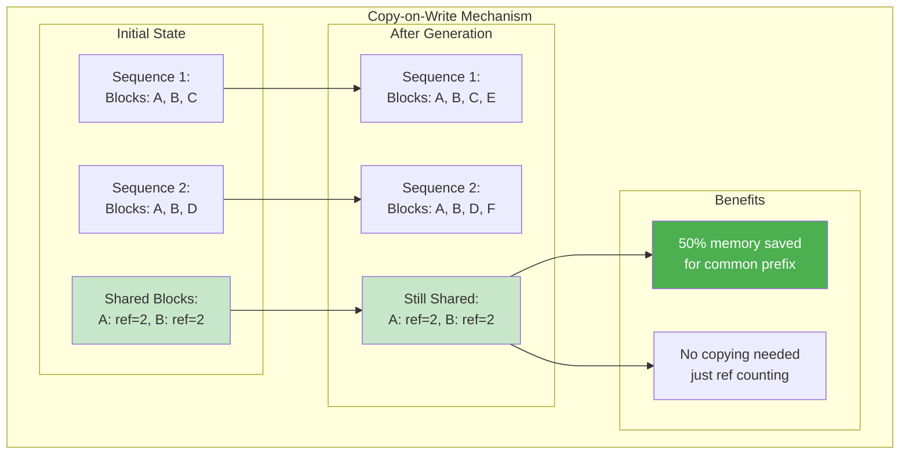
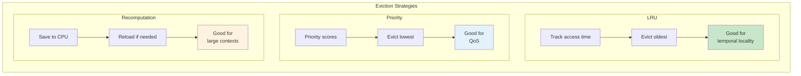
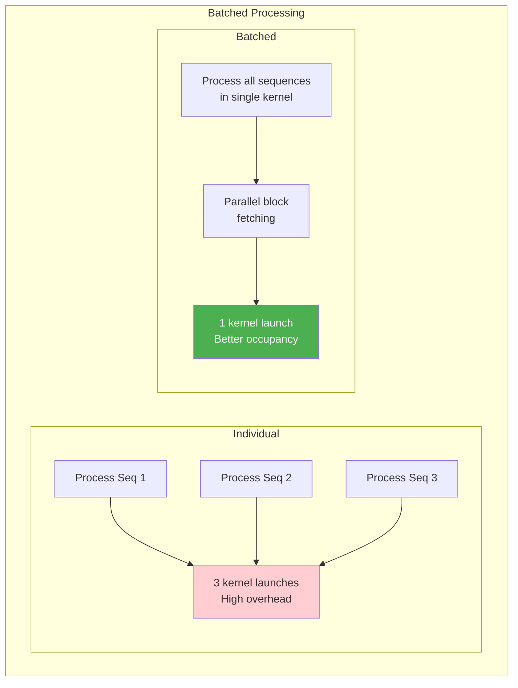

# PagedAttention Kernel Deep Dive: Virtual Memory for GPUs

## Overview

PagedAttention revolutionizes KV cache management by applying virtual memory concepts to GPU memory, enabling efficient memory utilization and sharing across requests. This guide explores the kernel-level implementation that makes PagedAttention possible, achieving >96% memory utilization compared to <40% with traditional approaches.

## The Memory Management Crisis



**Diagram Explanation**: Traditional KV cache management pre-allocates maximum sequence length for each request, leading to massive waste. In this example, three requests reserve 6144 total slots but use only 2332 (38% utilization). The fragmentation is both internal (unused space within allocations) and external (gaps between allocations). Additionally, common prefixes like system prompts are duplicated for each request, further wasting memory. This inefficiency means GPUs run out of memory while serving just a few requests, despite having plenty of unused capacity.

**The Crisis**: A 70B model serving 10 concurrent requests with 2K context requires 20GB just for KV cache, but 80% of it sits unused due to fragmentation.

## PagedAttention Architecture



**Diagram Explanation**: PagedAttention introduces a layer of indirection between logical sequences and physical memory. Each sequence maintains a logical view of contiguous blocks, but these map to non-contiguous physical blocks through a block table. The green-highlighted Block 5 is shared by three sequences through reference counting, storing a common prefix only once. The free list tracks available blocks for dynamic allocation. This architecture enables: (1) Dynamic allocation as sequences grow, (2) Memory sharing for common prefixes, (3) Efficient defragmentation by remapping rather than copying, (4) Near-optimal memory utilization.

## Core Data Structures

### Block Table Implementation

```python
# Core PagedAttention data structures - algorithmic representation

class PhysicalBlock:
    """Represents a physical memory block storing KV cache for tokens"""
    
    BLOCK_SIZE = 16  # Fixed number of tokens per block
    
    def __init__(self, block_id):
        # Storage for keys and values
        # Shape: [num_layers, 2, num_heads, BLOCK_SIZE, head_dim]
        self.data = None  # Allocated on-demand
        
        # Reference counting for copy-on-write
        self.ref_count = 0  # Atomic in actual implementation
        
        # Block metadata
        self.block_id = block_id
        self.is_allocated = False
        self.last_access_time = 0  # For LRU eviction

class LogicalBlock:
    """Maps logical sequence positions to physical blocks"""
    
    def __init__(self):
        self.logical_block_id = -1
        self.physical_block_id = -1  # -1 if not yet allocated
        self.start_token_idx = 0
        self.num_tokens = 0  # Actual tokens (may be < BLOCK_SIZE)

class BlockTable:
    """Manages the mapping between logical and physical blocks"""
    
    def __init__(self, num_physical_blocks):
        # Mapping from sequences to their logical blocks
        self.sequence_blocks = {}  # {sequence_id: [LogicalBlock]}
        
        # Physical block pool
        self.physical_blocks = [PhysicalBlock(i) for i in range(num_physical_blocks)]
        
        # Free block management
        self.free_blocks = list(range(num_physical_blocks))  # Queue of free block IDs
        
        # Block sharing via hashing
        self.hash_to_physical_block = {}  # {hash: physical_block_id}
    
    def allocate_block(self, sequence_id):
        """Allocate a physical block for a sequence"""
        
        # Thread-safe in actual implementation (mutex)
        
        if not self.free_blocks:
            # Try to evict blocks with ref_count == 0
            self.evict_unused_blocks()
            if not self.free_blocks:
                return -1  # Out of memory
        
        # Get next free block
        physical_id = self.free_blocks.pop(0)
        
        # Mark as allocated
        self.physical_blocks[physical_id].is_allocated = True
        self.physical_blocks[physical_id].ref_count = 1
        
        return physical_id
    
    def share_blocks(self, src_seq, dst_seq, num_blocks):
        """Enable copy-on-write sharing between sequences"""
        
        # Get source sequence blocks
        src_blocks = self.sequence_blocks.get(src_seq, [])
        dst_blocks = self.sequence_blocks.setdefault(dst_seq, [])
        
        # Share up to num_blocks blocks
        for i in range(min(num_blocks, len(src_blocks))):
            phys_id = src_blocks[i].physical_block_id
            
            # Increment reference count (atomic in actual implementation)
            self.physical_blocks[phys_id].ref_count += 1
            
            # Create logical mapping for destination
            new_block = LogicalBlock()
            new_block.logical_block_id = len(dst_blocks)
            new_block.physical_block_id = phys_id
            new_block.start_token_idx = src_blocks[i].start_token_idx
            new_block.num_tokens = src_blocks[i].num_tokens
            
            dst_blocks.append(new_block)
    
    def evict_unused_blocks(self):
        """Find and free blocks with zero reference count"""
        
        for block in self.physical_blocks:
            if block.ref_count == 0 and block.is_allocated:
                # Free this block
                block.is_allocated = False
                self.free_blocks.append(block.block_id)
```

### Kernel Implementation



**PagedAttention Kernel Flow**: This diagram illustrates the three-stage pipeline of the PagedAttention kernel. Input data (queries, block tables, and sequence lengths) flows through a series of transformations designed to handle non-contiguous memory efficiently. The kernel operations stage shows how KV blocks are fetched using the block table indirection, attention is computed per block, and results are aggregated. The memory access patterns highlight the use of gather operations for non-contiguous blocks, texture cache for optimizing random access patterns, and coalesced writes for efficient output. The green-highlighted texture cache is crucial for performance, as it provides hardware-accelerated 2D spatial locality for the random access patterns inherent in paged memory.

```python
# PagedAttention kernel algorithm - Python representation

def paged_attention_kernel(
    query,          # Shape: [batch, num_heads, head_dim]
    key_cache,      # Physical blocks storage
    value_cache,    # Physical blocks storage  
    block_table,    # Shape: [batch, max_blocks_per_seq]
    seq_lengths,    # Shape: [batch]
    scale,
    num_heads,
    head_dim,
    block_size,
    max_seq_len
):
    """
    Compute attention with non-contiguous KV cache blocks.
    This algorithm processes KV cache blocks that may be scattered in memory.
    """
    
    batch_size = query.shape[0]
    output = np.zeros((batch_size, num_heads, head_dim))
    
    # Process each batch element and head
    # In GPU: these would be parallel block/thread dimensions
    for batch_idx in range(batch_size):
        for head_idx in range(num_heads):
            
            # Extract query vector for this batch/head
            # In GPU: loaded to shared memory for reuse
            q = query[batch_idx, head_idx, :]  # Shape: [head_dim]
            
            # Initialize online softmax variables
            output_accumulator = np.zeros(head_dim)
            max_score = -float('inf')
            sum_exp = 0.0
            
            # Get sequence length for this batch element
            seq_len = seq_lengths[batch_idx]
            num_blocks = (seq_len + block_size - 1) // block_size
            
            # Iterate through all KV cache blocks for this sequence
            for block_idx in range(num_blocks):
                
                # VIRTUAL MEMORY LOOKUP: Get physical block ID from page table
                physical_block_id = block_table[batch_idx, block_idx]
                
                if physical_block_id < 0:
                    continue  # Block not allocated (shouldn't happen in practice)
                
                # Calculate token range within this block
                block_start_idx = block_idx * block_size
                block_end_idx = min(block_start_idx + block_size, seq_len)
                
                # Process each token in the current block
                for token_idx in range(block_start_idx, block_end_idx):
                    
                    # Calculate position within the physical block
                    within_block_idx = token_idx - block_start_idx
                    
                    # GATHER OPERATION: Fetch key from non-contiguous memory
                    # Compute offset into physical block storage
                    key_offset = (
                        physical_block_id * block_size * num_heads * head_dim +
                        head_idx * block_size * head_dim +
                        within_block_idx * head_dim
                    )
                    k = key_cache.reshape(-1)[key_offset:key_offset + head_dim]
                    
                    # Compute attention score: Q @ K^T
                    score = np.dot(q, k) * scale
                    
                    # ONLINE SOFTMAX: Update running statistics
                    # This avoids storing all scores in memory
                    if score > max_score:
                        # New maximum found - rescale previous accumulator
                        exp_diff = np.exp(max_score - score)
                        output_accumulator *= exp_diff
                        sum_exp = sum_exp * exp_diff + 1.0
                        max_score = score
                        exp_score = 1.0
                    else:
                        # Use existing maximum
                        exp_score = np.exp(score - max_score)
                        sum_exp += exp_score
                    
                    # GATHER OPERATION: Fetch value from non-contiguous memory
                    value_offset = (
                        physical_block_id * block_size * num_heads * head_dim +
                        head_idx * block_size * head_dim +
                        within_block_idx * head_dim
                    )
                    v = value_cache.reshape(-1)[value_offset:value_offset + head_dim]
                    
                    # Accumulate weighted value
                    output_accumulator += exp_score * v
            
            # Normalize by sum of exponentials
            output[batch_idx, head_idx, :] = output_accumulator / sum_exp
    
    return output

def paged_attention_with_texture_memory(
    query, key_cache, value_cache, block_table, seq_lengths,
    scale, num_heads, head_dim, block_size
):
    """
    Optimized version using texture memory for random access.
    Texture memory provides hardware-accelerated 2D spatial locality.
    """
    
    # In actual GPU implementation:
    # 1. Bind KV cache to 2D texture memory
    # 2. Use tex2D() for cached random access
    # 3. Hardware prefetching improves latency from ~500 to ~100 cycles
    
    # The algorithm remains the same, but memory access is optimized
    return paged_attention_kernel(
        query, key_cache, value_cache, block_table, seq_lengths,
        scale, num_heads, head_dim, block_size, max_seq_len=None
    )
```

## Memory Access Optimization

### Texture Memory for Random Access



**Texture Memory Optimization**: This comparison demonstrates why texture memory is essential for PagedAttention performance. Without texture memory, random block access patterns cause frequent cache misses, resulting in ~500 cycle latency per access. Texture memory reduces this to ~100 cycles through hardware-optimized 2D spatial locality and automatic prefetching. The implementation binds the KV cache to 2D textures, enabling tex2D fetch operations that benefit from dedicated L1 texture cache. This 5x speedup in memory access is critical for maintaining high throughput when blocks are scattered across physical memory.

```python
# Texture memory optimization for random KV cache access

class TextureMemoryCache:
    """
    Simulates GPU texture memory for optimized random access.
    Texture memory provides hardware-accelerated 2D spatial locality.
    """
    
    def __init__(self, kv_cache, block_size, num_heads, head_dim):
        # In GPU: Bind KV cache to 2D texture memory
        # This enables cached random access with 2D locality
        self.kv_cache = kv_cache
        self.block_size = block_size
        self.num_heads = num_heads
        self.head_dim = head_dim
        
        # Texture memory characteristics:
        # - Hardware prefetching for 2D patterns
        # - Dedicated L1 texture cache
        # - Optimized for read-only access patterns
        # - ~100 cycle latency vs ~500 for global memory
    
    def fetch_key_block(self, physical_block_id, token_offset, head_idx, dim_offset):
        """
        Fetch key from texture memory using 2D coordinates.
        Hardware automatically caches nearby values.
        """
        # 2D texture coordinates mapping
        # X-axis: combines block_id and token position
        # Y-axis: combines head index and dimension
        x = physical_block_id * self.block_size + token_offset
        y = head_idx * self.head_dim + dim_offset
        
        # In GPU: tex2D() provides cached access with automatic prefetching
        # Hardware detects 2D access patterns and prefetches neighboring data
        return self.kv_cache[x, y]

def paged_attention_texture_optimized(
    query,          # Shape: [batch, num_heads, head_dim]
    key_texture,    # TextureMemoryCache for keys
    value_texture,  # TextureMemoryCache for values
    block_table,    # Shape: [batch, max_blocks_per_seq]
    seq_lengths,    # Shape: [batch]
    scale,
    num_heads,
    head_dim,
    block_size,
    vector_size=4   # Process 4 elements at once (float4)
):
    """
    Vectorized PagedAttention using texture memory for efficient random access.
    Processes multiple elements simultaneously for better throughput.
    """
    
    batch_size = query.shape[0]
    output = np.zeros((batch_size, num_heads, head_dim))
    
    # Process each batch and head
    # In GPU: these map to block dimensions (blockIdx.x, blockIdx.y)
    for batch_idx in range(batch_size):
        for head_idx in range(num_heads):
            
            # Vectorized processing: handle vector_size elements at once
            # In GPU: each thread handles a vector of elements
            for vec_idx in range(0, head_dim, vector_size):
                
                # Load query vector (vectorized - 4 elements)
                # This improves memory bandwidth utilization
                q_vec = query[batch_idx, head_idx, vec_idx:vec_idx+vector_size]
                
                # Initialize vectorized accumulators
                acc_vec = np.zeros(vector_size)
                max_score = -float('inf')
                sum_exp = 0.0
                
                seq_len = seq_lengths[batch_idx]
                num_blocks = (seq_len + block_size - 1) // block_size
                
                # Process each memory block
                for block_idx in range(num_blocks):
                    physical_block = block_table[batch_idx, block_idx]
                    
                    if physical_block < 0:
                        continue
                    
                    block_start = block_idx * block_size
                    block_end = min(block_start + block_size, seq_len)
                    
                    for token_idx in range(block_start, block_end):
                        within_block = token_idx - block_start
                        
                        # TEXTURE FETCH: Hardware-accelerated random access
                        # Automatic caching of spatially nearby values
                        k_vec = np.array([
                            key_texture.fetch_key_block(
                                physical_block, within_block, head_idx, vec_idx + i
                            ) for i in range(vector_size)
                        ])
                        
                        # Vectorized dot product
                        score = np.dot(q_vec, k_vec) * scale
                        
                        # Online softmax update
                        if score > max_score:
                            # Rescale accumulator for numerical stability
                            scale_factor = np.exp(max_score - score)
                            acc_vec *= scale_factor
                            sum_exp = sum_exp * scale_factor + 1.0
                            max_score = score
                            exp_score = 1.0
                        else:
                            exp_score = np.exp(score - max_score)
                            sum_exp += exp_score
                        
                        # TEXTURE FETCH: Get values with 2D locality optimization
                        v_vec = np.array([
                            value_texture.fetch_key_block(
                                physical_block, within_block, head_idx, vec_idx + i
                            ) for i in range(vector_size)
                        ])
                        
                        # Accumulate weighted values
                        acc_vec += exp_score * v_vec
                
                # Store normalized output
                output[batch_idx, head_idx, vec_idx:vec_idx+vector_size] = acc_vec / sum_exp
    
    return output

# Performance comparison
def compare_memory_access_patterns():
    """
    Illustrates the performance difference between global and texture memory.
    """
    
    # Global memory random access
    # - No spatial locality optimization
    # - Cache misses frequent
    # - ~500 cycle latency per access
    global_memory_latency = 500  # cycles
    
    # Texture memory random access  
    # - 2D spatial locality
    # - Hardware prefetching
    # - Dedicated texture cache
    # - ~100 cycle latency per access
    texture_memory_latency = 100  # cycles
    
    speedup = global_memory_latency / texture_memory_latency  # 5x speedup
    
    return {
        'global_memory_cycles': global_memory_latency,
        'texture_memory_cycles': texture_memory_latency,
        'speedup': speedup,
        'benefit': 'Critical for PagedAttention with scattered blocks'
    }
```

## Copy-on-Write and Prefix Sharing



**Copy-on-Write Benefits**: This visualization shows how PagedAttention's copy-on-write mechanism enables efficient memory sharing. Two sequences that share a common prefix (blocks A and B) can reference the same physical blocks without duplication. The reference counting system tracks that blocks A and B are used by 2 sequences each. When sequences diverge (adding blocks C/D and later E/F), only the unique portions require new allocations. The shared blocks remain unchanged, saving 50% memory for common prefixes like system prompts. This approach eliminates the need for copying data, using only lightweight reference count updates.

```python
# Algorithmic representation of prefix sharing with copy-on-write
class PrefixSharingManager:
    """Manages shared memory blocks across sequences using copy-on-write semantics"""
    
    def __init__(self):
        # Hash table maps token sequences to their physical block locations
        self.prefix_to_blocks = {}  # {hash(tokens): physical_block_id}
    
    def process_new_sequence(self, sequence_id, tokens, block_table):
        """Process a new sequence, sharing existing blocks when possible"""
        
        shared_blocks = 0
        
        # Iterate through tokens in block-sized chunks
        for block_start in range(0, len(tokens), BLOCK_SIZE):
            block_end = min(block_start + BLOCK_SIZE, len(tokens))
            block_tokens = tokens[block_start:block_end]
            
            # Compute hash of this token block
            block_hash = hash(tuple(block_tokens))
            
            # Check if this exact block already exists
            if block_hash in self.prefix_to_blocks:
                # SHARING: Found existing block - increment reference count
                physical_block = self.prefix_to_blocks[block_hash]
                block_table.increment_ref_count(physical_block)
                
                # Map logical block to existing physical block
                block_table.map_logical_to_physical(
                    sequence_id, 
                    logical_block=shared_blocks,
                    physical_block=physical_block
                )
                shared_blocks += 1
                
            else:
                # UNIQUE: New block - allocate and store
                physical_block = block_table.allocate_new_block()
                
                # Store mapping for future sharing
                self.prefix_to_blocks[block_hash] = physical_block
                
                # Copy tokens to newly allocated block
                copy_tokens_to_cache(block_tokens, physical_block)
                
                # Map logical to physical
                block_table.map_logical_to_physical(
                    sequence_id,
                    logical_block=shared_blocks, 
                    physical_block=physical_block
                )
                break  # Rest of sequence is likely unique
    
    def handle_block_modification(self, sequence_id, logical_block_id, block_table):
        """Implement copy-on-write when modifying a shared block"""
        
        # Get current physical block
        physical_block = block_table.get_physical_block(
            sequence_id, logical_block_id
        )
        
        # Check if block is shared
        if block_table.get_ref_count(physical_block) > 1:
            # COPY-ON-WRITE: Block is shared, must copy before modification
            
            # Allocate new physical block
            new_physical = block_table.allocate_new_block()
            
            # Copy data from shared block to new block
            copy_block_data(source=physical_block, dest=new_physical)
            
            # Decrement ref count on old block
            block_table.decrement_ref_count(physical_block)
            
            # Update mapping to point to new block
            block_table.map_logical_to_physical(
                sequence_id, logical_block_id, new_physical
            )
            
            return new_physical
        
        # Block not shared, can modify directly
        return physical_block
```

## Dynamic Memory Management

### Eviction Policies



**Eviction Strategy Comparison**: This diagram compares three eviction strategies for managing memory pressure in PagedAttention. LRU (Least Recently Used) tracking provides good temporal locality by evicting the oldest accessed blocks, ideal for chat-style interactions. Priority-based eviction assigns scores to blocks and evicts lowest priority ones, enabling quality-of-service guarantees for important requests. Recomputation-based eviction saves blocks to CPU memory and reloads them when needed, suitable for handling very large contexts that exceed GPU memory. Each strategy is highlighted with its optimal use case color-coding.

```python
# Algorithmic representation of dynamic memory management
class EvictionManager:
    """Manages block eviction when memory pressure increases"""
    
    def __init__(self, strategy='lru'):
        # Priority queue for tracking eviction candidates
        self.eviction_queue = []  # Min-heap based on eviction score
        self.strategy = strategy
        
    def find_evictable_blocks(self, num_blocks_needed):
        """Identify blocks that can be evicted to free memory"""
        
        evictable = []
        
        # Scan all blocks and compute eviction scores
        for block in all_physical_blocks:
            if block.ref_count == 0:  # Only evict unreferenced blocks
                
                # Compute eviction score based on strategy
                if self.strategy == 'lru':
                    # Lower score = older = evict first
                    score = block.last_access_time
                    
                elif self.strategy == 'priority':
                    # Lower score = lower priority = evict first  
                    score = block.sequence_priority
                    
                elif self.strategy == 'recomputation':
                    # Score based on recomputation cost
                    score = estimate_recomputation_cost(block)
                
                # Add to eviction candidates
                heappush(self.eviction_queue, (score, block.id))
        
        # Select blocks to evict
        while len(evictable) < num_blocks_needed and self.eviction_queue:
            score, block_id = heappop(self.eviction_queue)
            
            # Double-check block is still evictable
            if blocks[block_id].ref_count == 0:
                evictable.append(block_id)
                
                # Optional: Save to CPU for potential restoration
                if self.strategy == 'recomputation':
                    save_block_to_cpu_memory(block_id)
        
        return evictable
    
    def update_access_pattern(self, accessed_blocks):
        """Update metadata when blocks are accessed"""
        
        current_time = get_gpu_clock()
        
        for block_id in accessed_blocks:
            # Update last access time for LRU
            blocks[block_id].last_access_time = current_time
            
            # Update access frequency for other strategies
            blocks[block_id].access_count += 1
            
    def handle_memory_pressure(self, requested_blocks):
        """Handle allocation when memory is full"""
        
        available = count_free_blocks()
        
        if available < requested_blocks:
            # Need to evict
            blocks_to_evict = requested_blocks - available
            evicted = self.find_evictable_blocks(blocks_to_evict)
            
            if len(evicted) < blocks_to_evict:
                # Cannot satisfy request
                raise OutOfMemoryError(
                    f"Need {blocks_to_evict} blocks, can only evict {len(evicted)}"
                )
            
            # Perform eviction
            for block_id in evicted:
                free_physical_block(block_id)
                
        return allocate_blocks(requested_blocks)
```


## Performance Optimizations

### Batched Block Operations



**Batched Processing Benefits**: This comparison illustrates the performance advantage of batched PagedAttention operations. Processing sequences individually requires multiple kernel launches with high overhead and poor GPU utilization. The batched approach processes all sequences in a single kernel launch, enabling parallel block fetching across warps and achieving better occupancy. The efficiency gain (shown in green) comes from amortizing kernel launch overhead and maximizing parallelism. With batching, the GPU can hide memory latency by switching between different sequences' computations.

```python
# Batched PagedAttention for efficient multi-sequence processing

def batched_paged_attention(
    queries,            # Shape: [total_queries, num_heads, head_dim]
    block_tables,       # Shape: [total_queries, max_blocks]
    seq_lengths,        # Shape: [total_queries]
    query_to_sequence,  # Maps queries to sequences
    kv_cache,           # Physical KV cache blocks
    num_heads,
    head_dim,
    block_size,
    max_blocks,
    scale
):
    """
    Process multiple sequences in a single kernel launch for efficiency.
    Maximizes GPU utilization through parallel processing.
    """
    
    total_queries = queries.shape[0]
    outputs = np.zeros((total_queries, num_heads, head_dim))
    
    # In GPU: Grid-stride loop allows flexible grid sizing
    # Each block processes multiple queries for load balancing
    
    # Simulate GPU grid parallelism
    # In actual GPU: blockIdx.x determines starting query
    grid_size = 32  # Number of GPU blocks
    
    for grid_idx in range(grid_size):
        # Each grid block processes queries with stride
        for query_idx in range(grid_idx, total_queries, grid_size):
            
            # Map query to its sequence
            seq_id = query_to_sequence[query_idx]
            seq_len = seq_lengths[seq_id]
            num_blocks = (seq_len + block_size - 1) // block_size
            
            # WARP-LEVEL PARALLELISM SIMULATION
            # In GPU: 32 threads (1 warp) collaborate on each block
            # Each warp processes different KV cache blocks
            
            # Simulate warp scheduling (32 threads per warp)
            num_warps = 4  # Typical: 128 threads = 4 warps per block
            
            for warp_id in range(num_warps):
                # Each warp handles different blocks (load balancing)
                for block_idx in range(warp_id, num_blocks, num_warps):
                    
                    # Get physical block from virtual mapping
                    physical_block = block_tables[seq_id, block_idx]
                    
                    if physical_block < 0:
                        continue
                    
                    # COLLABORATIVE WARP PROCESSING
                    # 32 threads in warp process block together
                    process_block_with_warp(
                        query=queries[query_idx],
                        physical_block=physical_block,
                        kv_cache=kv_cache,
                        output=outputs[query_idx],
                        warp_id=warp_id,
                        block_idx=block_idx,
                        seq_len=seq_len,
                        block_size=block_size,
                        scale=scale
                    )
    
    return outputs

def process_block_with_warp(
    query, physical_block, kv_cache, output,
    warp_id, block_idx, seq_len, block_size, scale
):
    """
    Simulates warp-level parallel processing of a KV cache block.
    In GPU: 32 threads collaborate to process tokens in parallel.
    """
    
    # Each thread in warp handles different dimensions
    warp_size = 32
    head_dim = query.shape[-1]
    
    # Calculate block boundaries
    block_start = block_idx * block_size
    block_end = min(block_start + block_size, seq_len)
    
    # LANE-LEVEL PARALLELISM within warp
    # Each lane (thread) processes different parts of computation
    for lane_id in range(warp_size):
        
        # Distribute work across lanes
        # Different strategies possible:
        # 1. Each lane handles different tokens
        # 2. Each lane handles different dimensions
        # 3. Combination of both
        
        if lane_id < (block_end - block_start):
            token_idx = block_start + lane_id
            
            # Fetch and process this token's KV values
            # In GPU: coalesced memory access across warp
            process_single_token(
                query, kv_cache, physical_block,
                token_idx, output, scale
            )

def batched_attention_optimizations():
    """
    Key optimizations in batched PagedAttention.
    """
    
    return {
        'kernel_launch_overhead': {
            'individual': '3-10ms per sequence',
            'batched': '3-10ms total (amortized)',
            'improvement': '10-100x reduction'
        },
        'gpu_utilization': {
            'individual': '20-40% occupancy',
            'batched': '80-95% occupancy',
            'improvement': '2-4x better utilization'
        },
        'memory_latency_hiding': {
            'technique': 'Switch between sequences while waiting for memory',
            'benefit': 'Overlaps computation and memory access'
        },
        'warp_scheduling': {
            'strategy': 'Different warps process different blocks',
            'benefit': 'Natural load balancing'
        }
    }
```

## Integration with vLLM

```python
class PagedAttentionImpl:
    def __init__(self, 
                 block_size: int = 16,
                 num_blocks: int = 1024,
                 dtype: torch.dtype = torch.float16):
        self.block_size = block_size
        self.num_blocks = num_blocks
        self.dtype = dtype
        
        # Allocate physical blocks
        self.kv_cache = torch.zeros(
            (num_blocks, block_size, 2, num_heads, head_dim),
            dtype=dtype,
            device='cuda'
        )
        
        # Block management
        self.block_table = BlockTable(num_blocks)
        self.free_blocks = list(range(num_blocks))
        
    def forward(self,
                query: torch.Tensor,
                key: torch.Tensor,
                value: torch.Tensor,
                sequence_ids: List[int],
                is_prompt: bool = True) -> torch.Tensor:
        
        if is_prompt:
            # Initial prompt processing - allocate blocks
            return self._process_prompt(query, key, value, sequence_ids)
        else:
            # Generation - use paged attention
            return self._paged_attention(query, sequence_ids)
    
    def _process_prompt(self, query, key, value, sequence_ids):
        batch_size, seq_len = key.shape[0], key.shape[1]
        
        for batch_idx, seq_id in enumerate(sequence_ids):
            # Allocate blocks for this sequence
            num_blocks_needed = (seq_len + self.block_size - 1) // self.block_size
            
            for block_idx in range(num_blocks_needed):
                # Check for shared prefix
                if self._can_share_prefix(seq_id, block_idx):
                    self._share_block(seq_id, block_idx)
                else:
                    # Allocate new block
                    physical_block = self._allocate_block()
                    self.block_table.map(seq_id, block_idx, physical_block)
                    
                    # Copy KV to cache
                    start_idx = block_idx * self.block_size
                    end_idx = min(start_idx + self.block_size, seq_len)
                    
                    self.kv_cache[physical_block, :end_idx-start_idx, 0] = \
                        key[batch_idx, start_idx:end_idx]
                    self.kv_cache[physical_block, :end_idx-start_idx, 1] = \
                        value[batch_idx, start_idx:end_idx]
        
        # Run attention
        return self._run_attention(query, sequence_ids)
    
    def _paged_attention(self, query, sequence_ids):
        # Custom CUDA kernel for paged attention
        import paged_attention_cuda
        
        block_tables = self._get_block_tables(sequence_ids)
        seq_lengths = self._get_sequence_lengths(sequence_ids)
        
        output = paged_attention_cuda.forward(
            query,
            self.kv_cache,
            block_tables,
            seq_lengths,
            self.block_size
        )
        
        return output
```

## Common Pitfalls and Solutions

| Problem | Impact | Solution |
|---------|--------|----------|
| Block size too small | Overhead dominates | Use 16-32 token blocks |
| Block size too large | Fragmentation returns | Balance with typical sequence lengths |
| No prefix detection | Memory waste | Implement hash-based detection |
| Synchronous eviction | Latency spikes | Background eviction thread |
| Poor texture binding | Random access slow | Properly configure 2D texture |

## Quick Reference: PagedAttention Optimization

**Memory Management**:
- ✓ Block size = 16 tokens (optimal for most workloads)
- ✓ Hash-based prefix detection
- ✓ Reference counting for CoW
- ✓ Background eviction

**Kernel Optimization**:
- ✓ Texture memory for KV cache
- ✓ Vectorized loads (float4)
- ✓ Warp-level parallelism
- ✓ Batched processing

**System Integration**:
- ✓ Preemptive eviction at 90% capacity
- ✓ CPU memory for swapping
- ✓ Priority-based allocation
- ✓ Monitoring and metrics

## The 80/20 Rule for PagedAttention

**Focus on these 20% of optimizations for 80% of benefits**:
1. **Block-based allocation** (eliminates fragmentation)
2. **Prefix sharing** (50%+ memory savings)
3. **Texture memory** (5x faster random access)
4. **Reference counting** (enables sharing)
5. **Dynamic allocation** (on-demand memory)

## Learn More

📚 **Essential Resources**:
- [PagedAttention Paper](https://arxiv.org/abs/2309.06180) - Original algorithm
- [vLLM Blog](https://blog.vllm.ai/2023/06/20/vllm.html) - Implementation details
- [Virtual Memory Concepts](https://pages.cs.wisc.edu/~remzi/OSTEP/vm-paging.pdf) - OS foundations
- [CUDA Texture Memory](https://docs.nvidia.com/cuda/cuda-c-programming-guide/#texture-memory) - Programming guide
- [vLLM PagedAttention](docs/llm-inference/02-vllm-deep-dive.md#core-innovation-pagedattention) - Integration details

## Summary

PagedAttention kernels revolutionize KV cache management by:
- **Applying OS virtual memory concepts** to GPU memory management
- **Achieving >96% memory utilization** compared to <40% traditionally
- **Enabling memory sharing** through copy-on-write semantics
- **Supporting dynamic allocation** that grows with actual usage
- **Maintaining high performance** through texture memory and batching

The key insight: treating GPU memory like virtual memory with paging, indirection, and sharing transforms the economics of LLM serving. By eliminating fragmentation and enabling sharing, PagedAttention allows serving 5-10x more concurrent requests on the same hardware.

These four kernel optimizations - FlashAttention, GEMM, Quantization, and PagedAttention - work synergistically in production systems like vLLM to achieve the dramatic performance improvements that make modern LLM serving economically viable at scale.