# Quantization Kernels Deep Dive: Precision-Performance Trade-offs

## Overview

Quantization reduces neural network weights and activations from high-precision formats (FP32/FP16) to lower-precision representations (INT8/INT4), enabling dramatic improvements in memory usage and inference speed. This guide explores the kernel-level implementations that make quantization efficient on modern GPUs.

## The Quantization Opportunity


**The Quantization Trade-off Space**: This diagram maps the three-dimensional trade-off space of quantization: model size reduction, throughput improvement, and accuracy impact. Each precision level creates a different point in this space. FP32 (baseline) requires full memory but maintains perfect accuracy. FP16 halving provides 2x benefits with negligible accuracy loss. INT8 (highlighted in green) represents the optimal balance for most production deployments - achieving 4x memory reduction and 4x throughput improvement while maintaining 99.5% of original accuracy. INT4 pushes the boundaries further with 8x compression but requires careful calibration to minimize the 1-2% accuracy degradation. For context, a 70B parameter model in FP32 requires 280GB of memory (multiple GPUs), but INT8 quantization brings it down to 70GB (single A100), while INT4 enables deployment on consumer GPUs with just 35GB.

**The Opportunity**: Modern GPUs have specialized hardware for INT8 operations (DP4A instructions) that can perform 4x more operations per cycle than FP32, making quantization both a memory and compute optimization.

## Quantization Fundamentals

### Linear Quantization

```mermaid
graph LR
    subgraph "Quantization Process"
        subgraph "Forward Quantization"
            FP["FP32 Weight<br/>-0.73 to 2.14"]
            Scale["Scale = max/127<br/>= 0.0169"]
            Quant["Quantize:<br/>round(W/scale)"]
            INT["INT8 Weight<br/>-43 to 127"]
        end
        
        subgraph "Dequantization"
            INT2["INT8 Weight<br/>-43 to 127"]
            Scale2[Scale<br/>0.0169]
            Dequant["Dequantize:<br/>W × scale"]
            FP2["~FP32 Weight<br/>-0.73 to 2.15"]
        end
        
        FP --> Scale
        Scale --> Quant
        Quant --> INT
        
        INT2 --> Dequant
        Scale2 --> Dequant
        Dequant --> FP2
    end
    
    style INT fill:#c8e6c9
    style INT2 fill:#c8e6c9
```



**Linear Quantization Process**: This diagram illustrates the complete round-trip of linear quantization. The forward path shows how a continuous FP32 weight distribution (ranging from -0.73 to 2.14) is compressed into discrete INT8 values. The scale factor (0.0169) is computed as the ratio of the maximum absolute value to the quantization range (127 for INT8). During quantization, weights are divided by the scale and rounded to the nearest integer, mapping the continuous distribution to just 256 discrete levels. The dequantization path reverses this process by multiplying the quantized values by the scale factor. Note that the dequantized values (~FP32) are approximations of the originals due to rounding errors - this quantization error is the price paid for 4x memory savings. The green highlighting emphasizes that the compact INT8 representation is where the memory and computational benefits are realized.

**Mathematical Foundation**:
```
Quantization:   q = round(x / scale) + zero_point
Dequantization: x̃ = (q - zero_point) × scale

Where:
- scale = (max - min) / (2^bits - 1)
- zero_point = round(-min / scale)
```

### Symmetric vs Asymmetric Quantization

```python
def symmetric_quantization(tensor, bits=8):
    """
    Symmetric quantization: zero point is always 0
    Range: [-2^(bits-1), 2^(bits-1)-1]
    """
    qmin = -(2**(bits-1))
    qmax = 2**(bits-1) - 1
    
    # Find the maximum absolute value
    max_abs = torch.max(torch.abs(tensor))
    
    # Calculate scale (no zero point needed)
    scale = max_abs / qmax
    
    # Quantize
    quantized = torch.round(tensor / scale)
    quantized = torch.clamp(quantized, qmin, qmax).to(torch.int8)
    
    return quantized, scale

def asymmetric_quantization(tensor, bits=8):
    """
    Asymmetric quantization: can have non-zero zero point
    Better for asymmetric distributions
    """
    qmin = 0
    qmax = 2**bits - 1
    
    # Find min and max values
    min_val = torch.min(tensor)
    max_val = torch.max(tensor)
    
    # Calculate scale and zero point
    scale = (max_val - min_val) / (qmax - qmin)
    zero_point = qmin - torch.round(min_val / scale)
    
    # Quantize
    quantized = torch.round(tensor / scale) + zero_point
    quantized = torch.clamp(quantized, qmin, qmax).to(torch.uint8)
    
    return quantized, scale, zero_point
```

## GPU Quantization Kernels

### INT8 GEMM with DP4A


**DP4A Hardware Acceleration**: This diagram shows how modern GPUs accelerate INT8 operations through the DP4A (Dot Product of 4 Accumulate) instruction. Instead of processing one multiply-accumulate operation per cycle, DP4A computes four INT8 multiplications and adds all results to an INT32 accumulator in a single cycle. This 4x throughput improvement is why INT8 quantization provides such dramatic speedups. The instruction takes two packed INT8 vectors (each containing 4 values), performs element-wise multiplication, sums the products, and adds to the accumulator - all in one GPU cycle. The green highlighting shows the critical path where hardware acceleration provides maximum benefit.

**Python Algorithm Implementation**:
```python
def int8_gemm_with_dp4a(
    A_quantized,  # Shape: [M, K], dtype: int8
    B_quantized,  # Shape: [K, N], dtype: int8  
    scale_A,      # Shape: [M], per-row scales
    scale_B,      # Shape: [N], per-column scales
    M, N, K
):
    """
    INT8 GEMM using DP4A hardware acceleration.
    Processes 4 INT8 values at once for 4x throughput.
    """
    import numpy as np
    
    # Output accumulator in INT32 for overflow prevention
    C_accumulator = np.zeros((M, N), dtype=np.int32)
    
    # Process each output element
    # In GPU: parallel across all (M, N) positions
    for row in range(M):
        for col in range(N):
            
            accumulator = 0  # INT32 accumulator
            
            # Process 4 elements at a time (DP4A simulation)
            for k in range(0, K, 4):
                # Pack 4 INT8 values from each matrix
                # In hardware: loaded as single 32-bit value
                a_vec = A_quantized[row, k:k+4]  # 4 INT8 values
                b_vec = B_quantized[k:k+4, col]  # 4 INT8 values
                
                # DP4A operation: multiply 4 pairs and accumulate
                # Hardware does this in 1 cycle vs 4 cycles normally
                for i in range(min(4, K - k)):
                    accumulator += int(a_vec[i]) * int(b_vec[i])
            
            C_accumulator[row, col] = accumulator
    
    # Dequantize the result using scales
    C_float = np.zeros((M, N), dtype=np.float32)
    for row in range(M):
        for col in range(N):
            # Apply both scales to get back to FP32 range
            C_float[row, col] = (
                C_accumulator[row, col] * 
                scale_A[row] * 
                scale_B[col]
            )
    
    return C_float

def simulate_dp4a_instruction(a_packed, b_packed, accumulator):
    """
    Simulates the DP4A hardware instruction.
    In actual hardware, this is a single cycle operation.
    """
    # Extract 4 INT8 values from packed INT32
    a_values = [
        (a_packed >> (i*8)) & 0xFF for i in range(4)
    ]
    b_values = [
        (b_packed >> (i*8)) & 0xFF for i in range(4)
    ]
    
    # Convert to signed INT8
    a_values = [v if v < 128 else v - 256 for v in a_values]
    b_values = [v if v < 128 else v - 256 for v in b_values]
    
    # Dot product of 4 INT8 pairs + accumulate
    # This entire operation is 1 GPU cycle with DP4A
    result = accumulator
    for i in range(4):
        result += a_values[i] * b_values[i]
    
    return result
```

### INT4 Quantization Kernel


**INT4 Packing Strategy**: This diagram illustrates how INT4 quantization achieves 8x memory compression by packing two 4-bit weights into a single 8-bit byte. The packing process takes two separate 4-bit values, shifts the first value left by 4 bits, and combines it with the second value using a bitwise OR operation. During inference, the unpacking process reverses this: the high nibble is extracted by shifting right 4 bits and masking with 0xF, while the low nibble is obtained by direct masking. This packing strategy allows GPUs to efficiently store and process INT4 values despite lacking native 4-bit arithmetic units. The modified DP4A instruction can then process these packed values with special handling for the 4-bit boundaries.

**Python Algorithm Implementation**:
```python
def pack_int4_weights(weights_int4):
    """
    Pack two INT4 weights into single INT8 for efficient storage.
    Reduces memory footprint by 50% compared to storing INT4 in INT8.
    """
    import numpy as np
    
    num_weights = len(weights_int4)
    packed = np.zeros(num_weights // 2, dtype=np.uint8)
    
    for i in range(0, num_weights, 2):
        # Get two INT4 values (range: -8 to 7)
        w1 = weights_int4[i] & 0x0F  # First 4 bits
        w2 = weights_int4[i + 1] & 0x0F if i + 1 < num_weights else 0
        
        # Pack into single byte: high nibble | low nibble
        # In hardware: single shift and OR operation
        packed[i // 2] = (w1 << 4) | w2
    
    return packed

def dequantize_int4_to_fp16(
    packed_weights,  # Packed INT4 weights (2 per byte)
    scales,          # Per-channel or per-group scales
    num_weights
):
    """
    Dequantize packed INT4 weights to FP16/FP32.
    Extracts and scales 4-bit values back to floating point.
    """
    import numpy as np
    
    output = np.zeros(num_weights, dtype=np.float16)
    
    # Process packed weights
    # In GPU: parallel across all packed bytes
    for packed_idx in range(len(packed_weights)):
        packed_byte = packed_weights[packed_idx]
        
        # Extract two INT4 values from single byte
        # Low nibble: bits 0-3
        low_nibble = packed_byte & 0x0F
        # High nibble: bits 4-7
        high_nibble = (packed_byte >> 4) & 0x0F
        
        # Convert to signed INT4 range (-8 to 7)
        # Values 8-15 represent negative numbers -8 to -1
        low_signed = low_nibble if low_nibble < 8 else low_nibble - 16
        high_signed = high_nibble if high_nibble < 8 else high_nibble - 16
        
        # Dequantize using scale factors
        out_idx = packed_idx * 2
        if out_idx < num_weights:
            output[out_idx] = low_signed * scales[out_idx]
        if out_idx + 1 < num_weights:
            output[out_idx + 1] = high_signed * scales[out_idx + 1]
    
    return output

def int4_gemm_optimized(
    A_packed,    # Packed INT4 matrix A
    B_packed,    # Packed INT4 matrix B
    scales_A,    # Scales for A
    scales_B,    # Scales for B
    M, N, K
):
    """
    Optimized INT4 GEMM using unpacking and accumulation.
    Achieves 8x memory reduction with ~2% accuracy loss.
    """
    import numpy as np
    
    # Unpack on-the-fly during computation
    # In GPU: done in registers to avoid memory overhead
    C = np.zeros((M, N), dtype=np.float32)
    
    for i in range(M):
        for j in range(N):
            accumulator = 0
            
            # Process K dimension with INT4 unpacking
            for k in range(0, K, 2):  # Process 2 INT4 values at once
                # Unpack A and B values
                packed_a = A_packed[i, k // 2]
                packed_b = B_packed[k // 2, j]
                
                # Extract and compute
                a_low = (packed_a & 0x0F) - 8 if (packed_a & 0x0F) >= 8 else (packed_a & 0x0F)
                a_high = ((packed_a >> 4) & 0x0F) - 8 if ((packed_a >> 4) & 0x0F) >= 8 else ((packed_a >> 4) & 0x0F)
                b_low = (packed_b & 0x0F) - 8 if (packed_b & 0x0F) >= 8 else (packed_b & 0x0F)
                b_high = ((packed_b >> 4) & 0x0F) - 8 if ((packed_b >> 4) & 0x0F) >= 8 else ((packed_b >> 4) & 0x0F)
                
                # Accumulate products
                accumulator += a_low * b_low
                if k + 1 < K:
                    accumulator += a_high * b_high
            
            # Apply scales
            C[i, j] = accumulator * scales_A[i] * scales_B[j]
    
    return C
```

## Advanced Quantization Methods

### 1. GPTQ (Gradient-based Post-Training Quantization)


The GPTQ algorithm performs layer-wise quantization using Optimal Brain Surgeon (OBS) techniques to minimize quantization error. The process begins by computing the Hessian matrix (H = 2XX^T) from the layer's input activations, which captures the sensitivity of each weight to quantization. GPTQ then processes weights in blocks of 128 columns, quantizing each block while compensating for the introduced error in subsequent blocks. This block-wise approach with error compensation ensures that quantization errors don't accumulate across the layer. The algorithm sequentially processes each layer from input to output, using the Hessian-based optimization to determine which weights can be quantized with minimal impact on model performance. The key innovation is the efficient OBS implementation that makes second-order optimization tractable for large models.

**GPTQ Implementation**:
```python
def gptq_quantize_layer(weight, inp, bits=4, groupsize=128, actorder=False):
    """
    GPTQ: Optimal Brain Surgeon for quantization
    Minimizes output reconstruction error
    """
    W = weight.clone()
    H = compute_hessian(inp)  # H = 2 * X @ X.T
    
    rows, columns = W.shape
    quantized = torch.zeros_like(W, dtype=torch.int8)
    scales = []
    
    # Process in blocks for memory efficiency
    for i in range(0, columns, groupsize):
        block_end = min(i + groupsize, columns)
        block_size = block_end - i
        
        # Extract block
        W_block = W[:, i:block_end]
        H_block = H[i:block_end, i:block_end]
        
        # Quantize columns with activation order
        if actorder:
            perm = torch.argsort(torch.diag(H_block), descending=True)
        else:
            perm = torch.arange(block_size)
        
        for j in perm:
            col_idx = i + j
            
            # Quantize column
            scale = W[:, col_idx].abs().max() / (2**(bits-1) - 1)
            scales.append(scale)
            quantized[:, col_idx] = torch.round(W[:, col_idx] / scale).clamp(
                -(2**(bits-1)), 2**(bits-1) - 1
            )
            
            # Compute error
            error = W[:, col_idx] - quantized[:, col_idx] * scale
            
            # Update remaining columns (OBS update rule)
            if j < block_size - 1:
                H_inv = 1.0 / H_block[j, j]
                for k in range(j + 1, block_size):
                    W[:, i + k] -= error * H_block[j, k] * H_inv
    
    return quantized, torch.tensor(scales)
```

### 2. AWQ (Activation-aware Weight Quantization)


**AWQ Activation-Aware Strategy**: This diagram shows AWQ's innovative approach to quantization that considers activation patterns, not just weight distributions. The process begins by collecting activation statistics during calibration to identify which channels carry the most important information. These important channels are then "protected" by scaling their weights up before quantization, reducing their relative quantization error. After quantization, the activation scales are adjusted to compensate for the weight scaling, maintaining mathematical equivalence. This selective protection ensures that the most critical pathways in the network maintain high precision while still achieving aggressive compression ratios.

**Python Algorithm Implementation**:
```python
def awq_quantize_weights(
    weights,           # Shape: [rows, cols], original FP32 weights
    importance_scores, # Shape: [cols], per-channel importance
    bits=4,           # Target bit width
    alpha=0.5         # Protection factor (0=no protection, 1=max)
):
    """
    AWQ: Activation-aware Weight Quantization
    Protects important channels by scaling before quantization.
    """
    import numpy as np
    
    rows, cols = weights.shape
    
    # Initialize outputs
    quantized_weights = np.zeros((rows, cols), dtype=np.int8)
    scales = np.zeros(cols, dtype=np.float32)
    zeros = np.zeros(cols, dtype=np.float32)
    
    # Process each channel (column)
    for col in range(cols):
        # Get importance score for this channel
        # Higher score = more important for model accuracy
        importance = importance_scores[col]
        
        # Compute protection factor
        # Important channels get larger protection (smaller quant error)
        protection = importance ** alpha
        
        # Extract and protect channel weights
        channel_weights = weights[:, col].copy()
        protected_weights = channel_weights * protection
        
        # Find optimal quantization parameters for protected weights
        channel_min = protected_weights.min()
        channel_max = protected_weights.max()
        
        # Compute scale and zero point
        if bits == 8:
            qmin, qmax = -128, 127
        elif bits == 4:
            qmin, qmax = -8, 7
        else:
            qmin, qmax = -(2**(bits-1)), 2**(bits-1) - 1
        
        # Scale computation with protection compensation
        weight_range = channel_max - channel_min
        scale = weight_range / (qmax - qmin) / protection  # Compensate
        zero_point = qmin - channel_min / scale
        
        # Store quantization parameters
        scales[col] = scale
        zeros[col] = zero_point
        
        # Quantize the protected weights
        quantized = np.round(protected_weights / scale + zero_point)
        quantized = np.clip(quantized, qmin, qmax)
        quantized_weights[:, col] = quantized.astype(np.int8)
    
    return quantized_weights, scales, zeros

def compute_channel_importance(
    model, 
    calibration_data,
    num_samples=128
):
    """
    Compute importance scores for each channel based on activations.
    Important channels have high activation magnitudes/frequencies.
    """
    import numpy as np
    
    importance_scores = {}
    
    # Collect activation statistics
    for sample in calibration_data[:num_samples]:
        activations = model.forward_with_activations(sample)
        
        for layer_name, acts in activations.items():
            # Compute channel-wise statistics
            # Shape: [batch, channels, ...]
            channel_magnitudes = np.abs(acts).mean(axis=(0, 2, 3))  # Average over batch, H, W
            
            if layer_name not in importance_scores:
                importance_scores[layer_name] = channel_magnitudes
            else:
                # Running average
                importance_scores[layer_name] += channel_magnitudes
    
    # Normalize importance scores
    for layer_name in importance_scores:
        scores = importance_scores[layer_name] / num_samples
        # Normalize to [0, 1] range
        scores = (scores - scores.min()) / (scores.max() - scores.min() + 1e-8)
        importance_scores[layer_name] = scores
    
    return importance_scores

def awq_dequantize(
    quantized_weights,
    scales,
    zeros,
    importance_scores,
    alpha=0.5
):
    """
    Dequantize AWQ weights back to FP32.
    Must account for protection scaling.
    """
    rows, cols = quantized_weights.shape
    weights = np.zeros((rows, cols), dtype=np.float32)
    
    for col in range(cols):
        # Dequantize
        dequantized = (quantized_weights[:, col] - zeros[col]) * scales[col]
        
        # Remove protection scaling
        importance = importance_scores[col]
        protection = importance ** alpha
        weights[:, col] = dequantized / protection
    
    return weights
```

### 3. FP8 Quantization (H100/H200)

```mermaid
graph TB
    subgraph "FP8 Formats"
        subgraph "E4M3 (1-4-3)"
            E4M3_Sign[Sign: 1 bit]
            E4M3_Exp[Exponent: 4 bits]
            E4M3_Mant[Mantissa: 3 bits]
            E4M3_Range[Range: ±448]
        end
        
        subgraph "E5M2 (1-5-2)"
            E5M2_Sign[Sign: 1 bit]
            E5M2_Exp[Exponent: 5 bits]
            E5M2_Mant[Mantissa: 2 bits]
            E5M2_Range[Range: ±57344]
        end
        
        subgraph "Usage"
            Forward[E4M3: Forward pass<br/>Better precision]
            Backward[E5M2: Backward pass<br/>Larger range]
        end
        
        E4M3_Sign --> E4M3_Exp --> E4M3_Mant --> E4M3_Range
        E5M2_Sign --> E5M2_Exp --> E5M2_Mant --> E5M2_Range
        E4M3_Range --> Forward
        E5M2_Range --> Backward
    end
    
    style Forward fill:#c8e6c9
    style Backward fill:#e3f2fd
```



**FP8 Format Comparison**: This diagram compares the two FP8 formats introduced with the H100/H200 GPUs. E4M3 (1 sign, 4 exponent, 3 mantissa bits) provides better precision with a range of ±448, making it ideal for forward pass computations where accuracy is critical. E5M2 (1 sign, 5 exponent, 2 mantissa bits) offers a much larger range of ±57,344 at the cost of precision, making it suitable for backward pass gradients that can have large magnitudes. The format choice is automatically handled by modern frameworks based on the operation type. FP8 quantization achieves similar compression to INT8 but maintains the floating-point representation, simplifying implementation and often providing better accuracy.

**Python Algorithm Implementation**:
```python
def fp8_quantize_tensor(
    tensor,          # Input FP32 tensor
    format='e4m3',   # 'e4m3' or 'e5m2'
    block_size=128   # Block-wise scaling for accuracy
):
    """
    FP8 quantization with hardware acceleration on H100/H200.
    Maintains floating-point representation with 8-bit storage.
    """
    import numpy as np
    
    # FP8 format specifications
    if format == 'e4m3':
        # E4M3: 1 sign, 4 exponent, 3 mantissa bits
        exp_bits = 4
        mantissa_bits = 3
        max_val = 448.0
        # Better precision, smaller range
    else:  # e5m2
        # E5M2: 1 sign, 5 exponent, 2 mantissa bits
        exp_bits = 5
        mantissa_bits = 2
        max_val = 57344.0
        # Larger range, less precision
    
    # Flatten tensor for processing
    original_shape = tensor.shape
    tensor_flat = tensor.flatten()
    size = len(tensor_flat)
    
    # Calculate number of blocks
    num_blocks = (size + block_size - 1) // block_size
    
    # Initialize outputs
    quantized = np.zeros(size, dtype=np.uint8)  # Store as uint8
    scales = np.zeros(num_blocks, dtype=np.float32)
    
    # Process each block
    for block_id in range(num_blocks):
        start_idx = block_id * block_size
        end_idx = min(start_idx + block_size, size)
        
        # Extract block
        block = tensor_flat[start_idx:end_idx]
        
        # Compute optimal scale for this block
        block_max = np.abs(block).max()
        scale = block_max / max_val if block_max > 0 else 1.0
        scales[block_id] = scale
        
        # Scale and quantize to FP8
        scaled_block = block / scale
        
        # Convert to FP8 (simulated)
        for i, val in enumerate(scaled_block):
            fp8_val = fp32_to_fp8(val, exp_bits, mantissa_bits)
            quantized[start_idx + i] = fp8_val
    
    return quantized.reshape(original_shape), scales

def fp32_to_fp8(value, exp_bits, mantissa_bits):
    """
    Convert FP32 to FP8 format.
    In hardware: single instruction on H100/H200.
    """
    import struct
    
    # Handle special cases
    if value == 0:
        return 0
    
    # Extract sign
    sign = 1 if value < 0 else 0
    abs_val = abs(value)
    
    # Convert to binary representation
    # In actual hardware: direct bit manipulation
    fp32_bits = struct.unpack('I', struct.pack('f', abs_val))[0]
    
    # Extract FP32 components
    fp32_exp = ((fp32_bits >> 23) & 0xFF) - 127  # Remove bias
    fp32_mantissa = fp32_bits & 0x7FFFFF
    
    # Convert to FP8 format
    # Adjust exponent bias
    if exp_bits == 4:
        bias = 7  # E4M3 bias
        max_exp = 8
    else:
        bias = 15  # E5M2 bias
        max_exp = 16
    
    fp8_exp = fp32_exp + bias
    
    # Clamp exponent
    if fp8_exp <= 0:
        # Underflow to zero
        return 0
    elif fp8_exp >= (1 << exp_bits) - 1:
        # Overflow to infinity
        fp8_exp = (1 << exp_bits) - 1
        fp8_mantissa = 0
    else:
        # Normal number - truncate mantissa
        mantissa_shift = 23 - mantissa_bits
        fp8_mantissa = fp32_mantissa >> mantissa_shift
    
    # Pack FP8
    fp8_val = (sign << 7) | (fp8_exp << mantissa_bits) | fp8_mantissa
    
    return fp8_val & 0xFF

def fp8_dequantize(
    quantized,  # FP8 tensor
    scales,     # Per-block scales
    format='e4m3',
    block_size=128
):
    """
    Dequantize FP8 back to FP32.
    Hardware accelerated on H100/H200.
    """
    # Format specifications
    if format == 'e4m3':
        exp_bits = 4
        mantissa_bits = 3
        bias = 7
    else:
        exp_bits = 5
        mantissa_bits = 2
        bias = 15
    
    original_shape = quantized.shape
    quantized_flat = quantized.flatten()
    size = len(quantized_flat)
    
    output = np.zeros(size, dtype=np.float32)
    
    for i in range(size):
        block_id = i // block_size
        fp8_val = quantized_flat[i]
        
        # Unpack FP8 components
        sign = (fp8_val >> 7) & 1
        exp = (fp8_val >> mantissa_bits) & ((1 << exp_bits) - 1)
        mantissa = fp8_val & ((1 << mantissa_bits) - 1)
        
        # Convert to FP32
        if exp == 0:
            # Zero or subnormal
            fp32_val = 0
        else:
            # Normal number
            fp32_exp = exp - bias + 127  # Add FP32 bias
            fp32_mantissa = mantissa << (23 - mantissa_bits)
            
            # Pack FP32
            fp32_bits = (sign << 31) | (fp32_exp << 23) | fp32_mantissa
            fp32_val = struct.unpack('f', struct.pack('I', fp32_bits))[0]
        
        # Apply scale
        output[i] = fp32_val * scales[block_id]
    
    return output.reshape(original_shape)
```

## Mixed-Precision Computation


**Mixed-Precision Computation Flow**: This diagram illustrates the mixed-precision computation strategy that combines the memory efficiency of INT8 quantization with the accuracy of floating-point accumulation. Input matrices are stored in INT8 format (4x smaller), but during computation, values are accumulated in INT32 to prevent overflow. This approach is crucial because the dot product of large vectors can easily exceed INT8 range. After accumulation, results are dequantized back to FP16/FP32 using the stored scale factors. The green-highlighted GEMM operation shows where hardware acceleration (DP4A) provides maximum benefit, while the final dequantization ensures the output maintains full precision for subsequent layers.

**Python Algorithm Implementation**:
```python
def mixed_precision_gemm(
    A_quantized,  # Shape: [M, K], dtype: int8
    B_quantized,  # Shape: [K, N], dtype: int8
    scale_A,      # Shape: [M] or scalar
    scale_B,      # Shape: [N] or scalar
    bias=None,    # Optional bias: Shape [N]
    use_gelu=False,  # Fused activation
    tile_size=16   # Tiling for cache efficiency
):
    """
    Mixed-precision GEMM: INT8 storage, INT32 compute, FP32 output.
    Combines memory efficiency with numerical stability.
    """
    import numpy as np
    
    M, K = A_quantized.shape
    K2, N = B_quantized.shape
    assert K == K2, "Matrix dimensions must match"
    
    # Output in FP32 for full precision
    C = np.zeros((M, N), dtype=np.float32)
    
    # Tiled computation for cache efficiency
    # In GPU: each tile fits in shared memory
    for i in range(0, M, tile_size):
        for j in range(0, N, tile_size):
            
            # Initialize tile accumulator in INT32
            # Prevents overflow during accumulation
            tile_accumulator = np.zeros(
                (min(tile_size, M - i), min(tile_size, N - j)),
                dtype=np.int32
            )
            
            # Compute this output tile
            for k in range(0, K, tile_size):
                # Load input tiles
                tile_M = min(tile_size, M - i)
                tile_N = min(tile_size, N - j)
                tile_K = min(tile_size, K - k)
                
                # Extract tiles from quantized matrices
                tile_A = A_quantized[i:i+tile_M, k:k+tile_K]
                tile_B = B_quantized[k:k+tile_K, j:j+tile_N]
                
                # Mixed-precision multiplication
                # Cast to INT32 to prevent overflow
                tile_A_int32 = tile_A.astype(np.int32)
                tile_B_int32 = tile_B.astype(np.int32)
                
                # Accumulate in INT32
                tile_accumulator += tile_A_int32 @ tile_B_int32
            
            # Dequantize tile to FP32
            for ti in range(tile_accumulator.shape[0]):
                for tj in range(tile_accumulator.shape[1]):
                    # Apply scales to recover original magnitude
                    if np.isscalar(scale_A):
                        s_a = scale_A
                    else:
                        s_a = scale_A[i + ti]
                    
                    if np.isscalar(scale_B):
                        s_b = scale_B
                    else:
                        s_b = scale_B[j + tj]
                    
                    # Dequantize
                    C[i + ti, j + tj] = tile_accumulator[ti, tj] * s_a * s_b
                    
                    # Apply bias if provided
                    if bias is not None:
                        C[i + ti, j + tj] += bias[j + tj]
    
    # Fused activation (GELU)
    if use_gelu:
        C = gelu_activation(C)
    
    return C

def gelu_activation(x):
    """
    GELU (Gaussian Error Linear Unit) activation.
    Smooth alternative to ReLU used in transformers.
    """
    import numpy as np
    
    # GELU(x) = 0.5 * x * (1 + tanh(sqrt(2/π) * (x + 0.044715 * x^3)))
    # Approximation that's faster to compute
    sqrt_2_over_pi = 0.7978845608
    x3 = x ** 3
    tanh_arg = sqrt_2_over_pi * (x + 0.044715 * x3)
    return 0.5 * x * (1 + np.tanh(tanh_arg))

def mixed_precision_optimization_benefits():
    """
    Explains the benefits of mixed-precision computation.
    """
    return {
        'memory_savings': {
            'int8_storage': '4x reduction vs FP32',
            'bandwidth': '4x less memory bandwidth needed',
            'cache_efficiency': 'More data fits in cache'
        },
        'compute_acceleration': {
            'dp4a_instruction': '4 INT8 ops per cycle',
            'tensor_cores': 'INT8 GEMM acceleration',
            'throughput': '4-8x higher than FP32'
        },
        'numerical_stability': {
            'int32_accumulation': 'Prevents overflow',
            'fp32_output': 'Full precision for next layer',
            'scale_factors': 'Accurate dequantization'
        },
        'fusion_opportunities': {
            'bias_add': 'Fused with dequantization',
            'activation': 'GELU/ReLU in same kernel',
            'quantization': 'Next layer quant fused'
        }
    }
```

## Calibration and Optimization

### Calibration Strategies


The calibration methods diagram illustrates four different strategies for determining optimal quantization parameters. MinMax calibration is the simplest approach, finding the minimum and maximum values across the calibration dataset, but it's sensitive to outliers that can waste quantization range. Percentile calibration improves on this by using the 99.9th percentile instead of absolute max, effectively clipping outliers to preserve range for the majority of values. MSE (Mean Squared Error) calibration finds the scale factor that minimizes reconstruction error between FP32 and quantized values, providing optimal numerical accuracy. KL divergence calibration minimizes the difference between the original and quantized distributions, which best preserves the model's behavioral characteristics. Each method offers different trade-offs between simplicity, robustness, and accuracy preservation.

```python
def calibrate_quantization(model, calibration_loader, method='mse'):
    """
    Calibrate quantization parameters using calibration dataset
    """
    stats = {}
    
    # Collect statistics
    with torch.no_grad():
        for batch in calibration_loader:
            _ = model(batch)
            
            for name, module in model.named_modules():
                if isinstance(module, nn.Linear):
                    weight = module.weight.data
                    
                    if name not in stats:
                        stats[name] = {
                            'min': weight.min(),
                            'max': weight.max(),
                            'hist': torch.histc(weight, bins=2048)
                        }
                    else:
                        stats[name]['min'] = torch.min(
                            stats[name]['min'], weight.min()
                        )
                        stats[name]['max'] = torch.max(
                            stats[name]['max'], weight.max()
                        )
                        stats[name]['hist'] += torch.histc(weight, bins=2048)
    
    # Compute optimal scales
    scales = {}
    for name, stat in stats.items():
        if method == 'minmax':
            scale = (stat['max'] - stat['min']) / 255
        elif method == 'percentile':
            values = stat['hist']
            percentile_99 = torch.quantile(values, 0.999)
            scale = percentile_99 / 127
        elif method == 'mse':
            scale = optimize_mse(stat['hist'])
        elif method == 'kl':
            scale = optimize_kl_divergence(stat['hist'])
        
        scales[name] = scale
    
    return scales
```

## Performance Optimization Strategies

### Kernel Fusion


Kernel fusion is a critical optimization that combines multiple operations into a single GPU kernel launch, dramatically reducing memory bandwidth requirements and kernel launch overhead. Without fusion, a typical quantized operation requires five separate kernel launches: quantizing input A, quantizing input B, performing INT8 GEMM, dequantizing the result, adding bias, and applying activation. Each kernel launch involves reading from and writing to global memory, creating significant bandwidth bottlenecks. With fusion, all these operations are combined into a single kernel that keeps intermediate values in registers or shared memory, avoiding multiple round-trips to global memory. This fusion can provide 2-3x speedup for quantized inference, especially for smaller batch sizes where kernel launch overhead is proportionally higher. The fused kernel performs quantization, computation, and dequantization in a single pass, making quantized operations competitive with or faster than FP16.

### Dynamic Quantization

```python
def dynamic_quantize_and_gemm(A, B, M, N, K):
    """
    Dynamic quantization with fused GEMM operation.
    Computes scales at runtime for each batch.
    
    Args:
        A: Input matrix [M, K] in FP32
        B: Weight matrix [K, N] in FP32  
        M, N, K: Matrix dimensions
    """
    # Phase 1: Compute per-row scales dynamically
    # This happens for each new input batch
    row_scales = np.zeros(M)
    
    # GPU simulation: 32 threads compute scales in parallel
    for row in range(M):  # In GPU: parallel across threads
        # Find maximum absolute value in each row
        row_max = 0.0
        for k in range(K):
            row_max = max(row_max, abs(A[row, k]))
        
        # Compute scale for INT8 range [-127, 127]
        row_scales[row] = row_max / 127.0 if row_max > 0 else 1.0
    
    # Phase 2: Quantized GEMM with dynamic scales
    C = np.zeros((M, N), dtype=np.float32)
    
    # Tile-based processing for cache efficiency
    TILE_M, TILE_N, TILE_K = 32, 32, 32
    
    for tile_m in range(0, M, TILE_M):
        for tile_n in range(0, N, TILE_N):
            # Accumulator for this tile
            acc = np.zeros((TILE_M, TILE_N), dtype=np.int32)
            
            for tile_k in range(0, K, TILE_K):
                # Quantize A tile using row scales
                A_int8 = np.zeros((TILE_M, TILE_K), dtype=np.int8)
                for i in range(TILE_M):
                    for j in range(TILE_K):
                        if tile_m + i < M and tile_k + j < K:
                            val = A[tile_m + i, tile_k + j] / row_scales[tile_m + i]
                            A_int8[i, j] = np.clip(round(val), -127, 127)
                
                # B is pre-quantized or quantized here
                B_int8 = quantize_static(B[tile_k:tile_k+TILE_K, 
                                          tile_n:tile_n+TILE_N])
                
                # INT8 matrix multiply accumulate
                acc += np.matmul(A_int8.astype(np.int32), 
                                B_int8.astype(np.int32))
            
            # Dequantize and store result
            for i in range(min(TILE_M, M - tile_m)):
                for j in range(min(TILE_N, N - tile_n)):
                    C[tile_m + i, tile_n + j] = (
                        acc[i, j] * row_scales[tile_m + i] * B_scale
                    )
    
    return C

def quantize_static(tensor, bits=8):
    """Helper function for static quantization"""
    scale = tensor.max() / (2**(bits-1) - 1)
    quantized = np.clip(np.round(tensor / scale), 
                       -(2**(bits-1)), 2**(bits-1) - 1)
    return quantized.astype(np.int8)
```

## Production Deployment in vLLM

```python
# vLLM's quantization configuration
class QuantizationConfig:
    def __init__(
        self,
        method: str = "awq",  # awq, gptq, fp8, int8
        bits: int = 4,
        group_size: int = 128,
        desc_act: bool = False,  # Activation order
        sym: bool = True,  # Symmetric quantization
        true_sequential: bool = True
    ):
        self.method = method
        self.bits = bits
        self.group_size = group_size
        
    def get_kernel(self, layer_type, shape):
        """Select optimal quantization kernel"""
        M, N, K = shape
        
        if self.method == "fp8" and torch.cuda.get_device_capability()[0] >= 9:
            return FP8QuantizedLinear
        elif self.bits == 8:
            return INT8QuantizedLinear  # Uses DP4A
        elif self.bits == 4:
            if self.method == "awq":
                return AWQQuantizedLinear
            else:
                return GPTQQuantizedLinear
        else:
            raise ValueError(f"Unsupported config: {self}")

# Integration with vLLM
llm = LLM(
    model="meta-llama/Llama-2-7b-hf",
    quantization="awq",  # Enable AWQ quantization
    gpu_memory_utilization=0.95
)
```

## Common Pitfalls and Solutions

| Problem | Impact | Solution |
|---------|--------|----------|
| Outlier weights | Poor quantization | Use percentile or MSE calibration |
| Activation spikes | Overflow in INT8 | Dynamic quantization or FP8 |
| Group size too small | Memory overhead | Use 128 or 256 group size |
| Poor calibration data | Accuracy loss | Use representative dataset |
| Kernel overhead | Slower than FP16 | Fusion and batching |

## Quick Reference: Quantization Decision Tree


The quantization decision tree provides a systematic approach for selecting the appropriate quantization strategy based on model size, hardware capabilities, and accuracy requirements. The decision process starts by evaluating whether the model fits in GPU memory with FP16 precision - if it does, quantization may not be necessary. For models that exceed memory capacity, the next critical decision is whether accuracy is paramount. Accuracy-critical applications should use FP8 (on H100/H200 hardware) or AWQ 4-bit quantization, which preserve model quality better than aggressive quantization. For less accuracy-sensitive deployments, GPTQ 4-bit provides maximum compression. The hardware check for H100/H200 GPUs is crucial because these architectures have native FP8 Tensor Core support, offering the best balance of compression and speed. This decision tree helps practitioners quickly identify the optimal quantization strategy without extensive experimentation.

## The 80/20 Rule for Quantization

**Focus on these 20% of techniques for 80% of benefits**:
1. **Use INT8 for compute-bound layers** (4x speedup)
2. **AWQ for memory-bound models** (best accuracy/compression)
3. **Group quantization** (better than per-tensor)
4. **Kernel fusion** (eliminate overhead)
5. **Calibration on real data** (maintains accuracy)

## Learn More

📚 **Essential Resources**:
- [GPTQ Paper](https://arxiv.org/abs/2210.17323) - Optimal Brain Surgeon
- [AWQ Paper](https://arxiv.org/abs/2306.00978) - Activation-aware quantization
- [SmoothQuant](https://arxiv.org/abs/2211.10438) - Smoothing for quantization
- [FP8 Training/Inference](https://arxiv.org/abs/2209.05433) - 8-bit floating point
- [vLLM Quantization](docs/llm-inference/02-vllm-deep-dive.md#quantization-support) - Production usage

## Summary

Quantization kernels enable efficient LLM inference by:
- **Reducing memory footprint** by 4-8x, enabling larger models on smaller GPUs
- **Accelerating computation** through specialized INT8/INT4 instructions
- **Maintaining accuracy** through sophisticated calibration and protection schemes
- **Enabling deployment** on resource-constrained environments

The key insight: quantization is not just compression but a complete rethinking of how neural networks compute, leveraging hardware acceleration for lower-precision operations while maintaining model quality through careful algorithm design.

Next: [PagedAttention Kernel Deep Dive →](./paged-attention-kernel-deep-dive.md)