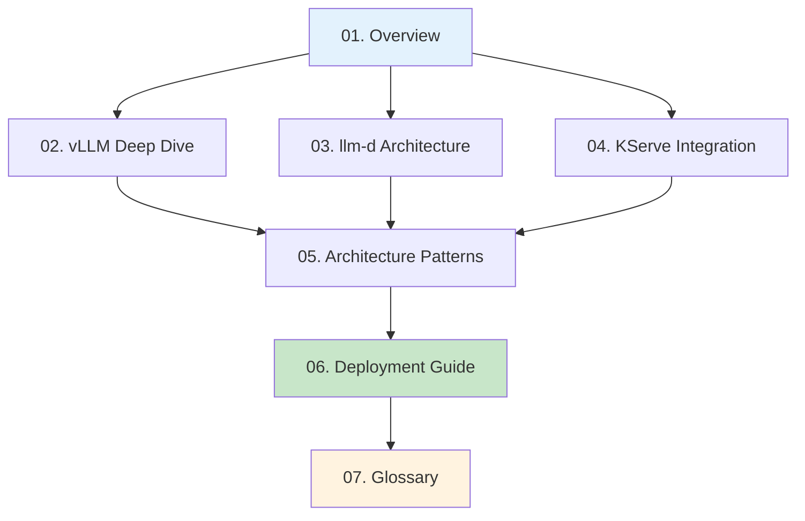

# LLM Inference Documentation Suite

## 📚 Complete Guide to vLLM, llm-d, and KServe

This comprehensive documentation suite provides in-depth coverage of modern Large Language Model (LLM) inference technologies and deployment patterns.

## 📖 Document Structure



## 📑 Documentation Contents

### [01. Overview](./01-overview.md)
**Start Here** - High-level introduction to the LLM inference stack
- Technology stack overview with visual diagrams
- How vLLM, llm-d, and KServe work together
- Performance comparisons and benefits
- Industry adoption examples
- Quick navigation to detailed topics

### [02. vLLM Deep Dive](./02-vllm-deep-dive.md)
**Performance Engine** - Comprehensive exploration of vLLM internals
- PagedAttention algorithm explained with diagrams
- Continuous batching mechanisms
- Tensor parallelism strategies
- Performance optimizations and benchmarks
- Supported models and hardware
- Advanced features (LoRA, quantization, speculative decoding)

### [03. llm-d Architecture](./03-llm-d-architecture.md)
**Orchestration Layer** - Kubernetes-native distributed inference
- Core architecture and components
- Inference Gateway and smart routing
- Disaggregated serving patterns
- Multi-tier caching strategies
- Integration with Kubernetes
- Performance benefits analysis

### [04. KServe Integration](./04-kserve-integration.md)
**Production Platform** - Model serving on Kubernetes
- InferenceService CRD detailed
- vLLM runtime configuration
- Auto-scaling with Knative
- Model storage and loading
- Monitoring and observability
- Security and access control

### [05. Architecture Patterns](./05-architecture-patterns.md)
**Design Patterns** - Choosing the right deployment architecture
- Pattern decision matrix
- 8 detailed architecture patterns:
  - Single Instance
  - Replicated Instances
  - Auto-scaling Pool
  - Disaggregated Serving
  - Tensor Parallel
  - Hybrid Multi-Tier
  - Federation
  - Caching-First
- Pattern selection guide
- Anti-patterns to avoid

### [06. Deployment Guide](./06-deployment-guide.md)
**Production Setup** - Step-by-step deployment instructions
- Prerequisites and system requirements
- Kubernetes cluster setup
- Component installation (Istio, Knative, KServe)
- Storage configuration
- Model deployment
- Monitoring setup
- Security hardening
- Load testing and validation
- Operations and maintenance

### [07. Glossary](./07-glossary.md)
**Reference** - Technical terms and acronyms explained
- Comprehensive A-Z terminology
- Acronyms quick reference
- Metrics and units guide
- Model size classifications
- Performance benchmarks reference

## 🎯 Learning Paths

### For Beginners
1. Start with [Overview](./01-overview.md)
2. Review [Glossary](./07-glossary.md) for unfamiliar terms
3. Read [KServe Integration](./04-kserve-integration.md)
4. Follow [Deployment Guide](./06-deployment-guide.md)

### For ML Engineers
1. Deep dive into [vLLM](./02-vllm-deep-dive.md)
2. Understand [Architecture Patterns](./05-architecture-patterns.md)
3. Study [llm-d Architecture](./03-llm-d-architecture.md)
4. Implement using [Deployment Guide](./06-deployment-guide.md)

### For DevOps/Platform Engineers
1. Start with [KServe Integration](./04-kserve-integration.md)
2. Review [Architecture Patterns](./05-architecture-patterns.md)
3. Follow [Deployment Guide](./06-deployment-guide.md)
4. Reference [llm-d Architecture](./03-llm-d-architecture.md)

## 🚀 Quick Start

```bash
# 1. Setup Kubernetes cluster with GPUs
kubectl create cluster --gpus

# 2. Install KServe
curl -s "https://raw.githubusercontent.com/kserve/kserve/release-0.11/hack/quick_install.sh" | bash

# 3. Deploy vLLM runtime
kubectl apply -f https://raw.githubusercontent.com/kserve/kserve/master/config/runtimes/kserve-vllmserver.yaml

# 4. Create InferenceService
kubectl apply -f inference-service.yaml

# 5. Test deployment
curl -X POST http://model-endpoint/v1/completions \
  -d '{"prompt": "Hello, world!", "max_tokens": 50}'
```

## 📊 Key Takeaways

### Performance Improvements
- **24x** throughput increase with vLLM
- **90%+** GPU utilization (vs 40-50% traditional)
- **5x** latency reduction
- **<4%** memory waste with PagedAttention

### Production Benefits
- **Auto-scaling** including scale-to-zero
- **Multi-model** serving capabilities
- **Enterprise-grade** monitoring and security
- **Cost optimization** through efficient resource usage

## 🔗 External Resources

- [vLLM Documentation](https://docs.vllm.ai/)
- [KServe Official Site](https://kserve.github.io/)
- [llm-d GitHub](https://github.com/llm-d/llm-d)
- [Kubernetes Documentation](https://kubernetes.io/docs/)

## 📝 Contributing

To contribute to this documentation:
1. Review existing documents for context
2. Follow the established format and style
3. Include mermaid diagrams for complex concepts
4. Expand acronyms on first use
5. Provide practical examples

## 📄 License

This documentation is provided as educational material for understanding LLM inference technologies.

---

**Last Updated**: January 2025
**Version**: 1.0.0
**Authors**: AI-Generated Documentation with Human Review